Bezier functions and modules.

# Functions

## bez\_point(curve, u)
Formula to calculate points on an N-point bezier curve. N=len(curve)-1

Arg         | What it is
----------- | --------------------------------
curve       | An array of control point vectors.
u           | Part of curve to get point of.  0 <= u <= 1

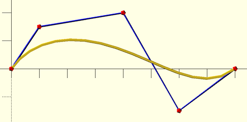

## bezier\_polyline(bezier, splinesteps=16, N=3)
Takes an array of bezier points and converts it into a 3D polyline.

Arg         | What it is
----------- | --------------------------------
splinesteps | The number of line segments to divide each bezier segment into.
N           | The number of points in each bezier segment.  Default=3 (cubic bezier)

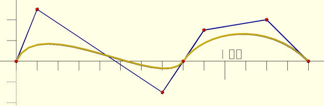

## bezier\_polygon(bezier, splinesteps=16)
Takes a closed 2D bezier path, and creates a 2D polygon from it.

Arg         | What it is
----------- | --------------------------------
splinesteps | The number of line segments to divide each bezier segment into.
N           | The number of points in each bezier segment.  Default=3 (cubic bezier)

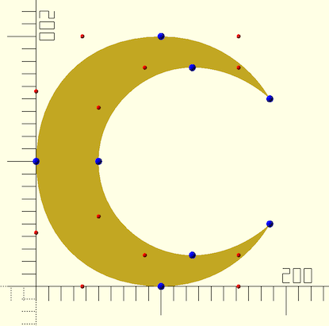

## fillet3pts(p0, p1, p2, r)
Generate a cubic (N=3) bezier curve to fillet 2 line segments between 3 points.
Returns two path points with surrounding cubic (N=3) bezier control points.

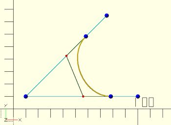

## fillet\_path(pts, fillet)
Takes a 3D polyline path and fillets it into a 3d cubic (N=3) bezier path.

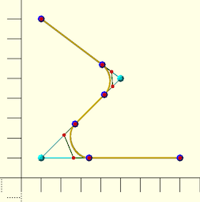

## bezier\_close\_to\_axis(bezier, N=3)
Takes a 2D bezier path and closes it to the X axis.

Arg         | What it is
----------- | --------------------------------
N           | The number of points in each bezier segment.  Default=3 (cubic bezier)

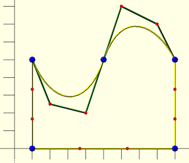

## bezier\_offset(inset, bezier, N=3)
Takes a bezier curve and closes it with a matching path that is lowered by a given amount towards the X axis.

Arg         | What it is
----------- | --------------------------------
N           | The number of points in each bezier segment.  Default=3 (cubic bezier)

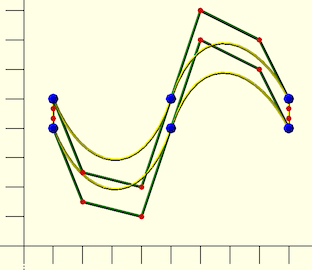

# Modules

## rotate\_extrude\_bezier()

Takes a closed 2D bezier and rotates it around the Z axis, forming a solid.
Behaves like `rotate_extrude()`, except for beziers instead of shapes.

Arg         | What it is
----------- | --------------------------------
bezier      | Array of 2D points for the bezier path to rotate.
splinesteps | Number of line segments to divide each bezier segment into.
N           | The number of points in each bezier segment.  Default=3 (cubic bezier)
convexity   | Max number of walls a line could pass through, for preview.  Default: 10
angle       | Degrees of sweep to make.  (Requires OpenSCAD 2016.XX or higher) Default: 360

Example:

    path = [
      [  0, 10], [ 50,  0], [ 50, 40],
      [ 95, 40], [100, 40], [100, 45],
      [ 95, 45], [ 66, 45], [  0, 20],
      [  0, 12], [  0, 12], [  0, 10],
      [  0, 10]
    ];
    rotate_extrude_bezier(path, splinesteps=32, $fn=180);

## revolve\_bezier()
Takes a closed 2D bezier and rotates it around the X axis, forming a solid.

Arg         | What it is
----------- | --------------------------------
bezier      | Array of points for the bezier path to rotate.
splinesteps | Number of segments to divide each bezier segment into.
N           | The number of points in each bezier segment.  Default=3 (cubic bezier)

Example:

    path = [
        [  0, 10], [ 50,  0], [ 50, 40],
        [ 95, 40], [100, 40], [100, 45],
        [ 95, 45], [ 66, 45], [  0, 20],
        [  0, 12], [  0, 12], [  0, 10],
        [  0, 10]
    ];
    revolve_bezier(path, splinesteps=32, $fn=180);

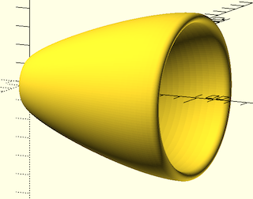

## revolve\_bezier\_solid\_to\_axis()
Takes a 2D bezier and rotates it around the X axis, forming a solid.

Arg         | What it is
----------- | --------------------------------
bezier      | array of points for the bezier path to rotate.
splinesteps | number of segments to divide each bezier segment into.
N           | The number of points in each bezier segment.  Default=3 (cubic bezier)

Example:

    path = [ [0, 10], [33, 10], [66, 40], [100, 40] ];
    revolve_bezier_solid_to_axis(path, splinesteps=32, $fn=72);

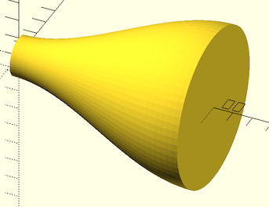

## revolve\_bezier\_offset\_shell()
Takes a 2D bezier and rotates it around the X axis, into a hollow shell.

Arg         | What it is
----------- | --------------------------------
bezier      | array of points for the bezier path to rotate.
offset      | the thickness of the created shell.
splinesteps | number of segments to divide each bezier segment into.
N           | The number of points in each bezier segment.  Default=3 (cubic bezier)

Example:

    path = [ [0, 10], [33, 10], [66, 40], [100, 40] ];
    revolve_bezier_offset_shell(path, offset=1, splinesteps=32, $fn=72);

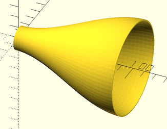

## extrude\_2d\_shapes\_along\_bezier()
Extrudes 2D children along a bezier path.

Arg         | What it is
----------- | --------------------------------
bezier      | array of points for the bezier path to extrude along.
splinesteps | number of segments to divide each bezier segment into.
N           | The number of points in each bezier segment.  Default=3 (cubic bezier)

Example:

    path = [ [0, 0, 0], [33, 33, 33], [66, -33, -33], [100, 0, 0] ];
    extrude_2d_shapes_along_bezier(path) {
    	circle(r=10, center=true);
    }

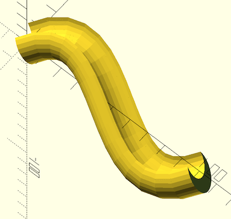

## extrude\_bezier\_along\_bezier()
Takes a closed 2D bezier path, centered on the XY plane, and
extrudes it perpendicularly along a 3D bezier path, forming a solid.

Arg         | What it is
----------- | --------------------------------
bezier      | Array of points of a bezier path, to be extruded.
path        | Array of points of a bezier path, to extrude along.
pathsteps   | number of steps to divide each path segment into.
bezsteps    | number of steps to divide each bezier segment into.
bezN        | The number of points in each extruded bezier segment.  Default=3 (cubic bezier)
pathN       | The number of points in each path bezier segment.  Default=3 (cubic bezier)

Example:

    bez = [
        [-10,   0],  [-15,  -5],
        [ -5, -10],  [  0, -10],  [ 5, -10],
        [ 10,  -5],  [ 15,   0],  [10,   5],
        [  5,  10],  [  0,  10],  [-5,  10],
        [ 25, -15],  [-10,   0]
    ];
    path = [ [0, 0, 0], [33, 33, 33], [66, -33, -33], [100, 0, 0] ];
    extrude_bezier_along_bezier(bez, path, pathsteps=32, bezsteps=16);

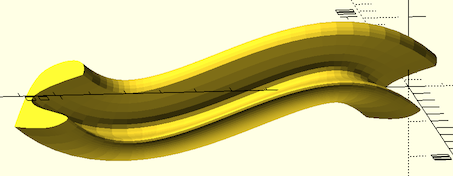

## linear\_extrude\_bezier()

Takes a closed 2D bezier path, centered on the XY plane, and
extrudes it linearly upwards, forming a solid.

Arg         | What it is
----------- | --------------------------------
bezier      | Array of 2D points of a bezier path, to be extruded.
splinesteps | Number of steps to divide each bezier segment into. Default: 16
N           | Number of points in each extruded bezier segment.  Default: 3 (cubic)
center      | If true, the extruded solid is centered vertically at z=0.
convexity   | Max number of walls a line could pass through, for preview.  Default: 10
twist       | Degrees to twist over length of extrusion.  Default: 0
scale       | Relative size of top of extrusion to the bottom.  Default: 1.0
slices      | Number of vertical slices to use for twisted extrusion.  Default: 20

Example:

    bez = [
        [-10,   0],  [-15,  -5],
        [ -5, -10],  [  0, -10],  [ 5, -10],
        [ 10,  -5],  [ 15,   0],  [10,   5],
        [  5,  10],  [  0,  10],  [-5,  10],
        [ 25, -15],  [-10,   0]
    ];
    linear_extrude_bezier(bez, height=20, splinesteps=32);

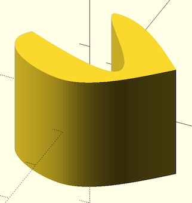

