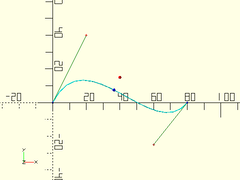
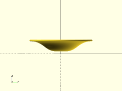
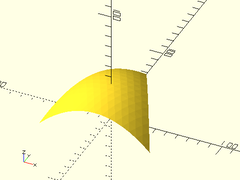

# Library File beziers.scad

Bezier functions and modules.
To use, add the following lines to the beginning of your file:
```
include <BOSL/constants.scad>
use <BOSL/beziers.scad>
```

---

# Table of Contents

1. [Terminology](#1-terminology)

2. [Segment Functions](#2-segment-functions)
    - [`bez_point()`](#bez_point)
    - [`bezier_segment_closest_point()`](#bezier_segment_closest_point)
    - [`bezier_segment_length()`](#bezier_segment_length)
    - [`fillet3pts()`](#fillet3pts)

3. [Path Functions](#3-path-functions)
    - [`bezier_path_point()`](#bezier_path_point)
    - [`bezier_path_closest_point()`](#bezier_path_closest_point)
    - [`bezier_path_length()`](#bezier_path_length)
    - [`bezier_polyline()`](#bezier_polyline)
    - [`fillet_path()`](#fillet_path)
    - [`bezier_close_to_axis()`](#bezier_close_to_axis)
    - [`bezier_offset()`](#bezier_offset)

4. [Path Modules](#4-path-modules)
    - [`bezier_polygon()`](#bezier_polygon)
    - [`linear_extrude_bezier()`](#linear_extrude_bezier)
    - [`revolve_bezier()`](#revolve_bezier)
    - [`rotate_extrude_bezier()`](#rotate_extrude_bezier)
    - [`revolve_bezier_solid_to_axis()`](#revolve_bezier_solid_to_axis)
    - [`revolve_bezier_offset_shell()`](#revolve_bezier_offset_shell)
    - [`extrude_2d_shapes_along_bezier()`](#extrude_2d_shapes_along_bezier)
    - [`extrude_bezier_along_bezier()`](#extrude_bezier_along_bezier)
    - [`trace_bezier()`](#trace_bezier)

5. [Patch Functions](#5-patch-functions)
    - [`bezier_patch_point()`](#bezier_patch_point)
    - [`bezier_triangle_point()`](#bezier_triangle_point)
    - [`bezier_patch()`](#bezier_patch)
    - [`bezier_triangle()`](#bezier_triangle)
    - [`bezier_patch_flat()`](#bezier_patch_flat)
    - [`patch_reverse()`](#patch_reverse)
    - [`patch_translate()`](#patch_translate)
    - [`patch_scale()`](#patch_scale)
    - [`patch_rotate()`](#patch_rotate)
    - [`patches_translate()`](#patches_translate)
    - [`patches_scale()`](#patches_scale)
    - [`patches_rotate()`](#patches_rotate)
    - [`bezier_surface()`](#bezier_surface)

6. [Bezier Surface Modules](#6-bezier-surface-modules)
    - [`bezier_polyhedron()`](#bezier_polyhedron)
    - [`trace_bezier_patches()`](#trace_bezier_patches)

---

# 1. Terminology

**Polyline**: A series of points joined by straight line segements.

**Bezier Curve**: A mathematical curve that joins two endpoints, following a curve determined by one or more control points.

**Endpoint**: A point that is on the end of a bezier segment.  This point lies on the bezier curve.

**Control Point**: A point that influences the shape of the curve that connects two endpoints.  This is often *NOT* on the bezier curve.

**Degree**: The number of control points, plus one endpoint, needed to specify a bezier segment.  Most beziers are cubic (degree 3).

**Bezier Segment**: A list consisting of an endpoint, one or more control points, and a final endpoint.  The number of control points is one less than the degree of the bezier.  A cubic (degree 3) bezier segment looks something like:
    `[endpt1, cp1, cp2, endpt2]`

**Bezier Path**: A list of bezier segments flattened out into a list of points, where each segment shares the endpoint of the previous segment as a start point. A cubic Bezier Path looks something like:
    `[endpt1, cp1, cp2, endpt2, cp3, cp4, endpt3]`
**NOTE**: A bezier path is *NOT* a polyline.  It is only the points and controls used to define the curve.

**Bezier Patch**: A surface defining grid of (N+1) by (N+1) bezier points.  If a Bezier Segment defines a curved line, a Bezier Patch defines a curved surface.

**Bezier Surface**: A surface defined by a list of one or more bezier patches.

**Spline Steps**: The number of straight-line segments to split a bezier segment into, to approximate the bezier curve.  The more spline steps, the closer the approximation will be to the curve, but the slower it will be to generate.  Usually defaults to 16.

# 2. Segment Functions

### bez\_point()

**Usage**:
- bez\_point(curve, u)

**Description**:
Formula to calculate points on a bezier curve.  The degree of
the curve, N, is one less than the number of points in `curve`.

Argument        | What it does
--------------- | ------------------------------
`curve`         | The list of endpoints and control points for this bezier segment.
`u`             | The proportion of the way along the curve to find the point of.  0<=`u`<=1

**Example 1**: Quadratic (Degree 2) Bezier.

    bez = [[0,0], [30,30], [80,0]];
    trace_bezier(bez, N=len(bez)-1);
    translate(bez_point(bez, 0.3)) color("red") sphere(1);


**Example 2**: Cubic (Degree 3) Bezier

    bez = [[0,0], [5,35], [60,-25], [80,0]];
    trace_bezier(bez, N=len(bez)-1);
    translate(bez_point(bez, 0.4)) color("red") sphere(1);


**Example 3**: Degree 4 Bezier.

    bez = [[0,0], [5,15], [40,20], [60,-15], [80,0]];
    trace_bezier(bez, N=len(bez)-1);
    translate(bez_point(bez, 0.8)) color("red") sphere(1);


---

### bezier\_segment\_closest\_point()

**Usage**:
- bezier\_segment\_closest\_point(bezier,pt)

**Description**:
Finds the closest part of the given bezier segment to point `pt`.
The degree of the curve, N, is one less than the number of points in `curve`.
Returns `u` for the shortest position on the bezier segment to the given point `pt`.

Argument        | What it does
--------------- | ------------------------------
`curve`         | The list of endpoints and control points for this bezier segment.
`pt`            | The point to find the closest curve point to.
`max_err`       | The maximum allowed error when approximating the closest approach.

**Example**:

    pt = [40,15];
    bez = [[0,0], [20,40], [60,-25], [80,0]];
    u = bezier_segment_closest_point(bez, pt);
    trace_bezier(bez, N=len(bez)-1);
    color("red") translate(pt) sphere(r=1);
    color("blue") translate(bez_point(bez,u)) sphere(r=1);



---

### bezier\_segment\_length()

**Usage**:
- bezier\_segment\_length(curve, [start\_u], [end\_u], [max\_deflect]);

**Description**:
Approximates the length of the bezier segment between start\_u and end\_u.

Argument        | What it does
--------------- | ------------------------------
`curve`         | The list of endpoints and control points for this bezier segment.
`start_u`       | The proportion of the way along the curve to start measuring from.  Between 0 and 1.
`end_u`         | The proportion of the way along the curve to end measuring at.  Between 0 and 1.  Greater than start\_u.
`max_deflect`   | The largest amount of deflection from the true curve to allow for approximation.

**Example**:

    bez = [[0,0], [5,35], [60,-25], [80,0]];
    echo(bezier_segment_length(bez));

---

### fillet3pts()

**Usage**:
- fillet3pts(p0, p1, p2, r);

**Description**:
Takes three points, defining two line segments, and works out the
cubic (degree 3) bezier segment (and surrounding control points)
needed to approximate a rounding of the corner with radius `r`.
If there isn't room for a radius `r` rounding, uses the largest
radius that will fit.  Returns [cp1, endpt1, cp2, cp3, endpt2, cp4]

Argument        | What it does
--------------- | ------------------------------
`p0`            | The starting point.
`p1`            | The middle point.
`p2`            | The ending point.
`r`             | The radius of the fillet/rounding.
`maxerr`        | Max amount bezier curve should diverge from actual radius curve.  Default: 0.1

**Example**:

    p0 = [40, 0];
    p1 = [0, 0];
    p2 = [30, 30];
    trace_polyline([p0,p1,p2], showpts=true, size=0.5, color="green");
    fbez = fillet3pts(p0,p1,p2, 10);
    trace_bezier(slice(fbez, 1, -2), size=1);


---

# 3. Path Functions

### bezier\_path\_point()

**Usage**:
- bezier\_path\_point(path, seg, u, [N])

**Description**:
Returns the coordinates of bezier path segment `seg` at position `u`.

Argument        | What it does
--------------- | ------------------------------
`path`          | A bezier path to approximate.
`seg`           | Segment number along the path.  Each segment is N points long.
`u`             | The proportion of the way along the segment to find the point of.  0<=`u`<=1
`N`             | The degree of the bezier curves.  Cubic beziers have N=3.  Default: 3

---

### bezier\_path\_closest\_point()

**Usage**:
- bezier\_path\_closest\_point(bezier,pt)

**Description**:
Finds the closest part of the given bezier path to point `pt`.
Returns [segnum, u] for the closest position on the bezier path to the given point `pt`.

Argument        | What it does
--------------- | ------------------------------
`path`          | A bezier path to approximate.
`pt`            | The point to find the closest curve point to.
`N`             | The degree of the bezier curves.  Cubic beziers have N=3.  Default: 3
`max_err`       | The maximum allowed error when approximating the closest approach.

**Example**:

    pt = [100,0];
    bez = [[0,0], [20,40], [60,-25], [80,0], [100,25], [140,25], [160,0]];
    pos = bezier_path_closest_point(bez, pt);
    xy = bezier_path_point(bez,pos[0],pos[1]);
    trace_bezier(bez, N=3);
    color("red") translate(pt) sphere(r=1);
    color("blue") translate(xy) sphere(r=1);


---

### bezier\_path\_length()

**Usage**:
- bezier\_path\_length(path, [N], [max\_deflect]);

**Description**:
Approximates the length of the bezier path.

Argument        | What it does
--------------- | ------------------------------
`path`          | A bezier path to approximate.
`N`             | The degree of the bezier curves.  Cubic beziers have N=3.  Default: 3
`max_deflect`   | The largest amount of deflection from the true curve to allow for approximation.

---

### bezier\_polyline()

**Usage**:
- bezier\_polyline(bezier, [splinesteps], [N])

**Description**:
Takes a bezier path and converts it into a polyline.

Argument        | What it does
--------------- | ------------------------------
`bezier`        | A bezier path to approximate.
`splinesteps`   | Number of straight lines to split each bezier segment into. default=16
`N`             | The degree of the bezier curves.  Cubic beziers have N=3.  Default: 3

**Example**:

    bez = [
        [0,0], [-5,30],
        [20,60], [50,50], [110,30],
        [60,25], [70,0], [80,-25],
        [80,-50], [50,-50]
    ];
    trace_polyline(bez, size=1, N=3, showpts=true);
    trace_polyline(bezier_polyline(bez, N=3), size=3);


---

### fillet\_path()

**Usage**:
- fillet\_path(pts, fillet, [maxerr]);

**Description**:
Takes a 3D polyline path and fillets the corners, returning a 3d cubic (degree 3) bezier path.

Argument        | What it does
--------------- | ------------------------------
`pts`           | 3D Polyline path to fillet.
`fillet`        | The radius to fillet/round the polyline corners by.
`maxerr`        | Max amount bezier curve should diverge from actual radius curve.  Default: 0.1

**Example**:

    pline = [[40,0], [0,0], [35,35], [0,70], [-10,60], [-5,55], [0,60]];
    bez = fillet_path(pline, 10);
    trace_polyline(pline, showpts=true, size=0.5, color="green");
    trace_bezier(bez, size=1);


---

### bezier\_close\_to\_axis()

**Usage**:
- bezier\_close\_to\_axis(bezier, [N], [axis]);

**Description**:
Takes a 2D bezier path and closes it to the specified axis.

Argument        | What it does
--------------- | ------------------------------
`bezier`        | The 2D bezier path to close to the axis.
`N`             | The degree of the bezier curves.  Cubic beziers have N=3.  Default: 3
`axis`          | The axis to close to, "X", or "Y".  Default: "X"

**Example 1**:

    bez = [[50,30], [40,10], [10,50], [0,30], [-10, 10], [-30,10], [-50,20]];
    closed = bezier_close_to_axis(bez);
    trace_bezier(closed, size=1);


**Example 2**:

    bez = [[30,50], [10,40], [50,10], [30,0], [10, -10], [10,-30], [20,-50]];
    closed = bezier_close_to_axis(bez, axis="Y");
    trace_bezier(closed, size=1);


---

### bezier\_offset()

**Usage**:
- bezier\_offset(inset, bezier, [N], [axis]);

**Description**:
Takes a 2D bezier path and closes it with a matching reversed path that is closer to the given axis by distance `inset`.

Argument        | What it does
--------------- | ------------------------------
`inset`         | Amount to lower second path by.
`bezier`        | The 2D bezier path.
`N`             | The degree of the bezier curves.  Cubic beziers have N=3.  Default: 3
`axis`          | The axis to offset towards, "X", or "Y".  Default: "X"

**Example 1**:

    bez = [[50,30], [40,10], [10,50], [0,30], [-10, 10], [-30,10], [-50,20]];
    closed = bezier_offset(5, bez);
    trace_bezier(closed, size=1);


**Example 2**:

    bez = [[30,50], [10,40], [50,10], [30,0], [10, -10], [10,-30], [20,-50]];
    closed = bezier_offset(5, bez, axis="Y");
    trace_bezier(closed, size=1);


---

# 4. Path Modules

### bezier\_polygon()

**Usage**:
- bezier\_polygon(bezier, [splinesteps], [N]) {

**Description**:
Takes a closed 2D bezier path, and creates a 2D polygon from it.

Argument        | What it does
--------------- | ------------------------------
`bezier`        | The closed bezier path to make into a polygon.
`splinesteps`   | Number of straight lines to split each bezier segment into. default=16
`N`             | The degree of the bezier curves.  Cubic beziers have N=3.  Default: 3

**Example**:

    bez = [
        [0,0], [-5,30],
        [20,60], [50,50], [110,30],
        [60,25], [70,0], [80,-25],
        [80,-50], [50,-50], [30,-50],
        [5,-30], [0,0]
    ];
    trace_bezier(bez, N=3, size=3);
    linear_extrude(height=0.1) bezier_polygon(bez, N=3);


---

### linear\_extrude\_bezier()

**Usage**:
- linear\_extrude\_bezier(bezier, height, [splinesteps], [N], [center], [convexity], [twist], [slices], [scale], [orient], [align]);

**Description**:
Takes a closed 2D bezier path, centered on the XY plane, and
extrudes it linearly upwards, forming a solid.

Argument        | What it does
--------------- | ------------------------------
`bezier`        | Array of 2D points of a bezier path, to be extruded.
`splinesteps`   | Number of steps to divide each bezier segment into. default=16
`N`             | The degree of the bezier curves.  Cubic beziers have N=3.  Default: 3
`convexity`     | max number of walls a line could pass through, for preview.  default=10
`twist`         | Angle in degrees to twist over the length of extrusion.  default=0
`scale`         | Relative size of top of extrusion to the bottom.  default=1.0
`slices`        | Number of vertical slices to use for twisted extrusion.  default=20
`center`        | If true, the extruded solid is centered vertically at z=0.
`orient`        | Orientation of the extrusion.  Use the `ORIENT_` constants from `constants.scad`.  Default: `ORIENT_Z`.
`align`         | Alignment of the extrusion.  Use the `V_` constants from `constants.scad`.  Default: `ALIGN_POS`.

**Example**:

    bez = [
        [-10,   0],  [-15,  -5],
        [ -5, -10],  [  0, -10],  [ 5, -10],
        [ 10,  -5],  [ 15,   0],  [10,   5],
        [  5,  10],  [  0,  10],  [-5,  10],
        [ 25, -15],  [-10,   0]
    ];
    linear_extrude_bezier(bez, height=20, splinesteps=32);


---

### revolve\_bezier()

**Usage**:
- revolve\_bezier(bezier, [splinesteps], [N], [convexity], [angle], [orient], [align])

**Description**:
Takes a closed 2D bezier and rotates it around the X axis, forming a solid.

Argument        | What it does
--------------- | ------------------------------
`bezier`        | array of 2D points for the bezier path to rotate.
`splinesteps`   | number of segments to divide each bezier segment into. default=16
`N`             | number of points in each bezier segment.  default=3 (cubic)
`convexity`     | max number of walls a line could pass through, for preview.  default=10
`angle`         | Degrees of sweep to make.  Default: 360
`orient`        | Orientation of the extrusion.  Use the `ORIENT_` constants from `constants.scad`.  Default: `ORIENT_X`.
`align`         | Alignment of the extrusion.  Use the `V_` constants from `constants.scad`.  Default: `V_CENTER`.

**Example**:

    path = [
      [  0, 10], [ 50,  0], [ 50, 40],
      [ 95, 40], [100, 40], [100, 45],
      [ 95, 45], [ 66, 45], [  0, 20],
      [  0, 12], [  0, 12], [  0, 10],
      [  0, 10]
    ];
    revolve_bezier(path, splinesteps=32, $fn=180);


---

### rotate\_extrude\_bezier()

**Usage**:
- rotate\_extrude\_bezier(bezier, splinesteps=16, N=3, convexity=10, angle=360)

**Description**:
Takes a closed 2D bezier and rotates it around the Z axis, forming a solid.
Behaves like rotate\_extrude(), except for beziers instead of shapes.

Argument        | What it does
--------------- | ------------------------------
`bezier`        | array of 2D points for the bezier path to rotate.
`splinesteps`   | number of segments to divide each bezier segment into. default=16
`N`             | number of points in each bezier segment.  default=3 (cubic)
`convexity`     | max number of walls a line could pass through, for preview.  default=10
`angle`         | Degrees of sweep to make.  Default: 360
`orient`        | Orientation of the extrusion.  Use the `ORIENT_` constants from `constants.scad`.  Default: `ORIENT_Z`.
`align`         | Alignment of the extrusion.  Use the `V_` constants from `constants.scad`.  Default: `V_CENTER`.

**Example**:

    path = [
      [  0, 10], [ 50,  0], [ 50, 40],
      [ 95, 40], [100, 40], [100, 45],
      [ 95, 45], [ 66, 45], [  0, 20],
      [  0, 12], [  0, 12], [  0, 10],
      [  0, 10]
    ];
    rotate_extrude_bezier(path, splinesteps=32, $fn=180);



---

### revolve\_bezier\_solid\_to\_axis()

**Usage**:
- revolve\_bezier\_solid\_to\_axis(bezier, [splinesteps], [N], [convexity], [angle], [orient], [align]);

**Description**:
Takes a 2D bezier and rotates it around the X axis, forming a solid.

Argument        | What it does
--------------- | ------------------------------
`bezier`        | array of points for the bezier path to rotate.
`splinesteps`   | number of segments to divide each bezier segment into. default=16
`N`             | number of points in each bezier segment.  default=3 (cubic)
`convexity`     | max number of walls a line could pass through, for preview.  default=10
`angle`         | Degrees of sweep to make.  Default: 360
`orient`        | Orientation of the extrusion.  Use the `ORIENT_` constants from `constants.scad`.  Default: `ORIENT_X`.
`align`         | Alignment of the extrusion.  Use the `V_` constants from `constants.scad`.  Default: `V_CENTER`.

**Example**:

    path = [ [0, 10], [33, 10], [66, 40], [100, 40] ];
    revolve_bezier_solid_to_axis(path, splinesteps=32, $fn=72);


---

### revolve\_bezier\_offset\_shell()

**Usage**:
- revolve\_bezier\_offset\_shell(bezier, offset, [splinesteps], [N], [convexity], [angle], [orient], [align]);

**Description**:
Takes a 2D bezier and rotates it around the X axis, into a hollow shell.

Argument        | What it does
--------------- | ------------------------------
`bezier`        | array of points for the bezier path to rotate.
`offset`        | the thickness of the created shell.
`splinesteps`   | number of segments to divide each bezier segment into. default=16
`N`             | number of points in each bezier segment.  default=3 (cubic)
`convexity`     | max number of walls a line could pass through, for preview.  default=10
`angle`         | degrees of sweep to make.  Default: 360
`orient`        | Orientation of the extrusion.  Use the `ORIENT_` constants from `constants.scad`.  Default: `ORIENT_X`.
`align`         | Alignment of the extrusion.  Use the `V_` constants from `constants.scad`.  Default: `V_CENTER`.

**Example**:

    path = [ [0, 10], [33, 10], [66, 40], [100, 40] ];
    revolve_bezier_offset_shell(path, offset=1, splinesteps=32, $fn=72);


---

### extrude\_2d\_shapes\_along\_bezier()

**Usage**:
- extrude\_2d\_shapes\_along\_bezier(bezier, [splinesteps], [N], [convexity], [clipsize]) ...

**Description**:
Extrudes 2D children along a bezier path.

Argument        | What it does
--------------- | ------------------------------
`bezier`        | array of points for the bezier path to extrude along.
`splinesteps`   | number of segments to divide each bezier segment into. default=16

**Example**:

    path = [ [0, 0, 0], [33, 33, 33], [66, -33, -33], [100, 0, 0] ];
    extrude_2d_shapes_along_bezier(path) difference(){
        circle(r=10);
        fwd(10/2) circle(r=8);
    }


---

### extrude\_bezier\_along\_bezier()

**Usage**:
- extrude\_bezier\_along\_bezier(bezier, path, [pathsteps], [bezsteps], [bezN], [pathN]);

**Description**:
Takes a closed 2D bezier path, centered on the XY plane, and
extrudes it perpendicularly along a 3D bezier path, forming a solid.

Argument        | What it does
--------------- | ------------------------------
`bezier`        | Array of 2D points of a bezier path, to be extruded.
`path`          | Array of 3D points of a bezier path, to extrude along.
`pathsteps`     | number of steps to divide each path segment into.
`bezsteps`      | number of steps to divide each bezier segment into.
`bezN`          | number of points in each extruded bezier segment.  default=3 (cubic)
`pathN`         | number of points in each path bezier segment.  default=3 (cubic)

**Example**:

    bez = [
        [-10,   0],  [-15,  -5],
        [ -5, -10],  [  0, -10],  [ 5, -10],
        [ 10,  -5],  [ 15,   0],  [10,   5],
        [  5,  10],  [  0,  10],  [-5,  10],
        [ 25, -15],  [-10,   0]
    ];
    path = [ [0, 0, 0], [33, 33, 33], [90, 33, -33], [100, 0, 0] ];
    extrude_bezier_along_bezier(bez, path, pathsteps=32, bezsteps=16);


---

### trace\_bezier()

**Description**:
Renders 2D or 3D bezier paths and their associated control points.
Useful for debugging bezier paths.

Argument        | What it does
--------------- | ------------------------------
`bez`           | the array of points in the bezier.
`N`             | Mark the first and every Nth vertex after in a different color and shape.
`size`          | diameter of the lines drawn.

**Example**:

    bez = [
        [-10,   0],  [-15,  -5],
        [ -5, -10],  [  0, -10],  [ 5, -10],
        [ 14,  -5],  [ 15,   0],  [16,   5],
        [  5,  10],  [  0,  10]
    ];
    trace_bezier(bez, N=3, size=0.5);


---

# 5. Patch Functions

### bezier\_patch\_point()

**Usage**:
- bezier\_patch\_point(patch, u, v)

**Description**:
Given a square 2-dimensional array of (N+1) by (N+1) points size,
that represents a Bezier Patch of degree N, returns a point on that
surface, at positions `u`, and `v`.  A cubic bezier patch will be 4x4
points in size.  If given a non-square array, each direction will have
its own degree.

Argument        | What it does
--------------- | ------------------------------
`patch`         | The 2D array of endpoints and control points for this bezier patch.
`u`             | The proportion of the way along the first dimension of the patch to find the point of.  0<=`u`<=1
`v`             | The proportion of the way along the second dimension of the patch to find the point of.  0<=`v`<=1

**Example**:

    patch = [
        [[-50, 50,  0], [-16, 50,  20], [ 16, 50,  20], [50, 50,  0]],
        [[-50, 16, 20], [-16, 16,  40], [ 16, 16,  40], [50, 16, 20]],
        [[-50,-16, 20], [-16,-16,  40], [ 16,-16,  40], [50,-16, 20]],
        [[-50,-50,  0], [-16,-50,  20], [ 16,-50,  20], [50,-50,  0]]
    ];
    trace_bezier_patches(patches=[patch], size=1, showcps=true);
    pt = bezier_patch_point(patch, 0.6, 0.75);
    translate(pt) color("magenta") sphere(d=3, $fn=12);


---

### bezier\_triangle\_point()

**Usage**:
- bezier\_triangle\_point(tri, u, v)

**Description**:
Given a triangular 2-dimensional array of N+1 by (for the first row) N+1 points,
that represents a Bezier triangular patch of degree N, returns a point on
that surface, at positions `u`, and `v`.  A cubic bezier triangular patch
will have a list of 4 points in the first row, 3 in the second, 2 in the
third, and 1 in the last row.

Argument        | What it does
--------------- | ------------------------------
`tri`           | Triangular bezier patch to get point on.
`u`             | The proportion of the way along the first dimension of the triangular patch to find the point of.  0<=`u`<=1
`v`             | The proportion of the way along the second dimension of the triangular patch to find the point of.  0<=`v`<=(1-`u`)

**Example**:

    tri = [
        [[-50,-33,0], [-25,16,40], [20,66,20]],
        [[0,-33,30], [25,16,30]],
        [[50,-33,0]]
    ];
    trace_bezier_patches(tris=[tri], size=1, showcps=true);
    pt = bezier_triangle_point(tri, 0.5, 0.2);
    translate(pt) color("magenta") sphere(d=3, $fn=12);


---

### bezier\_patch()

**Usage**:
- bezier\_patch(patch, [splinesteps], [vertices], [faces]);

**Description**:
Calculate vertices and faces for forming a partial polyhedron
from the given bezier rectangular patch.  Returns a list containing
two elements.  The first is the list of unique vertices.  The
second is the list of faces, where each face is a list of indices
into the list of vertices.  You can chain calls to this, to add
more vertices and faces for multiple bezier patches, to stitch
them together into a complete polyhedron.

Argument        | What it does
--------------- | ------------------------------
`patch`         | The rectangular array of endpoints and control points for this bezier patch.
`splinesteps`   | Number of steps to divide each bezier segment into.  Default: 16
`vertices`      | Vertex list to add new points to.  Default: []
`faces`         | Face list to add new faces to.  Default: []

**Example**:

    patch = [
        [[-50, 50,  0], [-16, 50, -20], [ 16, 50,  20], [50, 50,  0]],
        [[-50, 16, 20], [-16, 16, -20], [ 16, 16,  20], [50, 16, 20]],
        [[-50,-16, 20], [-16,-16,  20], [ 16,-16, -20], [50,-16, 20]],
        [[-50,-50,  0], [-16,-50,  20], [ 16,-50, -20], [50,-50,  0]]
    ];
    vnf = bezier_patch(patch, splinesteps=16);
    polyhedron(points=vnf[0], faces=vnf[1]);


---

### bezier\_triangle()

**Usage**:
- bezier\_triangle(tri, [splinesteps], [vertices], [faces]);

**Description**:
Calculate vertices and faces for forming a partial polyhedron
from the given bezier triangular patch.  Returns a list containing
two elements.  The first is the list of unique vertices.  The
second is the list of faces, where each face is a list of indices
into the list of vertices.  You can chain calls to this, to add
more vertices and faces for multiple bezier patches, to stitch
them together into a complete polyhedron.

Argument        | What it does
--------------- | ------------------------------
`tri`           | The triangular array of endpoints and control points for this bezier patch.
`splinesteps`   | Number of steps to divide each bezier segment into.  Default: 16
`vertices`      | Vertex list to add new points to.  Default: []
`faces`         | Face list to add new faces to.  Default: []

**Example**:

    tri = [
        [[-50,-33,0], [-25,16,50], [0,66,0]],
        [[0,-33,50], [25,16,50]],
        [[50,-33,0]]
    ];
    vnf = bezier_triangle(tri, splinesteps=16);
    polyhedron(points=vnf[0], faces=vnf[1]);



---

### bezier\_patch\_flat()

**Usage**:
- bezier\_patch\_flat(size, [N], [orient], [trans]);

**Description**:
Returns a flat rectangular bezier patch of degree `N`, centered on the XY plane.

Argument        | What it does
--------------- | ------------------------------
`size`          | 2D XY size of the patch.
`N`             | Degree of the patch to generate.  Since this is flat, a degree of 1 should usually be sufficient.
`orient`        | The orientation to rotate the edge patch into.  Use the `ORIENT` constants in `BOSL/constants.scad`.
`trans`         | Amount to translate patch, after rotating to `orient`.

**Example**:

    patch = bezier_patch_flat(size=[100,100], N=3);
    trace_bezier_patches([patch], size=1, showcps=true);


---

### patch\_reverse()

**Usage**:
- patch\_reverse(patch)

**Description**:
Reverses the patch, so that the faces generated from it are flipped back to front.

Argument        | What it does
--------------- | ------------------------------
`patch`         | The patch to reverse.

---

### patch\_translate()

**Usage**:
- patch\_translate(patch, v)

**Description**:
Translates all coordinates in a rectangular or triangular patch by a given amount.

Argument        | What it does
--------------- | ------------------------------
`patch`         | The patch to translate.
`v`             | Vector to translate by.

---

### patch\_scale()

**Usage**:
- patch\_scale(patch, v, [cp])

**Description**:
Scales all coordinates in a rectangular or triangular patch by a given amount.

Argument        | What it does
--------------- | ------------------------------
`patch`         | The patch to scale.
`v`             | [X,Y,Z] scaling factors.
`cp`            | Centerpoint to scale around.

---

### patch\_rotate()

**Usage**:
- patch\_rotate(patch, a, [cp])
- patch\_rotate(patch, a, v, [cp])

**Description**:
Rotates all coordinates in a rectangular or triangular patch by a given amount.

Argument        | What it does
--------------- | ------------------------------
`patch`         | The patch to rotate.
`a`             | Rotation angle(s) in degrees.
`v`             | Vector axis to rotate round.
`cp`            | Centerpoint to rotate around.

---

### patches\_translate()

**Usage**:
- patches\_translate(patch, v, [cp])

**Description**:
Translates all coordinates in each of a list of rectangular or triangular patches.

Argument        | What it does
--------------- | ------------------------------
`patches`       | List of patches to translate.
`v`             | Vector to translate by.

---

### patches\_scale()

**Usage**:
- patches\_scale(patch, v, [cp])

**Description**:
Scales all coordinates in each of a list of rectangular or triangular patches.

Argument        | What it does
--------------- | ------------------------------
`patches`       | List of patches to scale.
`v`             | [X,Y,Z] scaling factors.
`cp`            | Centerpoint to scale around.

---

### patches\_rotate()

**Usage**:
- patches\_rotate(patch, a, [cp])
- patches\_rotate(patch, a, v, [cp])

**Description**:
Rotates all coordinates in each of a list of rectangular or triangular patches.

Argument        | What it does
--------------- | ------------------------------
`patches`       | List of patches to rotate.
`a`             | Rotation angle(s) in degrees.
`v`             | Vector axis to rotate round.
`cp`            | Centerpoint to rotate around.

---

### bezier\_surface()

**Usage**:
- bezier\_surface(patches, [splinesteps], [vertices], [faces]);

**Description**:
Calculate vertices and faces for forming a (possibly partial)
polyhedron from the given rectangular and triangular bezier
patches.  Returns a list containing two elements.  The first is
the list of unique vertices.  The second is the list of faces,
where each face is a list of indices into the list of vertices.
You can chain calls to this, to add more vertices and faces for
multiple bezier patches, to stitch them together into a complete
polyhedron.

Argument        | What it does
--------------- | ------------------------------
`patches`       | A list of rectangular bezier patches.
`tris`          | A list of triangular bezier patches.
`splinesteps`   | Number of steps to divide each bezier segment into.  Default: 16
`vertices`      | Vertex list to add new points to.  Default: []
`faces`         | Face list to add new faces to.  Default: []

**Example**:

    patch1 = [
    	[[18,18,0], [33,  0,  0], [ 67,  0,  0], [ 82, 18,0]],
    	[[ 0,40,0], [ 0,  0,100], [100,  0, 20], [100, 40,0]],
    	[[ 0,60,0], [ 0,100,100], [100,100, 20], [100, 60,0]],
    	[[18,82,0], [33,100,  0], [ 67,100,  0], [ 82, 82,0]],
    ];
    patch2 = [
    	[[18,18,0], [33,  0,  0], [ 67,  0,  0], [ 82, 18,0]],
    	[[ 0,40,0], [ 0,  0,-50], [100,  0,-50], [100, 40,0]],
    	[[ 0,60,0], [ 0,100,-50], [100,100,-50], [100, 60,0]],
    	[[18,82,0], [33,100,  0], [ 67,100,  0], [ 82, 82,0]],
    ];
    vnf = bezier_surface(patches=[patch1, patch2], splinesteps=16);
    polyhedron(points=vnf[0], faces=vnf[1]);


---

# 6. Bezier Surface Modules

### bezier\_polyhedron()

**Description**:
Takes a list of two or more bezier patches and attempts to make a complete polyhedron from them.

Argument        | What it does
--------------- | ------------------------------
`patches`       | A list of rectangular bezier patches.
`tris`          | A list of triangular bezier patches.
`vertices`      | Vertex list for additional non-bezier faces.  Default: []
`faces`         | Additional non-bezier faces.  Default: []
`splinesteps`   | Number of steps to divide each bezier segment into. Default: 16

**Example**:

    patch1 = [
    	[[18,18,0], [33,  0,  0], [ 67,  0,  0], [ 82, 18,0]],
    	[[ 0,40,0], [ 0,  0, 20], [100,  0, 20], [100, 40,0]],
    	[[ 0,60,0], [ 0,100, 20], [100,100,100], [100, 60,0]],
    	[[18,82,0], [33,100,  0], [ 67,100,  0], [ 82, 82,0]],
    ];
    patch2 = [
    	[[18,18,0], [33,  0,  0], [ 67,  0,  0], [ 82, 18,0]],
    	[[ 0,40,0], [ 0,  0,-50], [100,  0,-50], [100, 40,0]],
    	[[ 0,60,0], [ 0,100,-50], [100,100,-50], [100, 60,0]],
    	[[18,82,0], [33,100,  0], [ 67,100,  0], [ 82, 82,0]],
    ];
    bezier_polyhedron([patch1, patch2], splinesteps=8);


---

### trace\_bezier\_patches()

**Usage**:
- trace\_bezier\_patches(patches, [size], [showcps], [splinesteps]);
- trace\_bezier\_patches(tris, [size], [showcps], [splinesteps]);
- trace\_bezier\_patches(patches, tris, [size], [showcps], [splinesteps]);

**Description**:
Shows the surface, and optionally, control points of a list of bezier patches.

Argument        | What it does
--------------- | ------------------------------
`patches`       | A list of rectangular bezier patches.
`tris`          | A list of triangular bezier patches.
`splinesteps`   | Number of steps to divide each bezier segment into. default=16
`showcps`       | If true, show the controlpoints as well as the surface.
`size`          | Size to show control points and lines.

**Example**:

    patch1 = [
    	[[15,15,0], [33,  0,  0], [ 67,  0,  0], [ 85, 15,0]],
    	[[ 0,33,0], [33, 33, 50], [ 67, 33, 50], [100, 33,0]],
    	[[ 0,67,0], [33, 67, 50], [ 67, 67, 50], [100, 67,0]],
    	[[15,85,0], [33,100,  0], [ 67,100,  0], [ 85, 85,0]],
    ];
    patch2 = [
    	[[15,15,0], [33,  0,  0], [ 67,  0,  0], [ 85, 15,0]],
    	[[ 0,33,0], [33, 33,-50], [ 67, 33,-50], [100, 33,0]],
    	[[ 0,67,0], [33, 67,-50], [ 67, 67,-50], [100, 67,0]],
    	[[15,85,0], [33,100,  0], [ 67,100,  0], [ 85, 85,0]],
    ];
    trace_bezier_patches(patches=[patch1, patch2], splinesteps=8, showcps=true);


---

