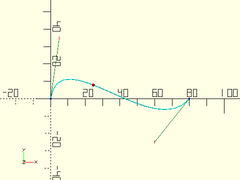
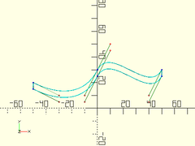

# Library File beziers.scad

Bezier functions and modules.
To use, add the following lines to the beginning of your file:
```
include <BOSL/constants.scad>
use <BOSL/beziers.scad>
```

---

# Table of Contents

1. [Terminology](#terminology)

2. [Functions](#functions)
    - [`bez_point()`](#bez_point)
    - [`bezier_polyline()`](#bezier_polyline)
    - [`fillet3pts()`](#fillet3pts)
    - [`fillet_path()`](#fillet_path)
    - [`bezier_close_to_axis()`](#bezier_close_to_axis)
    - [`bezier_offset()`](#bezier_offset)

3. [Modules](#modules)
    - [`bezier_polygon()`](#bezier_polygon)
    - [`revolve_bezier()`](#revolve_bezier)
    - [`rotate_extrude_bezier()`](#rotate_extrude_bezier)
    - [`revolve_bezier_solid_to_axis()`](#revolve_bezier_solid_to_axis)
    - [`revolve_bezier_offset_shell()`](#revolve_bezier_offset_shell)
    - [`extrude_2d_shapes_along_bezier()`](#extrude_2d_shapes_along_bezier)
    - [`extrude_bezier_along_bezier()`](#extrude_bezier_along_bezier)
    - [`linear_extrude_bezier()`](#linear_extrude_bezier)
    - [`trace_bezier()`](#trace_bezier)

---

# 1. Terminology

**Polyline**: A series of points joined by straight line segements.

**Bezier Curve**: A mathematical curve that joins two endpoints, following a curve determined by one or more control points.

**Endpoint**: A point that is on the end of a bezier segment.  This point lies on the bezier curve.

**Control Point**: A point that influences the shape of the curve that connects two endpoints.  This is often *NOT* on the bezier curve.

**Degree**: The number of control points, plus one endpoint, needed to specify a bezier segment.  Most beziers are cubic (degree 3).

**Bezier Segment**: A list consisting of an endpoint, one or more control points, and a final endpoint.  The number of control points is one less than the degree of the bezier.  A cubic (degree 3) bezier segment looks something like:
    `[endpt1, cp1, cp2, endpt2]`

**Bezier Path**: A list of bezier segments flattened out into a list of points, where each segment shares the endpoint of the previous segment as a start point. A cubic Bezier Path looks something like:
    `[endpt1, cp1, cp2, endpt2, cp3, cp4, endpt3]`
**NOTE**: A bezier path is *NOT* a polyline.  It is only the points and controls used to define the curve.

**Spline Steps**: The number of straight-line segments to split a bezier segment into, to approximate the bezier curve.  The more spline steps, the closer the approximation will be to the curve, but the slower it will be to generate.  Usually defaults to 16.

# 2. Functions

### bez\_point()

**Usage**:
- bez\_point(curve, u)

**Description**:
Formula to calculate points on a bezier curve.  The degree of
the curve, N, is one less than the number of points in `curve`.

Argument        | What it does
--------------- | ------------------------------
`curve`         | The list of endpoints and control points for this bezier segment.
`u`             | The proportion of the way along the curve to find the point of.  0<=`u`<=1

**Example 1**: Quadratic (Degree 2) Bezier.

    bez = [[0,0], [30,30], [80,0]];
    trace_bezier(bez, N=len(bez)-1);
    translate(bez_point(bez, 0.3)) color("red") sphere(1);


**Example 2**: Cubic (Degree 3) Bezier

    bez = [[0,0], [5,35], [60,-25], [80,0]];
    trace_bezier(bez, N=len(bez)-1);
    translate(bez_point(bez, 0.4)) color("red") sphere(1);



**Example 3**: Degree 4 Bezier.

    bez = [[0,0], [5,15], [40,20], [60,-15], [80,0]];
    trace_bezier(bez, N=len(bez)-1);
    translate(bez_point(bez, 0.8)) color("red") sphere(1);


---

### bezier\_polyline()

**Usage**:
- bezier\_polyline(bezier, [splinesteps], [N])

**Description**:
Takes a bezier path and converts it into a polyline.

Argument        | What it does
--------------- | ------------------------------
`bezier`        | A bezier path to approximate.
`splinesteps`   | Number of straight lines to split each bezier segment into. default=16
`N`             | The degree of the bezier curves.  Cubic beziers have N=3.  Default: 3

**Example**:

    bez = [
        [0,0], [-5,30],
        [20,60], [50,50], [110,30],
        [60,25], [70,0], [80,-25],
        [80,-50], [50,-50]
    ];
    trace_polyline(bez, size=1, N=3, showpts=true);
    trace_polyline(bezier_polyline(bez, N=3), size=3);


---

### fillet3pts()

**Usage**:
- fillet3pts(p0, p1, p2, r);

**Description**:
Takes three points, defining two line segments, and works out the
cubic (degree 3) bezier segment (and surrounding control points)
needed to approximate a rounding of the corner with radius `r`.
If there isn't room for a radius `r` rounding, uses the largest
radius that will fit.  Returns [cp1, endpt1, cp2, cp3, endpt2, cp4]

Argument        | What it does
--------------- | ------------------------------
`p0`            | The starting point.
`p1`            | The middle point.
`p2`            | The ending point.
`r`             | The radius of the fillet/rounding.
`maxerr`        | Max amount bezier curve should diverge from actual radius curve.  Default: 0.1

**Example**:

    p0 = [40, 0];
    p1 = [0, 0];
    p2 = [30, 30];
    trace_polyline([p0,p1,p2], showpts=true, size=0.5, color="green");
    fbez = fillet3pts(p0,p1,p2, 10);
    trace_bezier(slice(fbez, 1, -2), size=1);


---

### fillet\_path()

**Usage**:
- fillet\_path(pts, fillet, [maxerr]);

**Description**:
Takes a 3D polyline path and fillets the corners, returning a 3d cubic (degree 3) bezier path.

Argument        | What it does
--------------- | ------------------------------
`pts`           | 3D Polyline path to fillet.
`fillet`        | The radius to fillet/round the polyline corners by.
`maxerr`        | Max amount bezier curve should diverge from actual radius curve.  Default: 0.1

**Example**:

    pline = [[40,0], [0,0], [35,35], [0,70], [-10,60], [-5,55], [0,60]];
    bez = fillet_path(pline, 10);
    trace_polyline(pline, showpts=true, size=0.5, color="green");
    trace_bezier(bez, size=1);


---

### bezier\_close\_to\_axis()

**Usage**:
- bezier\_close\_to\_axis(bezier, [N]);

**Description**:
Takes a 2D bezier path and closes it to the X axis.

Argument        | What it does
--------------- | ------------------------------
`bezier`        | The 2D bezier path to close to the X axis.
`N`             | The degree of the bezier curves.  Cubic beziers have N=3.  Default: 3

**Example**:

    bez = [[50,30], [40,10], [10,50], [0,30], [-10, 10], [-30,10], [-50,20]];
    closed = bezier_close_to_axis(bez);
    trace_bezier(closed, size=1);


---

### bezier\_offset()

**Usage**:
- bezier\_offset(inset, bezier, [N]);

**Description**:
Takes a 2D bezier path and closes it with a matching path that is
lowered by a given amount towards the X axis.

Argument        | What it does
--------------- | ------------------------------
`inset`         | Amount to lower second path by.
`bezier`        | The 2D bezier path to close to the X axis.
`N`             | The degree of the bezier curves.  Cubic beziers have N=3.  Default: 3

**Example**:

    bez = [[50,30], [40,10], [10,50], [0,30], [-10, 10], [-30,10], [-50,20]];
    closed = bezier_offset(5, bez);
    trace_bezier(closed, size=1);



---

# 3. Modules

### bezier\_polygon()

**Usage**:
- bezier\_polygon(bezier, [splinesteps], [N]) {

**Description**:
Takes a closed 2D bezier path, and creates a 2D polygon from it.

Argument        | What it does
--------------- | ------------------------------
`bezier`        | The closed bezier path to make into a polygon.
`splinesteps`   | Number of straight lines to split each bezier segment into. default=16
`N`             | The degree of the bezier curves.  Cubic beziers have N=3.  Default: 3

**Example**:

    bez = [
        [0,0], [-5,30],
        [20,60], [50,50], [110,30],
        [60,25], [70,0], [80,-25],
        [80,-50], [50,-50], [30,-50],
        [5,-30], [0,0]
    ];
    trace_bezier(bez, N=3, size=3);
    linear_extrude(height=0.1) bezier_polygon(bez, N=3);


---

### revolve\_bezier()

**Usage**:
- revolve\_bezier(bezier, [splinesteps], [N], [convexity], [angle], [orient], [align])

**Description**:
Takes a closed 2D bezier and rotates it around the X axis, forming a solid.

Argument        | What it does
--------------- | ------------------------------
`bezier`        | array of 2D points for the bezier path to rotate.
`splinesteps`   | number of segments to divide each bezier segment into. default=16
`N`             | number of points in each bezier segment.  default=3 (cubic)
`convexity`     | max number of walls a line could pass through, for preview.  default=10
`angle`         | Degrees of sweep to make.  Default: 360
`orient`        | Orientation of the extrusion.  Use the `ORIENT_` constants from `constants.scad`.  Default: `ORIENT_X`.
`align`         | Alignment of the extrusion.  Use the `V_` constants from `constants.scad`.  Default: `V_CENTER`.

**Example**:

    path = [
      [  0, 10], [ 50,  0], [ 50, 40],
      [ 95, 40], [100, 40], [100, 45],
      [ 95, 45], [ 66, 45], [  0, 20],
      [  0, 12], [  0, 12], [  0, 10],
      [  0, 10]
    ];
    revolve_bezier(path, splinesteps=32, $fn=180);


---

### rotate\_extrude\_bezier()

**Usage**:
- rotate\_extrude\_bezier(bezier, splinesteps=16, N=3, convexity=10, angle=360)

**Description**:
Takes a closed 2D bezier and rotates it around the Z axis, forming a solid.
Behaves like rotate\_extrude(), except for beziers instead of shapes.

Argument        | What it does
--------------- | ------------------------------
`bezier`        | array of 2D points for the bezier path to rotate.
`splinesteps`   | number of segments to divide each bezier segment into. default=16
`N`             | number of points in each bezier segment.  default=3 (cubic)
`convexity`     | max number of walls a line could pass through, for preview.  default=10
`angle`         | Degrees of sweep to make.  Default: 360
`orient`        | Orientation of the extrusion.  Use the `ORIENT_` constants from `constants.scad`.  Default: `ORIENT_Z`.
`align`         | Alignment of the extrusion.  Use the `V_` constants from `constants.scad`.  Default: `ALIGN_POS`.

**Example**:

    path = [
      [  0, 10], [ 50,  0], [ 50, 40],
      [ 95, 40], [100, 40], [100, 45],
      [ 95, 45], [ 66, 45], [  0, 20],
      [  0, 12], [  0, 12], [  0, 10],
      [  0, 10]
    ];
    rotate_extrude_bezier(path, splinesteps=32, $fn=180);


---

### revolve\_bezier\_solid\_to\_axis()

**Usage**:
- revolve\_bezier\_solid\_to\_axis(bezier, [splinesteps], [N], [convexity], [angle], [orient], [align]);

**Description**:
Takes a 2D bezier and rotates it around the X axis, forming a solid.

Argument        | What it does
--------------- | ------------------------------
`bezier`        | array of points for the bezier path to rotate.
`splinesteps`   | number of segments to divide each bezier segment into. default=16
`N`             | number of points in each bezier segment.  default=3 (cubic)
`convexity`     | max number of walls a line could pass through, for preview.  default=10
`angle`         | Degrees of sweep to make.  Default: 360
`orient`        | Orientation of the extrusion.  Use the `ORIENT_` constants from `constants.scad`.  Default: `ORIENT_X`.
`align`         | Alignment of the extrusion.  Use the `V_` constants from `constants.scad`.  Default: `V_CENTER`.

**Example**:

    path = [ [0, 10], [33, 10], [66, 40], [100, 40] ];
    revolve_bezier_solid_to_axis(path, splinesteps=32, $fn=72);


---

### revolve\_bezier\_offset\_shell()

**Usage**:
- revolve\_bezier\_offset\_shell(bezier, offset, [splinesteps], [N], [convexity], [angle], [orient], [align]);

**Description**:
Takes a 2D bezier and rotates it around the X axis, into a hollow shell.

Argument        | What it does
--------------- | ------------------------------
`bezier`        | array of points for the bezier path to rotate.
`offset`        | the thickness of the created shell.
`splinesteps`   | number of segments to divide each bezier segment into. default=16
`N`             | number of points in each bezier segment.  default=3 (cubic)
`convexity`     | max number of walls a line could pass through, for preview.  default=10
`angle`         | degrees of sweep to make.  Default: 360
`orient`        | Orientation of the extrusion.  Use the `ORIENT_` constants from `constants.scad`.  Default: `ORIENT_X`.
`align`         | Alignment of the extrusion.  Use the `V_` constants from `constants.scad`.  Default: `V_CENTER`.

**Example**:

    path = [ [0, 10], [33, 10], [66, 40], [100, 40] ];
    revolve_bezier_offset_shell(path, offset=1, splinesteps=32, $fn=72);


---

### extrude\_2d\_shapes\_along\_bezier()

**Usage**:
- extrude\_2d\_shapes\_along\_bezier(bezier, [splinesteps], [N], [convexity], [clipsize]) ...

**Description**:
Extrudes 2D children along a bezier path.

Argument        | What it does
--------------- | ------------------------------
`bezier`        | array of points for the bezier path to extrude along.
`splinesteps`   | number of segments to divide each bezier segment into. default=16

**Example**:

    path = [ [0, 0, 0], [33, 33, 33], [66, -33, -33], [100, 0, 0] ];
    extrude_2d_shapes_along_bezier(path) difference(){
        circle(r=10);
        fwd(10/2) circle(r=8);
    }


---

### extrude\_bezier\_along\_bezier()

**Usage**:
- extrude\_bezier\_along\_bezier(bezier, path, [pathsteps], [bezsteps], [bezN], [pathN]);

**Description**:
Takes a closed 2D bezier path, centered on the XY plane, and
extrudes it perpendicularly along a 3D bezier path, forming a solid.

Argument        | What it does
--------------- | ------------------------------
`bezier`        | Array of 2D points of a bezier path, to be extruded.
`path`          | Array of 3D points of a bezier path, to extrude along.
`pathsteps`     | number of steps to divide each path segment into.
`bezsteps`      | number of steps to divide each bezier segment into.
`bezN`          | number of points in each extruded bezier segment.  default=3 (cubic)
`pathN`         | number of points in each path bezier segment.  default=3 (cubic)

**Example**:

    bez = [
        [-10,   0],  [-15,  -5],
        [ -5, -10],  [  0, -10],  [ 5, -10],
        [ 10,  -5],  [ 15,   0],  [10,   5],
        [  5,  10],  [  0,  10],  [-5,  10],
        [ 25, -15],  [-10,   0]
    ];
    path = [ [0, 0, 0], [33, 33, 33], [90, 33, -33], [100, 0, 0] ];
    extrude_bezier_along_bezier(bez, path, pathsteps=32, bezsteps=16);


---

### linear\_extrude\_bezier()

**Usage**:
- linear\_extrude\_bezier(bezier, height, [splinesteps], [N], [center], [convexity], [twist], [slices], [scale], [orient], [align]);

**Description**:
Takes a closed 2D bezier path, centered on the XY plane, and
extrudes it linearly upwards, forming a solid.

Argument        | What it does
--------------- | ------------------------------
`bezier`        | Array of 2D points of a bezier path, to be extruded.
`splinesteps`   | Number of steps to divide each bezier segment into. default=16
`N`             | The degree of the bezier curves.  Cubic beziers have N=3.  Default: 3
`convexity`     | max number of walls a line could pass through, for preview.  default=10
`twist`         | Angle in degrees to twist over the length of extrusion.  default=0
`scale`         | Relative size of top of extrusion to the bottom.  default=1.0
`slices`        | Number of vertical slices to use for twisted extrusion.  default=20
`center`        | If true, the extruded solid is centered vertically at z=0.
`orient`        | Orientation of the extrusion.  Use the `ORIENT_` constants from `constants.scad`.  Default: `ORIENT_Z`.
`align`         | Alignment of the extrusion.  Use the `V_` constants from `constants.scad`.  Default: `ALIGN_POS`.

**Example**:

    bez = [
        [-10,   0],  [-15,  -5],
        [ -5, -10],  [  0, -10],  [ 5, -10],
        [ 10,  -5],  [ 15,   0],  [10,   5],
        [  5,  10],  [  0,  10],  [-5,  10],
        [ 25, -15],  [-10,   0]
    ];
    linear_extrude_bezier(bez, height=20, splinesteps=32);


---

### trace\_bezier()

**Description**:
Renders 2D or 3D bezier paths and their associated control points.
Useful for debugging bezier paths.

Argument        | What it does
--------------- | ------------------------------
`bez`           | the array of points in the bezier.
`N`             | Mark the first and every Nth vertex after in a different color and shape.
`size`          | diameter of the lines drawn.

**Example**:

    bez = [
        [-10,   0],  [-15,  -5],
        [ -5, -10],  [  0, -10],  [ 5, -10],
        [ 14,  -5],  [ 15,   0],  [16,   5],
        [  5,  10],  [  0,  10]
    ];
    trace_bezier(bez, N=3, size=0.5);


---

