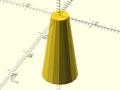
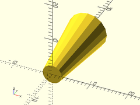
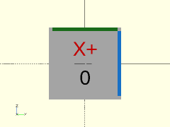
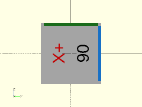
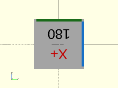
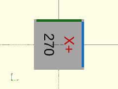

# Library File constants.scad

Useful Constants.
To use this, add the following line to the top of your file.
```
include <BOSL/constants.scad>
```

---

# Table of Contents

1. [General Constants](#1-general-constants)
    - [PRINTER_SLOP](#printer_slop)

2. [Directional Vectors](#2-directional-vectors)
    - [V_LEFT](#v_left)
    - [V_RIGHT](#v_right)
    - [V_FWD](#v_fwd)
    - [V_BACK](#v_back)
    - [V_DOWN](#v_down)
    - [V_UP](#v_up)
    - [V_ALLPOS](#v_allpos)
    - [V_ALLNEG](#v_allneg)
    - [V_ZERO](#v_zero)

3. [Vector Aliases](#3-vector-aliases)
    - [V_CENTER](#v_center)
    - [V_ABOVE](#v_above)
    - [V_BELOW](#v_below)
    - [V_BEFORE](#v_before)
    - [V_BEHIND](#v_behind)
    - [V_TOP](#v_top)
    - [V_BOTTOM](#v_bottom)
    - [V_FRONT](#v_front)
    - [V_REAR](#v_rear)

4. [Pre-Orientation Alignments](#4-pre-orientation-alignments)
    - [ALIGN_POS](#align_pos)
    - [ALIGN_CENTER](#align_center)
    - [ALIGN_NEG](#align_neg)

5. [Standard Orientations](#5-standard-orientations)
    - [ORIENT_X](#orient_x)
    - [ORIENT_Y](#orient_y)
    - [ORIENT_Z](#orient_z)
    - [ORIENT_XNEG](#orient_xneg)
    - [ORIENT_YNEG](#orient_yneg)
    - [ORIENT_ZNEG](#orient_zneg)

6. [Orientations Rotated 90º](#6-orientations-rotated-90)
    - [ORIENT_X_90](#orient_x_90)
    - [ORIENT_Y_90](#orient_y_90)
    - [ORIENT_Z_90](#orient_z_90)
    - [ORIENT_XNEG_90](#orient_xneg_90)
    - [ORIENT_YNEG_90](#orient_yneg_90)
    - [ORIENT_ZNEG_90](#orient_zneg_90)

7. [Orientations Rotated 180º](#7-orientations-rotated-180)
    - [ORIENT_X_180](#orient_x_180)
    - [ORIENT_Y_180](#orient_y_180)
    - [ORIENT_Z_180](#orient_z_180)
    - [ORIENT_XNEG_180](#orient_xneg_180)
    - [ORIENT_YNEG_180](#orient_yneg_180)
    - [ORIENT_ZNEG_180](#orient_zneg_180)

8. [Orientations Rotated 270º](#8-orientations-rotated-270)
    - [ORIENT_X_270](#orient_x_270)
    - [ORIENT_Y_270](#orient_y_270)
    - [ORIENT_Z_270](#orient_z_270)
    - [ORIENT_XNEG_270](#orient_xneg_270)
    - [ORIENT_YNEG_270](#orient_yneg_270)
    - [ORIENT_ZNEG_270](#orient_zneg_270)

9. [Individual Edges](#9-individual-edges)
    - [EDGE_TOP_BK](#edge_top_bk)
    - [EDGE_TOP_FR](#edge_top_fr)
    - [EDGE_BOT_FR](#edge_bot_fr)
    - [EDGE_BOT_BK](#edge_bot_bk)
    - [EDGE_TOP_RT](#edge_top_rt)
    - [EDGE_TOP_LF](#edge_top_lf)
    - [EDGE_BOT_LF](#edge_bot_lf)
    - [EDGE_BOT_RT](#edge_bot_rt)
    - [EDGE_BK_RT](#edge_bk_rt)
    - [EDGE_BK_LF](#edge_bk_lf)
    - [EDGE_FR_LF](#edge_fr_lf)
    - [EDGE_FR_RT](#edge_fr_rt)

10. [Sets of Edges](#10-sets-of-edges)
    - [EDGES_X_TOP](#edges_x_top)
    - [EDGES_X_BOT](#edges_x_bot)
    - [EDGES_X_FR](#edges_x_fr)
    - [EDGES_X_BK](#edges_x_bk)
    - [EDGES_X_ALL](#edges_x_all)
    - [EDGES_Y_TOP](#edges_y_top)
    - [EDGES_Y_BOT](#edges_y_bot)
    - [EDGES_Y_LF](#edges_y_lf)
    - [EDGES_Y_RT](#edges_y_rt)
    - [EDGES_Y_ALL](#edges_y_all)
    - [EDGES_Z_BK](#edges_z_bk)
    - [EDGES_Z_FR](#edges_z_fr)
    - [EDGES_Z_LF](#edges_z_lf)
    - [EDGES_Z_RT](#edges_z_rt)
    - [EDGES_Z_ALL](#edges_z_all)
    - [EDGES_LEFT](#edges_left)
    - [EDGES_RIGHT](#edges_right)
    - [EDGES_FRONT](#edges_front)
    - [EDGES_BACK](#edges_back)
    - [EDGES_BOTTOM](#edges_bottom)
    - [EDGES_TOP](#edges_top)
    - [EDGES_NONE](#edges_none)
    - [EDGES_ALL](#edges_all)

11. [Edge Helpers](#11-edge-helpers)
    - [EDGE_OFFSETS](#edge_offsets)
    - [`corner_edge_count()`](#corner_edge_count)

---

# 1. General Constants

### PRINTER\_SLOP

**Description**:
The printer specific amount of slop in mm to print with to make parts fit exactly.  You may need to override this value for your printer.

---

# 2. Directional Vectors

Vectors useful for `rotate()`, `mirror()`, and `align` arguments for `cuboid()`, `cyl()`, etc.

### V\_LEFT

**Description**:
Vector pointing left.  [-1,0,0]

**Example**: Usage with `align`

    cuboid(20, align=V_LEFT);


---

### V\_RIGHT

**Description**:
Vector pointing right.  [1,0,0]

**Example**: Usage with `align`

    cuboid(20, align=V_RIGHT);


---

### V\_FWD

**Description**:
Vector pointing forward.  [0,-1,0]

**Example**: Usage with `align`

    cuboid(20, align=V_FWD);


---

### V\_BACK

**Description**:
Vector pointing back.  [0,1,0]

**Example**: Usage with `align`

    cuboid(20, align=V_BACK);


---

### V\_DOWN

**Description**:
Vector pointing down.  [0,0,-1]

**Example**: Usage with `align`

    cuboid(20, align=V_DOWN);


---

### V\_UP

**Description**:
Vector pointing up.  [0,0,1]

**Example**: Usage with `align`

    cuboid(20, align=V_UP);


---

### V\_ALLPOS

**Description**:
Vector pointing right, back, and up.  [1,1,1]

**Example**: Usage with `align`

      cuboid(20, align=V_ALLPOS);


---

### V\_ALLNEG

**Description**:
Vector pointing left, forwards, and down.  [-1,-1,-1]

**Example**: Usage with `align`

      cuboid(20, align=V_ALLNEG);


---

### V\_ZERO

**Description**:
Zero vector.  Centered.  [0,0,0]

**Example**: Usage with `align`

      cuboid(20, align=V_ZERO);


---

# 3. Vector Aliases

Useful aliases for use with `align`.

### V\_CENTER

**Description**:
Centered, alias to `V_ZERO`.

---

### V\_ABOVE

**Description**:
Vector pointing up, alias to `V_UP`.

---

### V\_BELOW

**Description**:
Vector pointing down, alias to `V_DOWN`.

---

### V\_BEFORE

**Description**:
Vector pointing forward, alias to `V_FWD`.

---

### V\_BEHIND

**Description**:
Vector pointing back, alias to `V_BACK`.

---

### V\_TOP

**Description**:
Vector pointing up, alias to `V_UP`.

---

### V\_BOTTOM

**Description**:
Vector pointing down, alias to `V_DOWN`.

---

### V\_FRONT

**Description**:
Vector pointing forward, alias to `V_FWD`.

---

### V\_REAR

**Description**:
Vector pointing back, alias to `V_BACK`.

---

# 4. Pre-Orientation Alignments

Constants for pre-orientation alignments.

### ALIGN\_POS

**Description**:
Align the axis-positive end to the origin.

**Example 1**: orient=ORIENT\_X

      cyl(d1=10, d2=5, h=20, orient=ORIENT_X, align=ALIGN_POS);


**Example 2**: orient=ORIENT\_Y

      cyl(d1=10, d2=5, h=20, orient=ORIENT_Y, align=ALIGN_POS);


**Example 3**: orient=ORIENT\_Z

      cyl(d1=10, d2=5, h=20, orient=ORIENT_Z, align=ALIGN_POS);


**Example 4**: orient=ORIENT\_XNEG

      cyl(d1=10, d2=5, h=20, orient=ORIENT_XNEG, align=ALIGN_POS);


**Example 5**: orient=ORIENT\_YNEG

      cyl(d1=10, d2=5, h=20, orient=ORIENT_YNEG, align=ALIGN_POS);


**Example 6**: orient=ORIENT\_ZNEG

      cyl(d1=10, d2=5, h=20, orient=ORIENT_ZNEG, align=ALIGN_POS);


---

### ALIGN\_CENTER

**Description**:
Align centered.

---

### ALIGN\_NEG

**Description**:
Align the axis-negative end to the origin.

**Example 1**: orient=ORIENT\_X

      cyl(d1=10, d2=5, h=20, orient=ORIENT_X, align=ALIGN_NEG);


**Example 2**: orient=ORIENT\_Y

      cyl(d1=10, d2=5, h=20, orient=ORIENT_Y, align=ALIGN_NEG);


**Example 3**: orient=ORIENT\_Z

      cyl(d1=10, d2=5, h=20, orient=ORIENT_Z, align=ALIGN_NEG);



**Example 4**: orient=ORIENT\_XNEG

      cyl(d1=10, d2=5, h=20, orient=ORIENT_XNEG, align=ALIGN_NEG);


**Example 5**: orient=ORIENT\_YNEG

      cyl(d1=10, d2=5, h=20, orient=ORIENT_YNEG, align=ALIGN_NEG);



**Example 6**: orient=ORIENT\_ZNEG

      cyl(d1=10, d2=5, h=20, orient=ORIENT_ZNEG, align=ALIGN_NEG);


---

# 5. Standard Orientations

Orientations for `cyl()`, `prismoid()`, etc.  They take the form of standard [X,Y,Z]
rotation angles for rotating a vertical shape into the given orientations.

**Figure 1**: Standard Orientations



### ORIENT\_X

**Description**:
Orient along the X axis.

---

### ORIENT\_Y

**Description**:
Orient along the Y axis.

---

### ORIENT\_Z

**Description**:
Orient along the Z axis.

---

### ORIENT\_XNEG

**Description**:
Orient reversed along the X axis.

---

### ORIENT\_YNEG

**Description**:
Orient reversed along the Y axis.

---

### ORIENT\_ZNEG

**Description**:
Orient reversed along the Z axis.

---

# 6. Orientations Rotated 90º

Orientations for `cyl()`, `prismoid()`, etc.  They take the form of standard [X,Y,Z]
rotation angles for rotating a vertical shape into the given orientations.

**Figure 2**: Orientations Rotated 90º



### ORIENT\_X\_90

**Description**:
Orient along the X axis, then rotate 90 degrees counter-clockwise on that axis, as seen when facing the origin from that axis orientation.

---

### ORIENT\_Y\_90

**Description**:
Orient along the Y axis, then rotate 90 degrees counter-clockwise on that axis, as seen when facing the origin from that axis orientation.

---

### ORIENT\_Z\_90

**Description**:
Orient along the Z axis, then rotate 90 degrees counter-clockwise on that axis, as seen when facing the origin from that axis orientation.

---

### ORIENT\_XNEG\_90

**Description**:
Orient reversed along the X axis, then rotate 90 degrees counter-clockwise on that axis, as seen when facing the origin from that axis orientation.

---

### ORIENT\_YNEG\_90

**Description**:
Orient reversed along the Y axis, then rotate 90 degrees counter-clockwise on that axis, as seen when facing the origin from that axis orientation.

---

### ORIENT\_ZNEG\_90

**Description**:
Orient reversed along the Z axis, then rotate 90 degrees counter-clockwise on that axis, as seen when facing the origin from that axis orientation.

---

# 7. Orientations Rotated 180º

Orientations for `cyl()`, `prismoid()`, etc.  They take the form of standard [X,Y,Z]
rotation angles for rotating a vertical shape into the given orientations.

**Figure 3**: Orientations Rotated 180º



### ORIENT\_X\_180

**Description**:
Orient along the X axis, then rotate 180 degrees counter-clockwise on that axis, as seen when facing the origin from that axis orientation.

---

### ORIENT\_Y\_180

**Description**:
Orient along the Y axis, then rotate 180 degrees counter-clockwise on that axis, as seen when facing the origin from that axis orientation.

---

### ORIENT\_Z\_180

**Description**:
Orient along the Z axis, then rotate 180 degrees counter-clockwise on that axis, as seen when facing the origin from that axis orientation.

---

### ORIENT\_XNEG\_180

**Description**:
Orient reversed along the X axis, then rotate 180 degrees counter-clockwise on that axis, as seen when facing the origin from that axis orientation.

---

### ORIENT\_YNEG\_180

**Description**:
Orient reversed along the Y axis, then rotate 180 degrees counter-clockwise on that axis, as seen when facing the origin from that axis orientation.

---

### ORIENT\_ZNEG\_180

**Description**:
Orient reversed along the Z axis, then rotate 180 degrees counter-clockwise on that axis, as seen when facing the origin from that axis orientation.

---

# 8. Orientations Rotated 270º

Orientations for `cyl()`, `prismoid()`, etc.  They take the form of standard [X,Y,Z]
rotation angles for rotating a vertical shape into the given orientations.

**Figure 4**: Orientations Rotated 270º



### ORIENT\_X\_270

**Description**:
Orient along the X axis, then rotate 270 degrees counter-clockwise on that axis, as seen when facing the origin from that axis orientation.

---

### ORIENT\_Y\_270

**Description**:
Orient along the Y axis, then rotate 270 degrees counter-clockwise on that axis, as seen when facing the origin from that axis orientation.

---

### ORIENT\_Z\_270

**Description**:
Orient along the Z axis, then rotate 270 degrees counter-clockwise on that axis, as seen when facing the origin from that axis orientation.

---

### ORIENT\_XNEG\_270

**Description**:
Orient reversed along the X axis, then rotate 270 degrees counter-clockwise on that axis, as seen when facing the origin from that axis orientation.

---

### ORIENT\_YNEG\_270

**Description**:
Orient reversed along the Y axis, then rotate 270 degrees counter-clockwise on that axis, as seen when facing the origin from that axis orientation.

---

### ORIENT\_ZNEG\_270

**Description**:
Orient reversed along the Z axis, then rotate 270 degrees counter-clockwise on that axis, as seen when facing the origin from that axis orientation.

---

# 9. Individual Edges

Constants for specifying edges for `cuboid()`, etc.

### EDGE\_TOP\_BK

**Description**:
Top Back edge.

---

### EDGE\_TOP\_FR

**Description**:
Top Front edge.

---

### EDGE\_BOT\_FR

**Description**:
Bottom Front Edge.

---

### EDGE\_BOT\_BK

**Description**:
Bottom Back Edge.

---

### EDGE\_TOP\_RT

**Description**:
Top Right edge.

---

### EDGE\_TOP\_LF

**Description**:
Top Left edge.

---

### EDGE\_BOT\_LF

**Description**:
Bottom Left edge.

---

### EDGE\_BOT\_RT

**Description**:
Bottom Right edge.

---

### EDGE\_BK\_RT

**Description**:
Back Right edge.

---

### EDGE\_BK\_LF

**Description**:
Back Left edge.

---

### EDGE\_FR\_LF

**Description**:
Front Left edge.

---

### EDGE\_FR\_RT

**Description**:
Front Right edge.

---

# 10. Sets of Edges

Constants for specifying edges for `cuboid()`, etc.

### EDGES\_X\_TOP

**Description**:
Both X-aligned Top edges.

---

### EDGES\_X\_BOT

**Description**:
Both X-aligned Bottom edges.

---

### EDGES\_X\_FR

**Description**:
Both X-aligned Front edges.

---

### EDGES\_X\_BK

**Description**:
Both X-aligned Back edges.

---

### EDGES\_X\_ALL

**Description**:
All four X-aligned edges.

---

### EDGES\_Y\_TOP

**Description**:
Both Y-aligned Top edges.

---

### EDGES\_Y\_BOT

**Description**:
Both Y-aligned Bottom edges.

---

### EDGES\_Y\_LF

**Description**:
Both Y-aligned Left edges.

---

### EDGES\_Y\_RT

**Description**:
Both Y-aligned Right edges.

---

### EDGES\_Y\_ALL

**Description**:
All four Y-aligned edges.

---

### EDGES\_Z\_BK

**Description**:
Both Z-aligned Back edges.

---

### EDGES\_Z\_FR

**Description**:
Both Z-aligned Front edges.

---

### EDGES\_Z\_LF

**Description**:
Both Z-aligned Left edges.

---

### EDGES\_Z\_RT

**Description**:
Both Z-aligned Right edges.

---

### EDGES\_Z\_ALL

**Description**:
All four Z-aligned edges.

---

### EDGES\_LEFT

**Description**:
All four Left edges.

---

### EDGES\_RIGHT

**Description**:
All four Right edges.

---

### EDGES\_FRONT

**Description**:
All four Front edges.

---

### EDGES\_BACK

**Description**:
All four Back edges.

---

### EDGES\_BOTTOM

**Description**:
All four Bottom edges.

---

### EDGES\_TOP

**Description**:
All four Top edges.

---

### EDGES\_NONE

**Description**:
No edges.

---

### EDGES\_ALL

**Description**:
All edges.

---

# 11. Edge Helpers

### EDGE\_OFFSETS

**Description**:
Array of XYZ offsets to the center of each edge.

---

### corner\_edge\_count()

**Description**:
Counts how many given edges intersect at a specific corner.

Argument        | What it does
--------------- | ------------------------------
`edges`         | Standard edges array.
`v`             | Vector pointing to the corner to count edge intersections at.

---

