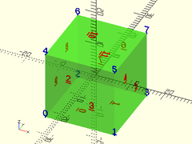

# Table of Contents

- [Debugging modules](#debugging-modules)
    - [`trace_polyline(pline, N, showpts, size, color)`](#trace_polylinepline-n-showpts-size-color)
    - [`trace_bezier(bez, N, size)`](#trace_bezierbez-n-size)
    - [`debug_vertices(vertices, size, disabled)`](#debug_verticesvertices-size-disabled)
    - [`debug_faces(vertices, faces, size, disabled)`](#debug_facesvertices-faces-size-disabled)
    - [`debug_polyhedron(points, faces, txtsize, disabled)`](#debug_polyhedronpoints-faces-txtsize-disabled)

# Debugging modules

Routines to help debug creation of beziers, polygons, and
polyhedrons.

## trace\_polyline(pline, N, showpts, size, color)

Renders lines between each point of a polyline path.
Can optionally show the individual vertex points.

Arg     | What it is
------- | --------------------------------
pline   | The array of points in the polyline.
showpts | If true, draw vertices and control points.
N       | Mark the first and every Nth vertex after in a different color and shape.
size    | Diameter of the lines drawn.
color   | Color to draw the lines (but not vertices) in.

Example:

    bez = [
        [-10, 0, 0], [-15, -5, 9], [0, -3, 5], [5, -10, 0],
        [15, 0, -5], [5, 12, -8], [0, 10, -5]
    ];
    trace_polyline(bez, N=1, showpts=true, size=0.5, color="lightgreen");

## trace\_bezier(bez, N, size)

Renders lines between each point of a polyline path.
Can also optionally show the individual vertex points.

Arg     | What it is
------- | --------------------------------
bez     | The array of points in the bezier.
N       | Number of points in each extruded bezier segment.  default = 3 (cubic)
size    | Diameter of the lines drawn.

Example:

    bez = [
        [-10,   0],  [-15,  -5],
        [ -5, -10],  [  0, -10],  [ 5, -10],
        [ 14,  -5],  [ 15,   0],  [16,   5],
        [  5,  10],  [  0,  10]
    ];
    trace_bezier(bez, N=3, size=0.5);

## debug\_vertices(vertices, size, disabled)
Draws all the vertices in an array, at their 3D position, numbered by their
position in the vertex array.  Also draws any children of this module with
transparency.

Arg         | What it is
----------- | --------------------------------
vertices    | Array of point vertices.
size        | The size of the text used to label the vertexes.
disabled    | If true, don't draw numbers, and draw children without transparency.  Default = false.

Example:

    verts = [
        [-10, 0, -10], [10, 0, -10],
        [0, -10, 10], [0, 10, 10]
    ];
    faces = [
        [0,2,1], [1,2,3], [0,3,2], [1,3,0]
    ];
    debug_vertices(vertices=verts, size=2) {
        polyhedron(points=verts, faces=faces);
    }

## debug\_faces(vertices, faces, size, disabled)
Draws all the vertices at their 3D position, numbered in blue by their
position in the vertex array.  Each face will have their face number drawn
in red, aligned with the center of face.  All children of this module are
drawn with transparency.  Works best with Thrown-Together preview mode, to
see reversed faces.

Arg         | What it is
----------- | --------------------------------
vertices    | Array of point vertices.
faces       | Array of faces by vertex numbers.
size        | The size of the text used to label the faces and vertexes.
disabled    | If true, don't draw numbers, and draw children without transparency.  Default = false.

Example:

    verts = [
        [-10, 0, -10], [10, 0, -10],
        [0, -10, 10], [0, 10, 10]
    ];
    faces = [
        [0,2,1], [1,2,3], [0,3,2], [1,3,0]
    ];
    debug_faces(vertices=verts, faces=faces, size=2) {
        polyhedron(points=verts, faces=faces);
    }

## debug\_polyhedron(points, faces, txtsize, disabled)
A drop-in module to replace `polyhedron()` and help debug vertices and faces.
Draws all the vertices at their 3D position, numbered in blue by their
position in the vertex array.  Each face will have their face number drawn
in red, aligned with the center of face.  All given faces are drawn with
transparency. All children of this module are drawn with transparency.
Works best with Thrown-Together preview mode, to see reversed faces.

Arg         | What it is
----------- | --------------------------------
vertices    | Array of point vertices.
faces       | Array of faces by vertex numbers.
txtsize     | The size of the text used to label the faces and vertexes.
disabled    | If true, act exactly like `polyhedron()`.  Default = false.

Example:

    pts = [[-5,0,-5], [5,0,-5], [0,-5,5], [0,5,5]];
    fcs = [[0,2,1], [1,2,3], [1,3,0], [0,2,3]];  // Last face reversed
    debug_polyhedron(points=pts, faces=fcs, txtsize=1);

