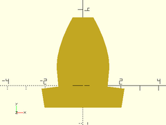
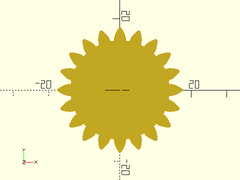
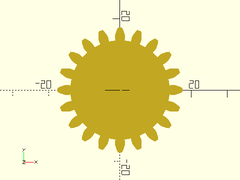
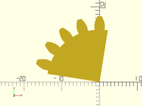
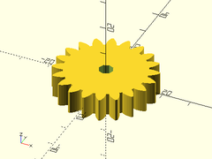
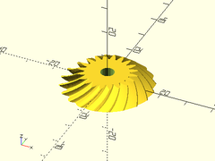
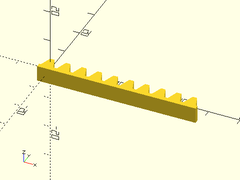

# Library File involute\_gears.scad

Involute Spur Gears and Racks

by Leemon Baird, 2011, Leemon@Leemon.com
http://www.thingiverse.com/thing:5505

Additional fixes and improvements by Revar Desmera, 2017-2019, revarbat@gmail.com

This file is public domain.  Use it for any purpose, including commercial
applications.  Attribution would be nice, but is not required.  There is
no warranty of any kind, including its correctness, usefulness, or safety.

This is parameterized involute spur (or helical) gear.  It is much simpler
and less powerful than others on Thingiverse.  But it is public domain.  I
implemented it from scratch from the descriptions and equations on Wikipedia
and the web, using Mathematica for calculations and testing, and I now
release it into the public domain.

To use, add the following line to the beginning of your file:
```
include <BOSL/constants.scad>
use <BOSL/involute_gears.scad>
```

---

# Table of Contents

1. [Terminology](#terminology)

2. [Functions](#functions)
    - [`circular_pitch()`](#circular_pitch)
    - [`diametral_pitch()`](#diametral_pitch)
    - [`module_value()`](#module_value)
    - [`adendum()`](#adendum)
    - [`dedendum()`](#dedendum)
    - [`pitch_radius()`](#pitch_radius)
    - [`outer_radius()`](#outer_radius)
    - [`root_radius()`](#root_radius)
    - [`base_radius()`](#base_radius)

3. [Modules](#modules)
    - [`gear_tooth_profile()`](#gear_tooth_profile)
    - [`gear2d()`](#gear2d)
    - [`gear()`](#gear)
    - [`rack()`](#rack)

---

# 1. Terminology

The outline of a gear is a smooth circle (the "pitch circle") which has
mountains and valleys added so it is toothed.  There is an inner
circle (the "root circle") that touches the base of all the teeth, an
outer circle that touches the tips of all the teeth, and the invisible
pitch circle in between them.  There is also a "base circle", which can
be smaller than all three of the others, which controls the shape of
the teeth.  The side of each tooth lies on the path that the end of a
string would follow if it were wrapped tightly around the base circle,
then slowly unwound.  That shape is an "involute", which gives this
type of gear its name.

# 2. Functions

These functions let the user find the derived dimensions of the gear.
A gear fits within a circle of radius outer\_radius, and two gears should have
their centers separated by the sum of their pitch\_radius.

### circular\_pitch()

**Description**:
Get tooth density expressed as "circular pitch".

Argument        | What it does
--------------- | ------------------------------
`mm_per_tooth`  | Distance between teeth around the pitch circle, in mm.

---

### diametral\_pitch()

**Description**:
Get tooth density expressed as "diametral pitch".

Argument        | What it does
--------------- | ------------------------------
`mm_per_tooth`  | Distance between teeth around the pitch circle, in mm.

---

### module\_value()

**Description**:
Get tooth density expressed as "module" or "modulus" in millimeters

Argument        | What it does
--------------- | ------------------------------
`mm_per_tooth`  | Distance between teeth around the pitch circle, in mm.

---

### adendum()

**Description**:
The height of the gear tooth above the pitch radius.

Argument        | What it does
--------------- | ------------------------------
`mm_per_tooth`  | Distance between teeth around the pitch circle, in mm.

---

### dedendum()

**Description**:
The depth of the gear tooth valley, below the pitch radius.

Argument        | What it does
--------------- | ------------------------------
`mm_per_tooth`  | Distance between teeth around the pitch circle, in mm.
`clearance`     | If given, sets the clearance between meshing teeth.

---

### pitch\_radius()

**Description**:
Calculates the pitch radius for the gear.

Argument        | What it does
--------------- | ------------------------------
`mm_per_tooth`  | Distance between teeth around the pitch circle, in mm.
`number of teeth` | The number of teeth on the gear.

---

### outer\_radius()

**Description**:
Calculates the outer radius for the gear. The gear fits entirely within a cylinder of this radius.

Argument        | What it does
--------------- | ------------------------------
`mm_per_tooth`  | Distance between teeth around the pitch circle, in mm.
`number of teeth` | The number of teeth on the gear.
`clearance`     | If given, sets the clearance between meshing teeth.
`interior`      | If true, calculate for an interior gear.

---

### root\_radius()

**Description**:
Calculates the root radius for the gear, at the base of the dedendum.

Argument        | What it does
--------------- | ------------------------------
`mm_per_tooth`  | Distance between teeth around the pitch circle, in mm.
`number of teeth` | The number of teeth on the gear.
`clearance`     | If given, sets the clearance between meshing teeth.
`interior`      | If true, calculate for an interior gear.

---

### base\_radius()

**Description**:
Get the base circle for involute teeth.

Argument        | What it does
--------------- | ------------------------------
`mm_per_tooth`  | Distance between teeth around the pitch circle, in mm.
`number_of_teeth` | The number of teeth on the gear.
`pressure_angle` | Pressure angle in degrees.  Controls how straight or bulged the tooth sides are.

---

# 3. Modules

### gear\_tooth\_profile()

**Description**:
Creates the 2D profile for an individual gear tooth.

Argument        | What it does
--------------- | ------------------------------
`mm_per_tooth`  | This is the "circular pitch", the circumference of the pitch circle divided by the number of teeth
`number_of_teeth` | Total number of teeth along the rack
`pressure_angle` | Controls how straight or bulged the tooth sides are. In degrees.
`backlash`      | Gap between two meshing teeth, in the direction along the circumference of the pitch circle
`bevelang`      | Angle of beveled gear face.
`clearance`     | Gap between top of a tooth on one gear and bottom of valley on a meshing gear (in millimeters)
`interior`      | If true, create a mask for difference()ing from something else.

**Example**:

    gear_tooth_profile(mm_per_tooth=5, number_of_teeth=20, pressure_angle=20);



---

### gear2d()

**Description**:
Creates a 2D involute spur gear, with reasonable defaults for all the parameters.
Normally, you should just specify the first 2 parameters, and let the rest be default values.
Meshing gears must match in mm\_per\_tooth, pressure\_angle, and twist,
and be separated by the sum of their pitch radii, which can be found with pitch\_radius().

Argument        | What it does
--------------- | ------------------------------
`mm_per_tooth`  | This is the "circular pitch", the circumference of the pitch circle divided by the number of teeth
`number_of_teeth` | Total number of teeth along the rack
`teeth_to_hide` | Number of teeth to delete to make this only a fraction of a circle
`pressure_angle` | Controls how straight or bulged the tooth sides are. In degrees.
`clearance`     | Gap between top of a tooth on one gear and bottom of valley on a meshing gear (in millimeters)
`backlash`      | Gap between two meshing teeth, in the direction along the circumference of the pitch circle
`bevelang`      | Angle of beveled gear face.
`interior`      | If true, create a mask for difference()ing from something else.

**Example 1**: Typical Gear Shape

    gear2d(mm_per_tooth=5, number_of_teeth=20);



**Example 2**: Lower Pressure Angle

    gear2d(mm_per_tooth=5, number_of_teeth=20, pressure_angle=20);



**Example 3**: Partial Gear

    gear2d(mm_per_tooth=5, number_of_teeth=20, teeth_to_hide=15, pressure_angle=20);



---

### gear()

**Description**:
Creates a (potentially helical) involute spur gear.
The module `gear()` gives an involute spur gear, with reasonable
defaults for all the parameters.  Normally, you should just choose
the first 4 parameters, and let the rest be default values.  The
module `gear()` gives a gear in the XY plane, centered on the origin,
with one tooth centered on the positive Y axis.  The various functions
below it take the same parameters, and return various measurements
for the gear.  The most important is `pitch_radius()`, which tells
how far apart to space gears that are meshing, and `outer_radius()`,
which gives the size of the region filled by the gear.  A gear has
a "pitch circle", which is an invisible circle that cuts through
the middle of each tooth (though not the exact center). In order
for two gears to mesh, their pitch circles should just touch.  So
the distance between their centers should be `pitch_radius()` for
one, plus `pitch_radius()` for the other, which gives the radii of
their pitch circles.
In order for two gears to mesh, they must have the same `mm_per_tooth`
and `pressure_angle` parameters.  `mm_per_tooth` gives the number
of millimeters of arc around the pitch circle covered by one tooth
and one space between teeth.  The `pressure_angle` controls how flat or
bulged the sides of the teeth are.  Common values include 14.5
degrees and 20 degrees, and occasionally 25.  Though I've seen 28
recommended for plastic gears. Larger numbers bulge out more, giving
stronger teeth, so 28 degrees is the default here.
The ratio of `number_of_teeth` for two meshing gears gives how many
times one will make a full revolution when the the other makes one
full revolution.  If the two numbers are coprime (i.e.  are not
both divisible by the same number greater than 1), then every tooth
on one gear will meet every tooth on the other, for more even wear.
So coprime numbers of teeth are good.

Argument        | What it does
--------------- | ------------------------------
`mm_per_tooth`  | This is the "circular pitch", the circumference of the pitch circle divided by the number of teeth
`number_of_teeth` | Total number of teeth around the entire perimeter
`thickness`     | Thickness of gear in mm
`hole_diameter` | Diameter of the hole in the center, in mm
`teeth_to_hide` | Number of teeth to delete to make this only a fraction of a circle
`pressure_angle` | Controls how straight or bulged the tooth sides are. In degrees.
`clearance`     | Clearance gap at the bottom of the inter-tooth valleys.
`backlash`      | Gap between two meshing teeth, in the direction along the circumference of the pitch circle
`bevelang`      | Angle of beveled gear face.
`twist`         | Teeth rotate this many degrees from bottom of gear to top.  360 makes the gear a screw with each thread going around once.
`slices`        | Number of vertical layers to divide gear into.  Useful for refining gears with `twist`.
`scale`         | Scale of top of gear compared to bottom.  Useful for making crown gears.
`interior`      | If true, create a mask for difference()ing from something else.
`orient`        | Orientation of the gear.  Use the `ORIENT_` constants from `constants.scad`.  Default: `ORIENT_Z`.
`align`         | Alignment of the gear.  Use the `V_` constants from `constants.scad`.  Default: `V_CENTER`.

**Example 1**: Spur Gear

    gear(mm_per_tooth=5, number_of_teeth=20, thickness=8, hole_diameter=5);



**Example 2**: Beveled Gear

    gear(mm_per_tooth=5, number_of_teeth=20, thickness=10*cos(45), hole_diameter=5, twist=-30, bevelang=45, slices=12, $fa=1, $fs=1);



---

### rack()

**Description**:
The module `rack()` gives a rack, which is a bar with teeth.  A
rack can mesh with any gear that has the same `mm_per_tooth` and
`pressure_angle`.

Argument        | What it does
--------------- | ------------------------------
`mm_per_tooth`  | This is the "circular pitch", the circumference of the pitch circle divided by the number of teeth
`number_of_teeth` | Total number of teeth along the rack
`thickness`     | Thickness of rack in mm (affects each tooth)
`height`        | Height of rack in mm, from tooth top to back of rack.
`pressure_angle` | Controls how straight or bulged the tooth sides are. In degrees.
`backlash`      | Gap between two meshing teeth, in the direction along the circumference of the pitch circle
`orient`        | Orientation of the rack.  Use the `ORIENT_` constants from `constants.scad`.  Default: `ORIENT_X`.
`align`         | Alignment of the rack.  Use the `V_` constants from `constants.scad`.  Default: `V_RIGHT`.

**Example**:

    rack(mm_per_tooth=5, number_of_teeth=10, thickness=5, height=5, pressure_angle=20);



---

