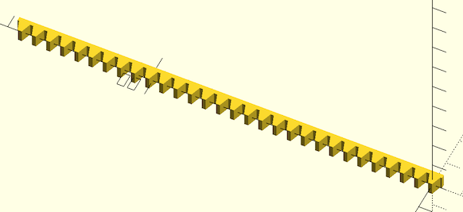

# Public Domain Parametric Involute Spur Gear and Rack
by Leemon Baird, 2011, Leemon@Leemon.com
With fixes by Revar Desmera, 2017, revarbat@gmail.com

The module `gear()` gives an involute spur gear, with reasonable
defaults for all the parameters.  Normally, you should just choose
the first 4 parameters, and let the rest be default values.  The
module `gear()` gives a gear in the XY plane, centered on the origin,
with one tooth centered on the positive Y axis.  The various functions
below it take the same parameters, and return various measurements
for the gear.  The most important is `pitch_radius`, which tells how
far apart to space gears that are meshing, and `adendum_radius`, which
gives the size of the region filled by the gear.  A gear has a
"pitch circle", which is an invisible circle that cuts through the
middle of each tooth (though not the exact center). In order for
two gears to mesh, their pitch circles should just touch.  So the
distance between their centers should be `pitch_radius()` for one,
plus `pitch_radius()` for the other, which gives the radii of their
pitch circles.

In order for two gears to mesh, they must have the same `mm_per_tooth`
and `pressure_angle` parameters.  `mm_per_tooth` gives the number of
millimeters of arc around the pitch circle covered by one tooth and
one space between teeth.  The pitch angle controls how flat or
bulged the sides of the teeth are.  Common values include 14.5
degrees and 20 degrees, and occasionally 25.  Though I've seen 28
recommended for plastic gears. Larger numbers bulge out more, giving
stronger teeth, so 28 degrees is the default here.  The ratio of
`number_of_teeth` for two meshing gears gives how many times one will
make a full revolution when the the other makes one full revolution.
If the two numbers are coprime (i.e.  are not both divisible by the
same number greater than 1), then every tooth on one gear will meet
every tooth on the other, for more even wear.  So coprime numbers
of teeth are good.  The module `rack()` gives a rack, which is a bar
with teeth.  A rack can mesh with any gear that has the same
`mm_per_tooth` and `pressure_angle`.

## Some Terminology: 
The outline of a gear is a smooth circle (the "pitch circle") which has
mountains and valleys added so it is toothed.  So there is an inner
circle (the "root circle") that touches the base of all the teeth, an
outer circle that touches the tips of all the teeth, and the invisible
pitch circle in between them.  There is also a "base circle", which can
be smaller than all three of the others, which controls the shape of
the teeth.  The side of each tooth lies on the path that the end of a
string would follow if it were wrapped tightly around the base circle,
then slowly unwound.  That shape is an "involute", which gives this
type of gear its name.

# Modules

## gear()
Creates a (potentially helical) involute spur gear.

Arg               | What it is
----------------- | -------------------------------------------
mm\_per\_tooth    | This is the "circular pitch", the circumference of the pitch circle divided by the number of teeth
number\_of\_teeth | Total number of teeth around the entire perimeter
thickness         | Thickness of gear in mm
hole\_diameter    | Diameter of the hole in the center, in mm
twist             | Teeth rotate this many degrees from bottom of gear to top.  360 makes the gear a screw with each thread going around once.
teeth\_to\_hide   | Number of teeth to delete to make this only a fraction of a circle
pressure\_angle   | Controls how straight or bulged the tooth sides are. In degrees.
clearance         | Gap between top of a tooth on one gear and bottom of valley on a meshing gear (in millimeters)
backlash          | Gap between two meshing teeth, in the direction along the circumference of the pitch circle

Example:

    gear(mm_per_tooth=5, number_of_teeth=20, thickness=5, hole_diameter=5);

## rack()
Creates a involute rack.

Arg               | What it is
----------------- | -------------------------------------------
mm\_per\_tooth    | This is the distance between rack teeth.
number\_of\_teeth | Total number of teeth in rack.
thickness         | Thickness of rack in mm.
height            | Height of rack in mm, from tooth top to back of rack.
pressure\_angle   | Controls how straight or bulged the tooth sides are. In degrees. (default 28)
backlash          | Gap between two meshing teeth, in the direction along the rack. (default 0)

Examples:

    rack(mm_per_tooth=5, number_of_teeth=30, thickness=5, height=5, pressure_angle=20);

# Functions

## circular\_pitch(mm\_per\_tooth)
Calculates the circular pitch from the `mm_per_tooth`.  Which is exactly equal to the `mm_per_tooth` value anyways.

Arg               | What it is
----------------- | -------------------------------------------
mm\_per\_tooth    | This is the distance between teeth of the gear along the circular pitch line.

## diametral\_pitch(mm\_per\_tooth)
Calculates the diametral pitch from the `mm_per_tooth`.

Arg               | What it is
----------------- | -------------------------------------------
mm\_per\_tooth    | This is the distance between teeth of the gear along the circular pitch line.

## adendum(mm\_per\_tooth)
Calculates the tooth adendum from the `mm_per_tooth`.

Arg               | What it is
----------------- | -------------------------------------------
mm\_per\_tooth    | This is the distance between teeth of the gear along the circular pitch line.

## dedendum(mm\_per\_tooth)
Calculates the tooth dedendum from the `mm_per_tooth`.

Arg               | What it is
----------------- | -------------------------------------------
mm\_per\_tooth    | This is the distance between teeth of the gear along the circular pitch line.

## module\_value(mm\_per\_tooth)
Calculate the gear "module" or "modulus" from the `mm_per_tooth`.

Arg               | What it is
----------------- | -------------------------------------------
mm\_per\_tooth    | This is the distance between teeth of the gear along the circular pitch line.

## pitch\_radius(mm\_per\_tooth, number\_of\_teeth)
Calculates the pitch padius from the `mm_per_tooth` and `number_of_teeth`.

Arg               | What it is
----------------- | -------------------------------------------
mm\_per\_tooth    | This is the distance between teeth of the gear along the circular pitch line.
number\_of\_teeth | Number of teeth in the spur gear.

## outer\_radius(mm\_per\_tooth, number\_of\_teeth, clearance)
The gear fits entirely within a cylinder of this radius.
Calculated from the `mm_per_tooth`, `number_of_teeth`, and `clearance`.

Arg               | What it is
----------------- | -------------------------------------------
mm\_per\_tooth    | This is the distance between teeth of the gear along the circular pitch line.
number\_of\_teeth | Number of teeth in the spur gear.
clearance         | Gap between top of a tooth on one gear and bottom of valley on a meshing gear (in millimeters) (default 0.1)

