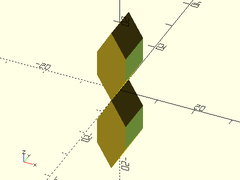
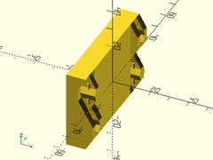
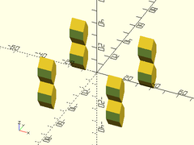

# Library File joiners.scad

Snap-together joiners.
To use, add the following lines to the beginning of your file:
```
include <BOSL/constants.scad>
use <BOSL/joiners.scad>
```

---

# Table of Contents

1. [Half Joiners](#1-half-joiners)
    - [`half_joiner_clear()`](#half_joiner_clear)
    - [`half_joiner()`](#half_joiner)
    - [`half_joiner2()`](#half_joiner2)

2. [Full Joiners](#2-full-joiners)
    - [`joiner_clear()`](#joiner_clear)
    - [`joiner()`](#joiner)

3. [Full Joiners Pairs/Sets](#3-full-joiners-pairssets)
    - [`joiner_pair_clear()`](#joiner_pair_clear)
    - [`joiner_pair()`](#joiner_pair)

4. [Full Joiners Quads/Sets](#4-full-joiners-quadssets)
    - [`joiner_quad_clear()`](#joiner_quad_clear)
    - [`joiner_quad()`](#joiner_quad)

---

# 1. Half Joiners

### half\_joiner\_clear()

**Usage**:
- half\_joiner\_clear(h, w, [a], [clearance], [overlap], [orient], [align])

**Description**:
Creates a mask to clear an area so that a half\_joiner can be placed there.

Argument        | What it does
--------------- | ------------------------------
`h`             | Height of the joiner to clear space for.
`w`             | Width of the joiner to clear space for.
`a`             | Overhang angle of the joiner.
`clearance`     | Extra width to clear.
`overlap`       | Extra depth to clear.
`orient`        | Orientation of the shape.  Use the `ORIENT_` constants from `constants.scad`.  Default: `ORIENT_Y`.
`align`         | Alignment of the shape by the axis-negative (size1) end.  Use the `V_` constants from `constants.scad`.  Default: `V_CENTER`.

**Example**:

    half_joiner_clear(orient=ORIENT_X);


---

### half\_joiner()

**Usage**:
- half\_joiner(h, w, l, [a], [screwsize], [guides], [slop], [orient], [align])

**Description**:
Creates a half\_joiner object that can be attached to half\_joiner2 object.

Argument        | What it does
--------------- | ------------------------------
`h`             | Height of the half\_joiner.
`w`             | Width of the half\_joiner.
`l`             | Length of the backing to the half\_joiner.
`a`             | Overhang angle of the half\_joiner.
`screwsize`     | Diameter of screwhole.
`guides`        | If true, create sliding alignment guides.
`slop`          | Printer specific slop value to make parts fit more closely.
`orient`        | Orientation of the shape.  Use the `ORIENT_` constants from `constants.scad`.  Default: `ORIENT_Y`.
`align`         | Alignment of the shape by the axis-negative (size1) end.  Use the `V_` constants from `constants.scad`.  Default: `V_CENTER`.

**Example**:

    half_joiner(screwsize=3, orient=ORIENT_X);


---

### half\_joiner2()

**Usage**:
- half\_joiner2(h, w, l, [a], [screwsize], [guides], [orient], [align])

**Description**:
Creates a half\_joiner2 object that can be attached to half\_joiner object.

Argument        | What it does
--------------- | ------------------------------
`h`             | Height of the half\_joiner.
`w`             | Width of the half\_joiner.
`l`             | Length of the backing to the half\_joiner.
`a`             | Overhang angle of the half\_joiner.
`screwsize`     | Diameter of screwhole.
`guides`        | If true, create sliding alignment guides.
`orient`        | Orientation of the shape.  Use the `ORIENT_` constants from `constants.scad`.  Default: `ORIENT_Y`.
`align`         | Alignment of the shape by the axis-negative (size1) end.  Use the `V_` constants from `constants.scad`.  Default: `V_CENTER`.

**Example**:

    half_joiner2(screwsize=3, orient=ORIENT_X);


---

# 2. Full Joiners

### joiner\_clear()

**Usage**:
- joiner\_clear(h, w, [a], [clearance], [overlap], [orient], [align])

**Description**:
Creates a mask to clear an area so that a joiner can be placed there.

Argument        | What it does
--------------- | ------------------------------
`h`             | Height of the joiner to clear space for.
`w`             | Width of the joiner to clear space for.
`a`             | Overhang angle of the joiner.
`clearance`     | Extra width to clear.
`overlap`       | Extra depth to clear.
`orient`        | Orientation of the shape.  Use the `ORIENT_` constants from `constants.scad`.  Default: `ORIENT_Y`.
`align`         | Alignment of the shape by the axis-negative (size1) end.  Use the `V_` constants from `constants.scad`.  Default: `V_CENTER`.

**Example**:

    joiner_clear(orient=ORIENT_X);



---

### joiner()

**Usage**:
- joiner(h, w, l, [a], [screwsize], [guides], [slop], [orient], [align])

**Description**:
Creates a joiner object that can be attached to another joiner object.

Argument        | What it does
--------------- | ------------------------------
`h`             | Height of the joiner.
`w`             | Width of the joiner.
`l`             | Length of the backing to the joiner.
`a`             | Overhang angle of the joiner.
`screwsize`     | Diameter of screwhole.
`guides`        | If true, create sliding alignment guides.
`slop`          | Printer specific slop value to make parts fit more closely.
`orient`        | Orientation of the shape.  Use the `ORIENT_` constants from `constants.scad`.  Default: `ORIENT_Y`.
`align`         | Alignment of the shape by the axis-negative (size1) end.  Use the `V_` constants from `constants.scad`.  Default: `V_CENTER`.

**Example 1**:

    joiner(screwsize=3, orient=ORIENT_X);


**Example 2**:

    joiner(w=10, l=10, h=40, orient=ORIENT_X) cuboid([10, 10*2, 40], align=V_LEFT);


---

# 3. Full Joiners Pairs/Sets

### joiner\_pair\_clear()

**Usage**:
- joiner\_pair\_clear(spacing, [n], [h], [w], [a], [clearance], [overlap], [orient], [align])

**Description**:
Creates a mask to clear an area so that a pair of joiners can be placed there.

Argument        | What it does
--------------- | ------------------------------
`spacing`       | Spacing between joiner centers.
`h`             | Height of the joiner to clear space for.
`w`             | Width of the joiner to clear space for.
`a`             | Overhang angle of the joiner.
`n`             | Number of joiners (2 by default) to clear for.
`clearance`     | Extra width to clear.
`overlap`       | Extra depth to clear.
`orient`        | Orientation of the shape.  Use the `ORIENT_` constants from `constants.scad`.  Default: `ORIENT_Y`.
`align`         | Alignment of the shape by the axis-negative (size1) end.  Use the `V_` constants from `constants.scad`.  Default: `V_CENTER`.

**Example 1**:

    joiner_pair_clear(spacing=50, n=2);


**Example 2**:

    joiner_pair_clear(spacing=50, n=3);


---

### joiner\_pair()

**Usage**:
- joiner\_pair(h, w, l, [a], [screwsize], [guides], [slop], [orient], [align])

**Description**:
Creates a joiner\_pair object that can be attached to other joiner\_pairs .

Argument        | What it does
--------------- | ------------------------------
`spacing`       | Spacing between joiner centers.
`h`             | Height of the joiners.
`w`             | Width of the joiners.
`l`             | Length of the backing to the joiners.
`a`             | Overhang angle of the joiners.
`n`             | Number of joiners in a row.  Default: 2
`alternate`     | If true (default), each joiner alternates it's orientation.  If alternate is "alt", do opposite alternating orientations.
`screwsize`     | Diameter of screwhole.
`guides`        | If true, create sliding alignment guides.
`slop`          | Printer specific slop value to make parts fit more closely.
`orient`        | Orientation of the shape.  Use the `ORIENT_` constants from `constants.scad`.  Default: `ORIENT_Y`.
`align`         | Alignment of the shape by the axis-negative (size1) end.  Use the `V_` constants from `constants.scad`.  Default: `V_CENTER`.

**Example 1**:

    joiner_pair(spacing=50, l=10, orient=ORIENT_X) cuboid([10, 50+10-0.1, 40], align=V_LEFT);



**Example 2**:

    joiner_pair(spacing=50, l=10, n=2, orient=ORIENT_X);


**Example 3**:

    joiner_pair(spacing=50, l=10, n=3, alternate=false, orient=ORIENT_X);


**Example 4**:

    joiner_pair(spacing=50, l=10, n=3, alternate=true, orient=ORIENT_X);


**Example 5**:

    joiner_pair(spacing=50, l=10, n=3, alternate="alt", orient=ORIENT_X);


---

# 4. Full Joiners Quads/Sets

### joiner\_quad\_clear()

**Usage**:
- joiner\_quad\_clear(spacing, [n], [h], [w], [a], [clearance], [overlap], [orient], [align])

**Description**:
Creates a mask to clear an area so that a pair of joiners can be placed there.

Argument        | What it does
--------------- | ------------------------------
`spacing1`      | Spacing between joiner centers.
`spacing2`      | Spacing between back-to-back pairs/sets of joiners.
`h`             | Height of the joiner to clear space for.
`w`             | Width of the joiner to clear space for.
`a`             | Overhang angle of the joiner.
`n`             | Number of joiners in a row.  Default: 2
`clearance`     | Extra width to clear.
`overlap`       | Extra depth to clear.
`orient`        | Orientation of the shape.  Use the `ORIENT_` constants from `constants.scad`.  Default: `ORIENT_Y`.
`align`         | Alignment of the shape by the axis-negative (size1) end.  Use the `V_` constants from `constants.scad`.  Default: `V_CENTER`.

**Example 1**:

    joiner_quad_clear(spacing1=50, spacing2=50, n=2);



**Example 2**:

    joiner_quad_clear(spacing1=50, spacing2=50, n=3);


---

### joiner\_quad()

**Usage**:
- joiner\_quad(h, w, l, [a], [screwsize], [guides], [slop], [orient], [align])

**Description**:
Creates a joiner\_quad object that can be attached to other joiner\_pairs .

Argument        | What it does
--------------- | ------------------------------
`spacing`       | Spacing between joiner centers.
`h`             | Height of the joiners.
`w`             | Width of the joiners.
`l`             | Length of the backing to the joiners.
`a`             | Overhang angle of the joiners.
`n`             | Number of joiners in a row.  Default: 2
`alternate`     | If true (default), each joiner alternates it's orientation.  If alternate is "alt", do opposite alternating orientations.
`screwsize`     | Diameter of screwhole.
`guides`        | If true, create sliding alignment guides.
`slop`          | Printer specific slop value to make parts fit more closely.
`orient`        | Orientation of the shape.  Use the `ORIENT_` constants from `constants.scad`.  Default: `ORIENT_Y`.
`align`         | Alignment of the shape by the axis-negative (size1) end.  Use the `V_` constants from `constants.scad`.  Default: `V_CENTER`.

**Example 1**:

    joiner_quad(spacing1=50, spacing2=50, l=10, orient=ORIENT_X) cuboid([50, 50+10-0.1, 40]);


**Example 2**:

    joiner_quad(spacing1=50, spacing2=50, l=10, n=2, orient=ORIENT_X);


**Example 3**:

    joiner_quad(spacing1=50, spacing2=50, l=10, n=3, alternate=false, orient=ORIENT_X);


**Example 4**:

    joiner_quad(spacing1=50, spacing2=50, l=10, n=3, alternate=true, orient=ORIENT_X);


**Example 5**:

    joiner_quad(spacing1=50, spacing2=50, l=10, n=3, alternate="alt", orient=ORIENT_X);


---

