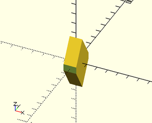
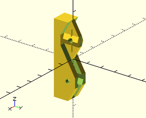

# Snap-together joiners
These joiners are useful for making snap-together parts.

## half\_joiner\_clear()

Creates a shape used to clear a volume to prepare to place a `half_joiner()` or `half_joiner2()`

Arg       | What it is
--------- | ------------------------
h         | Height of joiner.
w         | Width of joiner.
a         | Overhang angle of joiner in degrees.  (default 30)
clearance | Extra side clearance for joiner.  (default 0)

Example:

    difference() {
        cube(size=30, center=true);
        back(15) half_joiner_clear(h=30, w=10, clearance=2);
    }

## half\_joiner()

Creates a joiner shape that is designed to mate with a `half_joiner2()` shape.

Arg       | What it is
--------- | ------------------------
h         | Height of joiner.
w         | Width of joiner.
l         | Length extended from the back of the joiner.
a         | Overhang angle of joiner in degrees.  (default 30)
screwsize | Size of screwhole through the joiner. (default none)
guides    | If true (default), add guides to center mating of joiners.
slop      | Slight adjustment spacing to allow for vagarities of various printers.

Example:

    union() {
        difference() {
            cube(size=30, center=true);
            back(15) half_joiner_clear(h=30, w=10, clearance=2);
        }
        back(15) half_joiner(h=30, w=10, l=15, screwsize=3);
    }

## half\_joiner2()

Creates a joiner shape that is designed to mate with a `half_joiner()` shape.

Arg       | What it is
--------- | ------------------------
h         | Height of joiner.
w         | Width of joiner.
l         | Length extended from the back of the joiner.
a         | Overhang angle of joiner in degrees.  (default 30)
screwsize | Size of screwhole through the joiner. (default none)
guides    | If true (default), add guides to center mating of joiners.
slop      | Slight adjustment spacing to allow for vagarities of various printers.

Example:

    union() {
        difference() {
            cube(size=30, center=true);
            back(15) half_joiner_clear(h=30, w=10, clearance=2);
        }
        back(15) half_joiner2(h=30, w=10, l=15, screwsize=3);
    }

## joiner\_clear()

Creates a shape used to clear a volume to prepare to place a `joiner()`.

Arg       | What it is
--------- | ------------------------
h         | Height of joiner.
w         | Width of joiner.
a         | Overhang angle of joiner in degrees.  (default 30)
clearance | Extra side clearance for joiner.  (default 0)

Example:

    difference() {
        cube(size=50, center=true);
        back(25) joiner_clear(h=50, w=10, clearance=2);
    }

## joiner()

Creates a joiner shape that is designed to mate with another rotated `joiner()` shape.

Arg       | What it is
--------- | ------------------------
h         | Height of joiner.
w         | Width of joiner.
l         | Length extended from the back of the joiner.
a         | Overhang angle of joiner in degrees.  (default 30)
screwsize | Size of screwhole through the joiner. (default none)
guides    | If true (default), add guides to center mating of joiners.
slop      | Slight adjustment spacing to allow for vagarities of various printers.

Example:

    union() {
        difference() {
            cube(size=50, center=true);
            back(25) joiner_clear(h=50, w=10, clearance=2);
        }
        back(25) joiner(h=50, w=10, l=10, screwsize=3);
    }

## joiner\_pair\_clear()

Creates shapes used to clear a volume to prepare to place a `joiner_pair()`.

Arg       | What it is
--------- | ------------------------
spacing   | Spacing along X axis between the pair of joiners.
h         | Height of joiner.
w         | Width of joiner.
a         | Overhang angle of joiner in degrees.  (default 30)
clearance | Extra side clearance for joiner.  (default 0)

Example:

    difference() {
        cube(size=50, center=true);
        joiner_pair_clear(spacing=40, h=50, w=10, clearance=2);
    }

## joiner\_pair()

Creates a pair of joiner shapes that are designed to mate with another `joiner_pair()`.

Arg       | What it is
--------- | ------------------------
spacing   | Spacing along X axis between the pair of joiners.
h         | Height of joiner.
w         | Width of joiner.
l         | Length extended from the back of the joiner.
a         | Overhang angle of joiner in degrees.  (default 30)
screwsize | Size of screwhole through the joiner. (default none)
guides    | If true (default), add guides to center mating of joiners.
slop      | Slight adjustment spacing to allow for vagarities of various printers.

Example:

    union() {
        difference() {
            cube(size=50, center=true);
            joiner_pair_clear(spacing=40, h=50, w=10, clearance=2);
        }
        joiner_pair(spacing=40, h=50, w=10, l=10, screwsize=3);
    }

## joiner\_quad\_clear()

Creates shapes used to clear a volume to prepare to place a `joiner_quad()`.

Arg       | What it is
--------- | ------------------------
xspacing  | Spacing along X axis between pairs of joiners.
yspacing  | Spacing along Y axis between opposing pairs of joiners.
h         | Height of joiner.
w         | Width of joiner.
a         | Overhang angle of joiner in degrees.  (default 30)
clearance | Extra side clearance for joiner.  (default 0)

Example:

    difference() {
        cube(size=50, center=true);
        joiner_quad_clear(xspacing=40, yspacing=50, h=50, w=10, clearance=2);
    }

## joiner\_quad()

Creates two pairs of opposing joiner shapes that are designed to mate with other `joiner_pair()`s.

Arg       | What it is
--------- | ------------------------
xspacing  | Spacing along X axis between pairs of joiners.
yspacing  | Spacing along Y axis between opposing pairs of joiners.
h         | Height of joiner.
w         | Width of joiner.
l         | Length extended from the back of the joiner.
a         | Overhang angle of joiner in degrees.  (default 30)
screwsize | Size of screwhole through the joiner. (default none)
guides    | If true (default), add guides to center mating of joiners.
slop      | Slight adjustment spacing to allow for vagarities of various printers.

Example:

    union() {
        difference() {
            cube(size=50, center=true);
            joiner_quad_clear(xspacing=40, yspacing=50, h=50, w=10, clearance=2);
        }
        joiner_quad(xspacing=40, yspacing=50, h=50, w=10, l=10, screwsize=3);
    }

