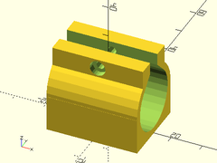

Linear Bearings.

# Table of Contents

- [Functions](#functions)
    - [`get_lmXuu_bearing_diam(size)`](#get_lmxuu_bearing_diamsize)
    - [`get_lmXuu_bearing_length(size)`](#get_lmxuu_bearing_lengthsize)
- [Modules](#modules)
    - [`linear_bearing_housing()`](#linear_bearing_housing)
    - [`lmXuu_housing()`](#lmxuu_housing)

# Functions

## get\_lmXuu\_bearing\_diam(size)
Given a shaft diameter, returns the outer diameter of the standard LMxUU
linear bearing for that shaft.

## get\_lmXuu\_bearing\_length(size)
Given a shaft diameter, returns the length of the standard LMxUU
linear bearing for that shaft.

# Modules

## linear\_bearing\_housing()
Creates a model of a clamp to hold an arbitrary linear bearing cartridge.

Arg       | What it is
--------- | -------------------------------
d         | Diameter of linear bearing. (Default: 15)
l         | Length of linear bearing. (Default: 24)
tab       | Clamp tab height. (Default: 7)
tabwall   | Clamp Tab thickness. (Default: 5)
wall      | Wall thickness of clamp housing. (Default: 3)
gap       | Gap in clamp. (Default: 5)
screwsize | Size of screw to use to tighten clamp. (Default: 3)

Examples:

    linear_bearing_housing(d=15, l=24);

    linear_bearing_housing(d=19, l=29, wall=2, tab=6, screwsize=2.5);

## lmXuu\_housing()
Creates a model of a clamp to hold a LMxUU linear bearing cartridge.

Arg       | What it is
--------- | -------------------------------
size      | Shaft diameter that LMxUU bearing is for.
tab       | Clamp tab height. (Default: 7)
tabwall   | Clamp Tab thickness. (Default: 5)
wall      | Wall thickness of clamp housing. (Default: 3)
gap       | Gap in clamp. (Default: 5)
screwsize | Size of screw to use to tighten clamp. (Default: 3)

Examples:

	lmXuu_housing(size=8);

	lmXuu_housing(size=10, wall=2, tab=6, screwsize=2.5);

