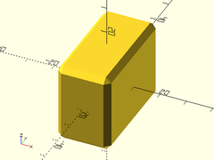
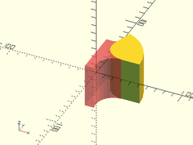

# Library File masks.scad

Masking shapes.
To use, add the following lines to the beginning of your file:
```
include <BOSL/constants.scad>
use <BOSL/masks.scad>
```

---

# Table of Contents

1. [General Masks](#1-general-masks)
    - [`angle_pie_mask()`](#angle_pie_mask)
    - [`cylinder_mask()`](#cylinder_mask)

2. [Chamfers](#2-chamfers)
    - [`chamfer_mask()`](#chamfer_mask)
    - [`chamfer_mask_x()`](#chamfer_mask_x)
    - [`chamfer_mask_y()`](#chamfer_mask_y)
    - [`chamfer_mask_z()`](#chamfer_mask_z)
    - [`chamfer()`](#chamfer)
    - [`chamfer_cylinder_mask()`](#chamfer_cylinder_mask)
    - [`chamfer_hole_mask()`](#chamfer_hole_mask)

3. [Filleting/Rounding](#3-filletingrounding)
    - [`fillet_mask()`](#fillet_mask)
    - [`fillet_mask_x()`](#fillet_mask_x)
    - [`fillet_mask_y()`](#fillet_mask_y)
    - [`fillet_mask_z()`](#fillet_mask_z)
    - [`fillet()`](#fillet)
    - [`fillet_angled_edge_mask()`](#fillet_angled_edge_mask)
    - [`fillet_angled_corner_mask()`](#fillet_angled_corner_mask)
    - [`fillet_corner_mask()`](#fillet_corner_mask)
    - [`fillet_cylinder_mask()`](#fillet_cylinder_mask)
    - [`fillet_hole_mask()`](#fillet_hole_mask)

---

# 1. General Masks

### angle\_pie\_mask()

**Usage**:
- angle\_pie\_mask(r|d, l, ang, [orient], [align], [center]);
- angle\_pie\_mask(r1|d1, r2|d2, l, ang, [orient], [align], [center]);

**Description**:
Creates a pie wedge shape that can be used to mask other shapes.

Argument        | What it does
--------------- | ------------------------------
`ang`           | angle of wedge in degrees.
`l`             | height of wedge.
`r`             | Radius of circle wedge is created from. (optional)
`r1`            | Bottom radius of cone that wedge is created from.  (optional)
`r2`            | Upper radius of cone that wedge is created from.  (optional)
`d`             | Diameter of circle wedge is created from. (optional)
`d1`            | Bottom diameter of cone that wedge is created from.  (optional)
`d2`            | Upper diameter of cone that wedge is created from. (optional)
`orient`        | Orientation of the pie slice.  Use the ORIENT\_ constants from constants.h.  Default: ORIENT\_Z.
`align`         | Alignment of the pie slice.  Use the V\_ constants from constants.h.  Default: V\_CENTER.
`center`        | If true, centers vertically.  If false, lift up to sit on top of the XY plane.  Overrides `align`.

**Example**:

    angle_pie_mask(ang=30, d=100, l=20);


---

### cylinder\_mask()

**Mask objects**:
- cylinder\_mask(l, r|d, chamfer, [chamfang], [from\_end], [circum], [overage], [ends\_only], [orient], [align]);
- cylinder\_mask(l, r|d, fillet, [circum], [overage], [ends\_only], [orient], [align]);
- cylinder\_mask(l, r|d, [chamfer1|fillet1], [chamfer2|fillet2], [chamfang1], [chamfang2], [from\_end], [circum], [overage], [ends\_only], [orient], [align]);

**Masking operators**:
- cylinder\_mask(l, r|d, chamfer, [chamfang], [from\_end], [circum], [overage], [ends\_only], [orient], [align]) ...
- cylinder\_mask(l, r|d, fillet, [circum], [overage], [ends\_only], [orient], [align]) ...
- cylinder\_mask(l, r|d, [chamfer1|fillet1], [chamfer2|fillet2], [chamfang1], [chamfang2], [from\_end], [circum], [overage], [ends\_only], [orient], [align]) ...

**Description**:
If passed children, bevels/chamfers and/or rounds/fillets one or
both ends of the origin-centered cylindrical region specified.  If
passed no children, creates a mask to bevel/chamfer and/or round/fillet
one or both ends of the cylindrical region.  Difference the mask
from the region, making sure the center of the mask object is align
exactly with the center of the cylindrical region to be chamferred.

Argument        | What it does
--------------- | ------------------------------
`l`             | Length of the cylindrical/conical region.
`r`             | Radius of cylindrical region to chamfer.
`r1`            | Radius of axis-negative end of the region to chamfer.
`r2`            | Radius of axis-positive end of the region to chamfer.
`d`             | Diameter of cylindrical region to chamfer.
`d1`            | Diameter of axis-negative end of the region to chamfer.
`d1`            | Diameter of axis-positive end of the region to chamfer.
`chamfer`       | Size of the chamfers/bevels. (Default: 0.25)
`chamfer1`      | Size of the chamfers/bevels for the axis-negative end of the region.
`chamfer2`      | Size of the chamfers/bevels for the axis-positive end of the region.
`chamfang`      | Angle of chamfers/bevels in degrees from the length axis of the region.  (Default: 45)
`chamfang1`     | Angle of chamfer/bevel of the axis-negative end of the region, in degrees from the length axis.
`chamfang2`     | Angle of chamfer/bevel of the axis-positive end of the region, in degrees from the length axis.
`fillet`        | The radius of the fillets on the ends of the region.  Default: none.
`fillet1`       | The radius of the fillet on the axis-negative end of the region.
`fillet2`       | The radius of the fillet on the axis-positive end of the region.
`circum`        | If true, region will circumscribe the circle of the given radius/diameter.
`from_end`      | If true, chamfer/bevel size is measured from end of region.  If false, chamfer/bevel is measured outset from the radius of the region.  (Default: false)
`overage`       | The extra thickness of the mask.  Default: `10`.
`ends_only`     | If true, only mask the ends and not around the middle of the cylinder.
`orient`        | Orientation.  Use the `ORIENT_` constants from `constants.scad`.  Default: `ORIENT_Z`.
`align`         | Alignment of the region.  Use the `V_` constants from `constants.scad`.  Default: `V_CENTER`.

**Example 1**:

    difference() {
        cylinder(h=100, r1=60, r2=30, center=true);
        cylinder_mask(l=100, r1=60, r2=30, chamfer=10, from_end=true);
    }


**Example 2**:

    cylinder_mask(l=100, r=50, chamfer1=10, fillet2=10) {
        cube([100,50,100], center=true);
    }


---

# 2. Chamfers

### chamfer\_mask()

**Usage**:
- chamfer\_mask(l, chamfer, [orient], [align], [center]);

**Description**:
Creates a shape that can be used to chamfer a 90 degree edge.
Difference it from the object to be chamfered.  The center of
the mask object should align exactly with the edge to be chamfered.

Argument        | What it does
--------------- | ------------------------------
`l`             | Length of mask.
`chamfer`       | Size of chamfer
`orient`        | Orientation of the mask.  Use the `ORIENT_` constants from `constants.h`.  Default: vertical.
`align`         | Alignment of the mask.  Use the `V_` constants from `constants.h`.  Default: centered.
`center`        | If true, centers vertically.  If false, lift up to sit on top of the XY plane.  Overrides `align`.

**Example**:

    difference() {
        cube(50);
        #chamfer_mask(l=50, chamfer=10, orient=ORIENT_X, align=V_RIGHT);
    }


---

### chamfer\_mask\_x()

**Usage**:
- chamfer\_mask\_x(l, chamfer, [align]);

**Description**:
Creates a shape that can be used to chamfer a 90 degree edge along the X axis.
Difference it from the object to be chamfered.  The center of the mask
object should align exactly with the edge to be chamfered.

Argument        | What it does
--------------- | ------------------------------
`l`             | Height of mask
`chamfer`       | size of chamfer
`align`         | Alignment of the cylinder.  Use the V\_ constants from constants.h.  Default: centered.

**Example**:

    difference() {
        left(40) cube(80);
        #chamfer_mask_x(l=80, chamfer=20);
    }


---

### chamfer\_mask\_y()

**Usage**:
- chamfer\_mask\_y(l, chamfer, [align]);

**Description**:
Creates a shape that can be used to chamfer a 90 degree edge along the Y axis.
Difference it from the object to be chamfered.  The center of the mask
object should align exactly with the edge to be chamfered.

Argument        | What it does
--------------- | ------------------------------
`l`             | Height of mask
`chamfer`       | size of chamfer
`align`         | Alignment of the cylinder.  Use the V\_ constants from constants.h.  Default: centered.

**Example**:

    difference() {
        fwd(40) cube(80);
        right(80) #chamfer_mask_y(l=80, chamfer=20);
    }


---

### chamfer\_mask\_z()

**Usage**:
- chamfer\_mask\_z(l, chamfer, [align]);

**Description**:
Creates a shape that can be used to chamfer a 90 degree edge along the Z axis.
Difference it from the object to be chamfered.  The center of the mask
object should align exactly with the edge to be chamfered.

Argument        | What it does
--------------- | ------------------------------
`l`             | Height of mask
`chamfer`       | size of chamfer
`align`         | Alignment of the cylinder.  Use the V\_ constants from constants.h.  Default: centered.

**Example**:

    difference() {
        down(40) cube(80);
        #chamfer_mask_z(l=80, chamfer=20);
    }


---

### chamfer()

**Usage**:
- chamfer(chamfer, size, [edges]) ...

**Description**:
Chamfers the edges of a cuboid region containing childrem, centered on the origin.
You should use `EDGE` constants from `constants.scad` with the `edge` argument.
However, if you must handle it raw, the edge ordering is this:
    [
        [Y+Z+, Y-Z+, Y-Z-, Y+Z-],
        [X+Z+, X-Z+, X-Z-, X+Z-],
        [X+Y+, X-Y+, X-Y-, X+Y-]
    ]

Argument        | What it does
--------------- | ------------------------------
`chamfer`       | Inset of the chamfer from the edge. (Default: 1)
`size`          | The size of the rectangular cuboid we want to chamfer.
`edges`         | Which edges do we want to chamfer.  Recommend to use EDGE constants from constants.scad.

**Example 1**:

    chamfer(chamfer=2, size=[20,40,30]) {
      cube(size=[20,40,30], center=true);
    }



**Example 2**:

    chamfer(chamfer=2, size=[20,40,30], edges=EDGES_TOP - EDGE_TOP_LF + EDGE_FR_RT) {
      cube(size=[20,40,30], center=true);
    }


---

### chamfer\_cylinder\_mask()

**Usage**:
- chamfer\_cylinder\_mask(r|d, chamfer, [ang], [from\_end], [orient])

**Description**:
Create a mask that can be used to bevel/chamfer the end of a cylindrical region.
Difference it from the end of the region to be chamferred.  The center of the mask
object should align exactly with the center of the end of the cylindrical region
to be chamferred.

Argument        | What it does
--------------- | ------------------------------
`r`             | Radius of cylinder to chamfer.
`d`             | Diameter of cylinder to chamfer. Use instead of r.
`chamfer`       | Size of the edge chamferred, inset from edge. (Default: 0.25)
`ang`           | Angle of chamfer in degrees from vertical.  (Default: 45)
`from_end`      | If true, chamfer size is measured from end of cylinder.  If false, chamfer is measured outset from the radius of the cylinder.  (Default: false)
`orient`        | Orientation of the mask.  Use the `ORIENT_` constants from `constants.h`.  Default: ORIENT\_Z.

**Example**:

    difference() {
        cylinder(r=50, h=100, center=true);
        up(50) #chamfer_cylinder_mask(r=50, chamfer=10);
    }


---

### chamfer\_hole\_mask()

**Usage**:
- chamfer\_hole\_mask(r|d, chamfer, [ang], [from\_end]);

**Description**:
Create a mask that can be used to bevel/chamfer the end of a cylindrical hole.
Difference it from the hole to be chamferred.  The center of the mask object
should align exactly with the center of the end of the hole to be chamferred.

Argument        | What it does
--------------- | ------------------------------
`r`             | Radius of hole to chamfer.
`d`             | Diameter of hole to chamfer. Use instead of r.
`chamfer`       | Size of the chamfer. (Default: 0.25)
`ang`           | Angle of chamfer in degrees from vertical.  (Default: 45)
`from_end`      | If true, chamfer size is measured from end of hole.  If false, chamfer is measured outset from the radius of the hole.  (Default: false)
`overage`       | The extra thickness of the mask.  Default: `0.1`.

**Example 1**:

    difference() {
        cube(100, center=true);
        cylinder(d=50, h=100.1, center=true);
        up(50) #chamfer_hole_mask(d=50, chamfer=10);
    }


**Example 2**:

    chamfer_hole_mask(d=100, chamfer=25, ang=30, overage=10);


---

# 3. Filleting/Rounding

### fillet\_mask()

**Usage**:
- fillet\_mask(l|h, r, [orient], [align], [center])

**Description**:
Creates a shape that can be used to fillet a vertical 90 degree edge.
Difference it from the object to be filletted.  The center of the mask
object should align exactly with the edge to be filletted.

Argument        | What it does
--------------- | ------------------------------
`l`             | Length of mask.
`r`             | Radius of the fillet.
`orient`        | Orientation of the mask.  Use the `ORIENT_` constants from `constants.h`.  Default: vertical.
`align`         | Alignment of the mask.  Use the `V_` constants from `constants.h`.  Default: centered.
`center`        | If true, centers vertically.  If false, lift up to sit on top of the XY plane.  Overrides `align`.

**Example**:

    difference() {
        cube(size=100, center=false);
        #fillet_mask(l=100, r=25, orient=ORIENT_Z, align=V_UP);
    }


---

### fillet\_mask\_x()

**Usage**:
- fillet\_mask\_x(l, r, [align], [center])

**Description**:
Creates a shape that can be used to fillet a 90 degree edge oriented
along the X axis.  Difference it from the object to be filletted.
The center of the mask object should align exactly with the edge to
be filletted.

Argument        | What it does
--------------- | ------------------------------
`l`             | Length of mask.
`r`             | Radius of the fillet.
`align`         | Alignment of the mask.  Use the `V_` constants from `constants.h`.  Default: centered.
`center`        | If true, centers vertically.  If false, lift up to sit on top of the XY plane.  Overrides `align`.

**Example**:

    difference() {
        cube(size=100, center=false);
        #fillet_mask_x(l=100, r=25, align=V_RIGHT);
    }


---

### fillet\_mask\_y()

**Usage**:
- fillet\_mask\_y(l, r, [align], [center])

**Description**:
Creates a shape that can be used to fillet a 90 degree edge oriented
along the Y axis.  Difference it from the object to be filletted.
The center of the mask object should align exactly with the edge to
be filletted.

Argument        | What it does
--------------- | ------------------------------
`l`             | Length of mask.
`r`             | Radius of the fillet.
`align`         | Alignment of the mask.  Use the `V_` constants from `constants.h`.  Default: centered.
`center`        | If true, centers vertically.  If false, lift up to sit on top of the XY plane.  Overrides `align`.

**Example**:

    difference() {
        cube(size=100, center=false);
        right(100) #fillet_mask_y(l=100, r=25, align=V_BACK);
    }


---

### fillet\_mask\_z()

**Usage**:
- fillet\_mask\_z(l, r, [align], [center])

**Description**:
Creates a shape that can be used to fillet a 90 degree edge oriented
along the Z axis.  Difference it from the object to be filletted.
The center of the mask object should align exactly with the edge to
be filletted.

Argument        | What it does
--------------- | ------------------------------
`l`             | Length of mask.
`r`             | Radius of the fillet.
`align`         | Alignment of the mask.  Use the `V_` constants from `constants.h`.  Default: centered.
`center`        | If true, centers vertically.  If false, lift up to sit on top of the XY plane.  Overrides `align`.

**Example**:

    difference() {
        cube(size=100, center=false);
        #fillet_mask_z(l=100, r=25, align=V_UP);
    }


---

### fillet()

**Usage**:
- fillet(fillet, size, [edges]) ...

**Description**:
Fillets the edges of a cuboid region containing the given children.
You should use `EDGE` constants from `constants.scad` with the `edge` argument.
However, if you must handle it raw, the edge ordering is this:
    [
        [Y+Z+, Y-Z+, Y-Z-, Y+Z-],
        [X+Z+, X-Z+, X-Z-, X+Z-],
        [X+Y+, X-Y+, X-Y-, X+Y-]
    ]

Argument        | What it does
--------------- | ------------------------------
`fillet`        | Radius of the fillet. (Default: 1)
`size`          | The size of the rectangular cuboid we want to chamfer.
`edges`         | Which edges do we want to chamfer.  Recommend to use EDGE constants from constants.scad.

**Example 1**:

    fillet(fillet=10, size=[50,100,150], $fn=24) {
      cube(size=[50,100,150], center=true);
    }


**Example 2**:

    fillet(fillet=10, size=[50,50,75], edges=EDGES_TOP - EDGE_TOP_LF + EDGE_FR_RT, $fn=24) {
      cube(size=[50,50,75], center=true);
    }


---

### fillet\_angled\_edge\_mask()

**Usage**:
- fillet\_angled\_edge\_mask(h, r, [ang], [center]);

**Description**:
Creates a vertical mask that can be used to fillet the edge where two
face meet, at any arbitrary angle.  Difference it from the object to
be filletted.  The center of the mask should align exactly with the
edge to be filletted.

Argument        | What it does
--------------- | ------------------------------
`h`             | height of vertical mask.
`r`             | radius of the fillet.
`ang`           | angle that the planes meet at.
`center`        | If true, vertically center mask.

**Example**:

    difference() {
        angle_pie_mask(ang=70, h=50, d=100);
        #fillet_angled_edge_mask(h=51, r=20.0, ang=70, $fn=32);
    }



---

### fillet\_angled\_corner\_mask()

**Usage**:
- fillet\_angled\_corner\_mask(fillet, ang);

**Description**:
Creates a shape that can be used to fillet the corner of an angle.
Difference it from the object to be filletted.  The center of the mask
object should align exactly with the point of the corner to be filletted.

Argument        | What it does
--------------- | ------------------------------
`fillet`        | radius of the fillet.
`ang`           | angle between planes that you need to fillet the corner of.

**Example**:

    ang=60;
    difference() {
        angle_pie_mask(ang=ang, h=50, r=200);
        up(50/2) {
            #fillet_angled_corner_mask(fillet=20, ang=ang);
            zrot_copies([0, ang]) right(200/2) fillet_mask_x(l=200, r=20);
        }
        fillet_angled_edge_mask(h=51, r=20, ang=ang);
    }


---

### fillet\_corner\_mask()

**Usage**:
- fillet\_corner\_mask(r);

**Description**:
Creates a shape that you can use to round 90 degree corners on a fillet.
Difference it from the object to be filletted.  The center of the mask
object should align exactly with the corner to be filletted.

Argument        | What it does
--------------- | ------------------------------
`r`             | radius of corner fillet.

**Example 1**:

    fillet_corner_mask(r=20.0);


**Example 2**:

    difference() {
      cube(size=[30, 50, 80], center=true);
      translate([0, 25, 40]) fillet_mask_x(l=31, r=15);
      translate([15, 0, 40]) fillet_mask_y(l=51, r=15);
      translate([15, 25, 0]) fillet_mask_z(l=81, r=15);
      translate([15, 25, 40]) #fillet_corner_mask(r=15);
    }


---

### fillet\_cylinder\_mask()

**Usage**:
- fillet\_cylinder\_mask(r, fillet, [xtilt], [ytilt]);

**Description**:
Create a mask that can be used to round the end of a cylinder.
Difference it from the cylinder to be filletted.  The center of the
mask object should align exactly with the center of the end of the
cylinder to be filletted.

Argument        | What it does
--------------- | ------------------------------
`r`             | radius of cylinder to fillet. (Default: 1.0)
`fillet`        | radius of the edge filleting. (Default: 0.25)
`xtilt`         | angle of tilt of end of cylinder in the X direction. (Default: 0)
`ytilt`         | angle of tilt of end of cylinder in the Y direction. (Default: 0)

**Example 1**:

    difference() {
      cylinder(r=50, h=50, center=false);
      up(50) #fillet_cylinder_mask(r=50, fillet=10);
    }


**Example 2**:

    difference() {
      cylinder(r=50, h=100, center=false);
      up(75) fillet_cylinder_mask(r=50, fillet=10, xtilt=30);
    }


---

### fillet\_hole\_mask()

**Usage**:
- fillet\_hole\_mask(r|d, fillet, [xtilt], [ytilt]);

**Description**:
Create a mask that can be used to round the edge of a circular hole.
Difference it from the hole to be filletted.  The center of the
mask object should align exactly with the center of the end of the
hole to be filletted.

Argument        | What it does
--------------- | ------------------------------
`r`             | Radius of hole to fillet.
`d`             | Diameter of hole to fillet.
`fillet`        | Radius of the filleting. (Default: 0.25)
`xtilt`         | Angle of tilt of end of cylinder in the X direction. (Default: 0)
`ytilt`         | Angle of tilt of end of cylinder in the Y direction. (Default: 0)
`overage`       | The extra thickness of the mask.  Default: `0.1`.

**Example 1**:

    difference() {
      cube([150,150,100], center=true);
      cylinder(r=50, h=100.1, center=true);
      up(50) #fillet_hole_mask(r=50, fillet=10);
    }


**Example 2**:

    fillet_hole_mask(r=40, fillet=20, $fa=2, $fs=2);


---

