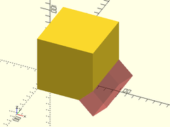
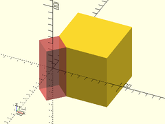
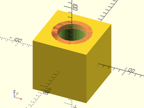
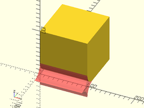

Shapes that are useful for masking with `difference()` and `intersect()`.

## Table of Contents

- [`angle_pie_mask()`](#angle_pie_mask)
- [`chamfer_mask_x()`](#chamfer_mask_x)
- [`chamfer_mask_y()`](#chamfer_mask_y)
- [`chamfer_mask_z()`](#chamfer_mask_z)
- [`chamfer() { ... }`](#chamfer---)
- [`chamfer_hole_mask()`](#chamfer_hole_mask)
- [`chamfer_cylinder_mask()`](#chamfer_cylinder_mask)
- [`chamfer_hole_mask()`](#chamfer_hole_mask)
- [`fillet_mask()`](#fillet_mask)
- [`fillet_mask_x()`](#fillet_mask_x)
- [`fillet_mask_y()`](#fillet_mask_y)
- [`fillet_mask_z()`](#fillet_mask_z)
- [`fillet() { ... }`](#fillet---)
- [`fillet_angled_edge_mask()`](#fillet_angled_edge_mask)
- [`fillet_angled_corner_mask()`](#fillet_angled_corner_mask)
- [`fillet_corner_mask()`](#fillet_corner_mask)
- [`fillet_cylinder_mask()`](#fillet_cylinder_mask)
- [`fillet_hole_mask()`](#fillet_hole_mask)

## angle\_pie\_mask()
Creates a pie wedge shape that can be used to mask other shapes. You must specify either `r` or `d`, or their `r1`/`r2`, `d1`/`d2` variants.

Arg | What it is
--- | ----------------------------------------------------------------
ang | angle of wedge in degrees.
h   | height of wedge.
r   | Radius of circle wedge is created from. (optional)
r1  | Bottom radius of cone that wedge is created from.  (optional)
r2  | Upper radius of cone that wedge is created from.  (optional)
d   | Diameter of circle wedge is created from. (optional)
d1  | Bottom diameter of cone that wedge is created from.  (optional)
d2  | Upper diameter of cone that wedge is created from. (optional)

Examples:

    angle_pie_mask(ang=30, h=20, d=100);
    angle_pie_mask(ang=35, h=30, d1=100, d2=60);
    angle_pie_mask(ang=45, h=25, r=50);
    angle_pie_mask(ang=60, h=30, r1=50, r2=30);

## chamfer\_mask\_x()
Creates a shape that can be used to chamfer a 90 degree edge along the X axis.
Difference it from the object to be chamfered.  The center of the mask
object should align exactly with the edge to be chamfered.

Arg     | What it is
------- | -----------------
l       | Length of mask
chamfer | Size of chamfer

Example:

    difference() {
        left(5) cube(10);
        chamfer_mask_x(l=10.1, chamfer=2.0);
    }

## chamfer\_mask\_y()
Creates a shape that can be used to chamfer a 90 degree edge along the Y axis.
Difference it from the object to be chamfered.  The center of the mask
object should align exactly with the edge to be chamfered.

Arg     | What it is
------- | -----------------
l       | Length of mask
chamfer | Size of chamfer

Example:

    difference() {
        fwd(5) cube(10);
        chamfer_mask_y(l=10.1, chamfer=2.0);
    }

## chamfer\_mask\_z()
Creates a shape that can be used to chamfer a 90 degree edge along the Z axis.
Difference it from the object to be chamfered.  The center of the mask
object should align exactly with the edge to be chamfered.

Arg     | What it is
------- | -----------------
l       | Length of mask
chamfer | Size of chamfer

Example:

    difference() {
        down(5) cube(10);
        chamfer_mask_z(l=10.1, chamfer=2.0);
    }

## chamfer() { ... }
Chamfers the edges of a cuboid region containing children.

Arg     | What it is
------- | -----------------
chamfer | inset of the chamfer from the edge. (Default: 1)
size    | The size of the rectangular cuboid we want to chamfer.
edges   | which edges do we want to chamfer.  Recommend using EDGE constants from `constants.scad`.

The easiest way to use the `edges` argument is with the EDGE 
constants from the file `constants.scad` like this:

    EDGES_LEFT + EDGE_TOP_BK - EDGE_FR_LF

or:

    EDGES_ALL - EDGE_BK_RT

NOTE: Because of OpenSCAD limitations, if you add two constants
that contain the same edge, `chamfer()` will still chamfer that
edge the same, but you may need to doubly remove that edge if
you don't actually want it chamferred.  ie:

    EDGES_TOP + EDGES_LEFT - EDGE_TOP_LF * 2

Otherwise, the array format of `edges` argument is as follows:

    [
        [Y+Z+, Y-Z+, Y-Z-, Y+Z-],
        [X+Z+, X-Z+, X-Z-, X+Z-],
        [X+Y+, X-Y+, X-Y-, X+Y-]
    ]

Examples:

    include <BOSL/constants.scad>
    chamfer(chamfer=2, size=[10,40,30], edges=EDGE_BOT_BK + EDGE_TOP_RT + EDGE_TOP_LF) {
        cube(size=[10,40,30], center=true);
    }

## chamfer\_hole\_mask()

Creates a mask that can be used to bevel/chamfer the edge of a circular hole.
Difference it from the hole to be chamferred.  The center of the mask object
should align exactly with the center of the end of the hole to be chamferred.

Arg     | What it is
------- | -----------------
r       | radius of hole to chamfer.
d       | Diameter of hole to chamfer. Use instead of r.
chamfer | size of the chamfer. (Default: 0.25)

Example:

    difference() {
        cube([150,150,100], center=true);
        cylinder(r=50, h=100.1, center=true);
        up(50) chamfer_hole_mask(r=50, chamfer=10);
    }

## chamfer\_cylinder\_mask()
- chamfer\_cylinder\_mask(r|d, chamfer, [ang], [from\_end])

Creates a mask that can be used to bevel/chamfer the end of a cylinder.
Difference it from the cylinder to be chamferred.  The center of the mask object
should align exactly with the center of the end of the cylinder to be chamferred.

Arg       | What it is
--------- | -----------------
r         | radius of cylinder to chamfer.
d         | Diameter of cylinder to chamfer. Use instead of r.
chamfer   | size of the chamfer, inset from edge. (Default: 0.25)
ang       | Angle of chamfer in degrees from top.  (Default: 45)
from\_end | If true, chamfer size is measured from end of cylinder.  If false, chamfer is measured inset from the radius of the cylinder.  (Default: false)

Example:

    difference() {
        cylinder(r=50, h=100, center=true);
        up(50) chamfer_cylinder_mask(r=50, chamfer=10);
    }

## chamfer\_hole\_mask()
- chamfer\_hole\_mask(r|d, chamfer, [ang], [from\_end])

Create a mask that can be used to bevel/chamfer the end of a cylindrical
hole.  Difference it from the object around the hole to be chamferred.
The center of the mask object should align exactly with the center of
the end of the hole to be chamferred.

Arg       | What it is
--------- | -----------------
r         | Radius of hole to chamfer.
d         | Diameter of hole to chamfer. Use instead of r.
chamfer   | Size of the chamfer, inset from edge. (Default: 0.25)
ang       | Angle of chamfer in degrees from vertical.  (Default: 45)
from\_end | If true, chamfer size is measured from end of hole.  If false, chamfer is measured outset from the radius of the hole.  (Default: false)

Example:

    $fa=2; $fs=2;
    difference() {
        cube(100, center=true);
        cylinder(d=50, h=100.1, center=true);
        up(50) chamfer_hole_mask(d=50, chamfer=10);
    }

## fillet\_mask()
Creates a shape that can be used to fillet a vertical 90 degree edge.
Difference it from the object to be filleted.  The center of the mask
object should align exactly with the edge to be filleted.

Arg     | What it is
------- | -----------------
h       | height of vertical mask.
r       | radius of the fillet.
center  | If true, vertically center mask.

Example:

    difference() {
        cube(size=100, center=false);
        fillet_mask(h=100.1, r=10.0, center=false);
    }

## fillet\_mask\_x()
Creates a shape that can be used to fillet a 90 degree edge along the X axis.
Difference it from the object to be filleted.  The center of the mask
object should align exactly with the edge to be filleted.

Arg     | What it is
------- | -----------------
l       | Length of mask.
r       | Radius of the fillet.

Example:

    difference() {
        cube(size=100, center=true);
        translate([0,50,50]) fillet_mask_x(l=100.1, r=10.0);
    }

## fillet\_mask\_y()
Creates a shape that can be used to fillet a 90 degree edge along the Y axis.
Difference it from the object to be filleted.  The center of the mask
object should align exactly with the edge to be filleted.

Arg     | What it is
------- | -----------------
l       | Length of mask.
r       | Radius of the fillet.

Example:

    difference() {
        cube(size=100, center=true);
        translate([50,0,50]) fillet_mask_y(l=100.1, r=10.0);
    }

## fillet\_mask\_z()
Creates a shape that can be used to fillet a 90 degree edge along the Z axis.
Difference it from the object to be filleted.  The center of the mask
object should align exactly with the edge to be filleted.

Arg     | What it is
------- | -----------------
l       | Length of mask.
r       | Radius of the fillet.

Example:

    difference() {
        cube(size=100, center=true);
        translate([50,50,0]) fillet_mask_z(l=100.1, r=10.0);
    }

## fillet() { ... }
Fillets (rounds) the edges of a cuboid region containing children.

Arg     | What it is
------- | -----------------
fillet  | Radius of the fillet. (Default: 1)
size    | The size of the rectangular cuboid we want to fillet.
edges   | Which edges we want to fillet.  Recommend using EDGE constants from `constants.scad`.

The easiest way to use the `edges` argument is with the EDGE 
constants from the file `constants.scad` like this:

    EDGES_LEFT + EDGE_TOP_BK - EDGE_FR_LF

or:

    EDGES_ALL - EDGE_BK_RT

NOTE: Because of OpenSCAD limitations, if you add two constants
that contain the same edge, `chamfer()` will still chamfer that
edge the same, but you may need to doubly remove that edge if
you don't actually want it chamferred.  ie:

    EDGES_TOP + EDGES_LEFT - EDGE_TOP_LF * 2

Otherwise, the array format of `edges` argument is as follows:

    [
        [Y+Z+, Y-Z+, Y-Z-, Y+Z-],
        [X+Z+, X-Z+, X-Z-, X+Z-],
        [X+Y+, X-Y+, X-Y-, X+Y-]
    ]

Examples:

    include <BOSL/constants.scad>
    fillet(fillet=10, size=[50,100,150], edges=EDGES_TOP + EDGES_RIGHT - EDGE_BOT_RT) {
        cube(size=[50,100,150], center=true);
    }

## fillet\_angled\_edge\_mask()
Creates a vertical mask that can be used to fillet the edge where two
face meet, at any arbitrary angle.  Difference it from the object to
be filleted.  The center of the mask should align exactly with the
edge to be filleted.

Arg     | What it is
------- | -----------------
h       | Height of  mask.
r       | Radius of the fillet.
ang     | Angle that the planes meet at.
center  | If true, vertically center mask.

Examples:

    difference() {
        angle_pie_mask(ang=30, h=20, d=100);
        fillet_angled_edge_mask(h=21, r=10.0, ang=30);
    }
    
    difference() {
        angle_pie_mask(ang=70, h=50, d=100);
        fillet_angled_edge_mask(h=51, r=20.0, ang=70, $fn=32);
    }

## fillet\_angled\_corner\_mask()
Creates a shape that can be used to fillet the corner of an angle.
Difference it from the object to be filleted.  The center of the mask
object should align exactly with the point of the corner to be filleted.

Arg      | What it is
-------- | -----------------
fillet   | Radius of the fillet.
ang      | Angle between planes that you need to fillet the corner of.

Example:

    ang=60;
    difference() {
        angle_pie_mask(ang=ang, h=50, r=200);
        up(50/2) {
            fillet_angled_corner_mask(fillet=20, ang=ang);
            zrot_copies([0, ang]) right(200/2) fillet_mask_x(l=200, r=20);
        }
        fillet_angled_edge_mask(h=51, r=20, ang=ang);
    }

## fillet\_corner\_mask()
Creates a shape that you can use to round 90 degree corners on a fillet.
Difference it from the object to be filleted.  The center of the mask
object should align exactly with the corner to be filleted.

Arg      | What it is
-------- | -----------------
r        | Radius of corner fillet.

Example:

    $fa=1; $fs=1;
    difference() {
        cube(size=[6,10,16], center=true);
        translate([0, 5, 8]) yrot(90) fillet_mask(h=7, r=3);
        translate([3, 0, 8]) xrot(90) fillet_mask(h=11, r=3);
        translate([3, 5, 0]) fillet_mask(h=17, r=3);
        translate([3, 5, 8]) fillet_corner_mask(r=3);
    }

## fillet\_cylinder\_mask()
Create a mask that can be used to round the end of a cylinder.
Difference it from the cylinder to be filleted.  The center of the
mask object should align exactly with the center of the end of the
cylinder to be filleted.

Arg      | What it is
-------- | -----------------
r        | radius of cylinder to fillet. (Default: 1.0)
fillet   | radius of the edge filleting. (Default: 0.25)
xtilt    | angle of tilt of end of cylinder in the X direction. (Default: 0)
ytilt    | angle of tilt of end of cylinder in the Y direction. (Default: 0)

Example:

    $fa=2; $fs=2;
    difference() {
        cylinder(r=50, h=100, center=true);
        up(50) fillet_cylinder_mask(r=50, fillet=10, xtilt=30);
    }

## fillet\_hole\_mask()
Create a mask that can be used to round the edge of a circular hole.
Difference it from the hole to be filleted.  The center of the
mask object should align exactly with the center of the end of the
hole to be filleted.

Arg      | What it is
-------- | -----------------
r        | radius of hole to fillet. (Default: 1.0)
fillet   | radius of the edge filleting. (Default: 0.25)
xtilt    | angle of tilt of end of cylinder in the X direction. (Default: 0)
ytilt    | angle of tilt of end of cylinder in the Y direction. (Default: 0)

Example:

    $fa=2; $fs=2;
    difference() {
        cube([150,150,100], center=true);
        cylinder(r=50, h=100.1, center=true);
        up(50) fillet_hole_mask(r=50, fillet=10, xtilt=0, ytilt=0);
    }

