# Library File metric\_screws.scad

Screws, Bolts, and Nuts.
To use, include the following lines at the top of your file:
```
include <BOSL/constants.scad>
use <BOSL/metric_screws.scad>
```

---

# Table of Contents

1. [Functions](#functions)
    - [`get_metric_bolt_head_size()`](#get_metric_bolt_head_size)
    - [`get_metric_bolt_head_height()`](#get_metric_bolt_head_height)
    - [`get_metric_socket_cap_diam()`](#get_metric_socket_cap_diam)
    - [`get_metric_socket_cap_height()`](#get_metric_socket_cap_height)
    - [`get_metric_socket_cap_socket_size()`](#get_metric_socket_cap_socket_size)
    - [`get_metric_socket_cap_socket_depth()`](#get_metric_socket_cap_socket_depth)
    - [`get_metric_iso_coarse_thread_pitch()`](#get_metric_iso_coarse_thread_pitch)
    - [`get_metric_iso_fine_thread_pitch()`](#get_metric_iso_fine_thread_pitch)
    - [`get_metric_iso_superfine_thread_pitch()`](#get_metric_iso_superfine_thread_pitch)
    - [`get_metric_jis_thread_pitch()`](#get_metric_jis_thread_pitch)
    - [`get_metric_nut_size()`](#get_metric_nut_size)
    - [`get_metric_nut_thickness()`](#get_metric_nut_thickness)

2. [Modules](#modules)
    - [`screw()`](#screw)
    - [`metric_bolt()`](#metric_bolt)
    - [`metric_nut()`](#metric_nut)

---

# 1. Functions

### get\_metric\_bolt\_head\_size()

**Description**:
Returns the diameter of a typical metric bolt's head, based on the bolt `size`.

---

### get\_metric\_bolt\_head\_height()

**Description**:
Returns the height of a typical metric bolt's head, based on the bolt `size`.

---

### get\_metric\_socket\_cap\_diam()

**Description**:
Returns the diameter of a typical metric socket cap bolt's head, based on the bolt `size`.

---

### get\_metric\_socket\_cap\_height()

**Description**:
Returns the height of a typical metric socket cap bolt's head, based on the bolt `size`.

---

### get\_metric\_socket\_cap\_socket\_size()

**Description**:
Returns the diameter of a typical metric socket cap bolt's hex drive socket, based on the bolt `size`.

---

### get\_metric\_socket\_cap\_socket\_depth()

**Description**:
Returns the depth of a typical metric socket cap bolt's hex drive socket, based on the bolt `size`.

---

### get\_metric\_iso\_coarse\_thread\_pitch()

**Description**:
Returns the ISO metric standard coarse threading pitch for a given bolt `size`.

---

### get\_metric\_iso\_fine\_thread\_pitch()

**Description**:
Returns the ISO metric standard fine threading pitch for a given bolt `size`.

---

### get\_metric\_iso\_superfine\_thread\_pitch()

**Description**:
Returns the ISO metric standard superfine threading pitch for a given bolt `size`.

---

### get\_metric\_jis\_thread\_pitch()

**Description**:
Returns the JIS metric standard threading pitch for a given bolt `size`.

---

### get\_metric\_nut\_size()

**Description**:
Returns the typical metric nut flat-to-flat diameter for a given bolt `size`.

---

### get\_metric\_nut\_thickness()

**Description**:
Returns the typical metric nut thickness for a given bolt `size`.

---

# 2. Modules

### screw()

**Usage**:
- screw(screwsize, screwlen, headsize, headlen, [countersunk], [orient], [align])

**Description**:
Makes a very simple screw model, useful for making screwholes.

Argument        | What it does
--------------- | ------------------------------
`screwsize`     | diameter of threaded part of screw.
`screwlen`      | length of threaded part of screw.
`headsize`      | diameter of the screw head.
`headlen`       | length of the screw head.
`countersunk`   | If true, center from cap's top instead of it's bottom.
`orient`        | Orientation of the screw.  Use the `ORIENT_` constants from `constants.scad`.  Default: `ORIENT_Z`.
`align`         | Alignment of the screw.  Use the `V_` constants from `constants.scad` or `"sunken"`, or `"base"`.  Default: `"base"`.

**Example 1**:

    screw(screwsize=3,screwlen=10,headsize=6,headlen=3,countersunk=true);

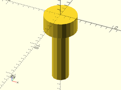

**Example 2**:

    screw(screwsize=3,screwlen=10,headsize=6,headlen=3, align="base");

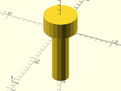

---

### metric\_bolt()

**Description**:
Makes a standard metric screw model.

Argument        | What it does
--------------- | ------------------------------
`size`          | Diameter of threaded part of screw.
`headtype`      | One of `"hex"`, `"pan"`, `"button"`, `"round"`, `"countersunk"`, `"oval"`, `"socket`".  Default: `"socket"`
`l`             | Length of screw, except for the head.
`shank`         | Length of unthreaded portion of the shaft.
`pitch`         | If given, render threads of the given pitch.  If 0, then no threads.  Overrides coarse argument.
`details`       | If true model should be rendered with extra details.  (Default: false)
`coarse`        | If true, make coarse threads instead of fine threads.  Default = true
`flange`        | Radius of flange beyond the head.  Default = 0 (no flange)
`phillips`      | If given, the size of the phillips drive hole to add.  (ie: "#1", "#2", or "#3")
`torx`          | If given, the size of the torx drive hole to add.  (ie: 10, 20, 30, etc.)
`orient`        | Orientation of the bolt.  Use the `ORIENT_` constants from `constants.scad`.  Default: `ORIENT_Z`.
`align`         | Alignment of the bolt.  Use the `V_` constants from `constants.scad` or `"sunken"`, `"base"`, or `"shank"`.  Default: `"base"`.

**Example 1**: Bolt Head Types

    ydistribute(40) {
        xdistribute(30) {
            // Front Row, Left to Right
            metric_bolt(headtype="pan", size=10, l=15, details=true, phillips="#2");
            metric_bolt(headtype="button", size=10, l=15, details=true, phillips="#2");
            metric_bolt(headtype="round", size=10, l=15, details=true, phillips="#2");
        }
        xdistribute(30) {
            // Back Row, Left to Right
            metric_bolt(headtype="socket", size=10, l=15, details=true);
            metric_bolt(headtype="hex", size=10, l=15, details=true, phillips="#2");
            metric_bolt(headtype="countersunk", size=10, l=15, details=true, phillips="#2");
            metric_bolt(headtype="oval", size=10, l=15, details=true, phillips="#2");
        }
    }

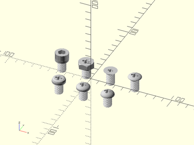

**Example 2**: Details

    metric_bolt(size=10, l=15, details=true, $fn=32);

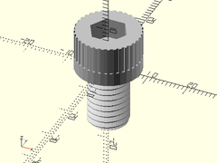

**Example 3**: No Details Except Threads

    metric_bolt(size=10, l=15);

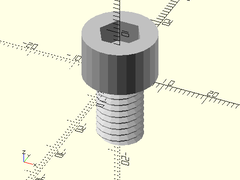

**Example 4**: No Details, No Threads

    metric_bolt(size=10, l=15, pitch=0);

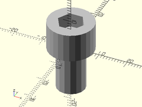

**Example 5**: Fine Threads

    metric_bolt(size=10, l=15, coarse=false);

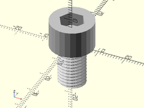

**Example 6**: Flange

    metric_bolt(size=10, l=15, flange=5);

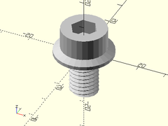

**Example 7**: Shank

    metric_bolt(size=10, l=25, shank=10);

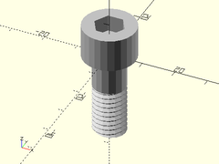

**Example 8**: Hex Head with Phillips

    metric_bolt(headtype="hex", size=10, l=15, phillips="#2");

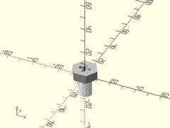

**Example 9**: Hex Head with Torx

    metric_bolt(headtype="hex", size=10, l=15, torx=50);

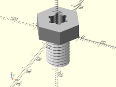

---

### metric\_nut()

**Description**:
Makes a model of a standard nut for a standard metric screw.

Argument        | What it does
--------------- | ------------------------------
`size`          | standard metric screw size in mm. (Default: 3)
`hole`          | include the hole in the nut.  (Default: true)
`pitch`         | pitch of threads in the hole.  No threads if not given.
`flange`        | radius of flange beyond the head.  Default = 0 (no flange)
`details`       | true if model should be rendered with extra details.  (Default: false)
`orient`        | Orientation of the nut.  Use the `ORIENT_` constants from `constants.scad`.  Default: `ORIENT_Z`.
`align`         | Alignment of the nut.  Use the `V_` constants from `constants.scad`.  Default: `V_UP`.
`center`        | If true, centers the nut at the origin.  If false, sits on top of XY plane.  Overrides `align` if given.

**Example 1**: No details, No Hole.  Useful for a mask.

    metric_nut(size=10, hole=false);

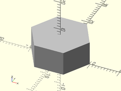

**Example 2**: Hole, with No Threads

    metric_nut(size=10, hole=true);

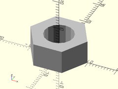

**Example 3**: Threads

    metric_nut(size=10, hole=true, pitch=1.5);

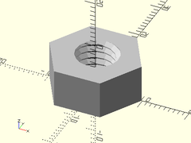

**Example 4**: Details

    metric_nut(size=10, hole=true, pitch=1.5, details=true);

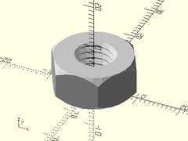

**Example 5**: Centered

    metric_nut(size=10, hole=true, pitch=1.5, details=true, center=true);

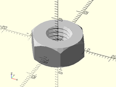

**Example 6**: Flange

    metric_nut(size=10, hole=true, pitch=1.5, flange=3, details=true);

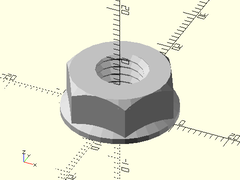

---

