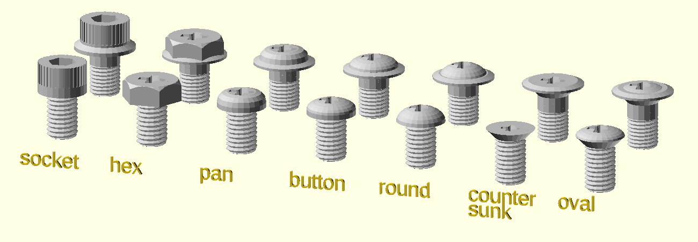
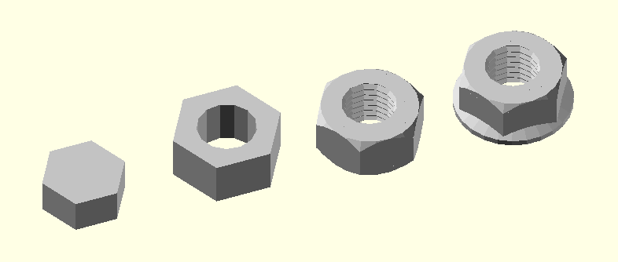

Screws, Bolts, and Nuts.

# Table of Contents

- [Functions](#functions)
    - [`get_metric_bolt_head_size(size)`](#get_metric_bolt_head_sizesize)
    - [`get_metric_bolt_head_height(size)`](#get_metric_bolt_head_heightsize)
    - [`get_metric_socket_cap_diam(size)`](#get_metric_socket_cap_diamsize)
    - [`get_metric_socket_cap_height(size)`](#get_metric_socket_cap_heightsize)
    - [`get_metric_socket_cap_socket_size(size)`](#get_metric_socket_cap_socket_sizesize)
    - [`get_metric_socket_cap_socket_depth(size)`](#get_metric_socket_cap_socket_depthsize)
    - [`get_metric_iso_coarse_thread_pitch(size)`](#get_metric_iso_coarse_thread_pitchsize)
    - [`get_metric_iso_fine_thread_pitch(size)`](#get_metric_iso_fine_thread_pitchsize)
    - [`get_metric_iso_superfine_thread_pitch(size)`](#get_metric_iso_superfine_thread_pitchsize)
    - [`get_metric_jis_thread_pitch(size)`](#get_metric_jis_thread_pitchsize)
    - [`get_metric_nut_size(size)`](#get_metric_nut_sizesize)
    - [`get_metric_nut_thickness(size)`](#get_metric_nut_thicknesssize)
- [Modules](#modules)
    - [`screw()`](#screw)
    - [`metric_bolt()`](#metric_bolt)
    - [`metric_nut()`](#metric_nut)

# Functions

## get\_metric\_bolt\_head\_size(size)
Get the bolt head size for a given metric screw diameter.

## get\_metric\_bolt\_head\_height(size)
Get the bolt head height for a given metric screw diameter.

## get\_metric\_socket\_cap\_diam(size)
Get the standard diameter for the given size of a metric
socket-cap bolt.

## get\_metric\_socket\_cap\_height(size)
Get the standard height for the given size of a metric
socket-cap bolt.

## get\_metric\_socket\_cap\_socket\_size(size)
Get the standard size of the metric allen wrench needed to
drive the given size of a metric socket-cap bolt.

## get\_metric\_socket\_cap\_socket\_depth(size)
Get the standard depth of the socket for the given size of
metric socket-cap bolt.

## get\_metric\_iso\_coarse\_thread\_pitch(size)
Get the standard coarse thread pitch for the given size/diameter
of metric threads.

## get\_metric\_iso\_fine\_thread\_pitch(size)
Get the standard fine thread pitch for the given size/diameter
of metric threads.  If no standard fine pitch exists for that
size, returns the coarse thread pitch for that size.

## get\_metric\_iso\_superfine\_thread\_pitch(size)
Get the standard superfine thread pitch for the given
size/diameter of metric threads.  If no standard superfine
pitch exists for that size, returns the fine pitch if it
exists, otherwise, returns the coarse thread pitch for
that size.

## get\_metric\_jis\_thread\_pitch(size)
Get the JIS standard thread pitch for the given size/diameter
of metric threads.

## get\_metric\_nut\_size(size)
Get the nut diameter for a given metric screw diameter.

## get\_metric\_nut\_thickness(size)
Get the nut thickness for a given metric screw diameter.

# Modules

## screw()
Makes a very simple screw model , useful for making screwholes.

Arg         | What it is
----------- | -----------------------------
screwsize   | diameter of threaded part of screw.
screwlen    | length of threaded part of screw.
headsize    | diameter of the screw head.
headlen     | length of the screw head.
pitch       | if given, thread shaft with given pitch.
countersunk | If true, lower head to be flush.

Example:

    screw(screwsize=3,screwlen=10,headsize=6,headlen=3);

## metric\_bolt()
Makes a standard metric screw model of a variety of possible styles.

Arg         | What it is
----------- | -----------------------------
size        | diameter of threaded part of screw.
headtype    | One of "hex", "pan", "button", "round", "countersunk", "oval", "socket".  Default: "socket"
l           | length of screw, except for the head.
shank       | Length of unthreaded portion of the shaft.
pitch       | If given, render threads of the given pitch.  If 0, then no threads.  Overrides coarse argument.
details     | If true model should be rendered with extra details.  Default: false
coarse      | If true, make coarse threads instead of fine threads.  Default: true
flange      | radius of flange beyond the head.  Default: 0 (no flange)
phillips    | If given, the size of the phillips drive hole to add.  (ie: "#1", "#2", or "#3")

Examples:

    metric_bolt(headtype="pan", size=10, l=15, details=true, phillips="#2");
    metric_bolt(headtype="countersunk", size=10, l=15, details=true, phillips="#2");
    metric_bolt(headtype="socket", size=10, l=15, flange=4, coarse=false, shank=5, details=true);
    metric_bolt(headtype="hex", size=10, l=15, flange=4, coarse=false, shank=5, details=true, phillips="#2");

## metric\_nut()
Makes an model of a standard nut for a standard metric screw.

Arg       | What it is
--------- | -----------------------------
size      | standard metric screw size in mm. Default: 3
hole      | include the hole in the nut.  Default: true
pitch     | pitch of threads in the hole.  No threads if not given.
flange    | radius of flange beyond the head.  Default: 0 (no flange)
details   | true if model should be rendered with extra details.  Default: false
center    | If true, nut is centered, otherwise, sits on top of XY plane.  Default: false

Example:

    metric_nut(size=5, hole=false);
    metric_nut(size=8, hole=true);
    metric_nut(size=8, hole=true, pitch=1, details=true, center=true);
    metric_nut(size=8, hole=true, pitch=1, details=true, flange=3, center=true);

