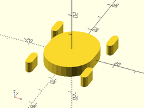
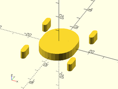
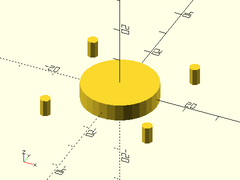
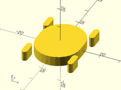
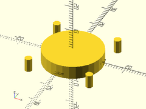
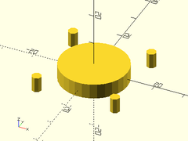
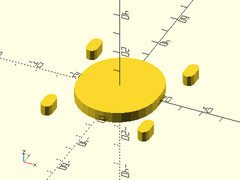
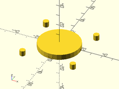
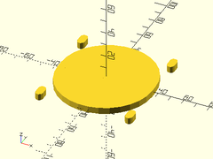
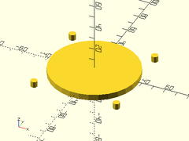

# Library File nema\_steppers.scad

Masks and models for NEMA stepper motors.
To use, add these lines to the top of your file:
```
include <BOSL/constants.scad>
use <BOSL/nema_steppers.scad>
```

---

# Table of Contents

1. [Functions](#functions)
    - [`nema_motor_width()`](#nema_motor_width)
    - [`nema_motor_plinth_height()`](#nema_motor_plinth_height)
    - [`nema_motor_plinth_diam()`](#nema_motor_plinth_diam)
    - [`nema_motor_screw_spacing()`](#nema_motor_screw_spacing)
    - [`nema_motor_screw_size()`](#nema_motor_screw_size)
    - [`nema_motor_screw_depth()`](#nema_motor_screw_depth)

2. [Motor Models](#motor-models)
    - [`nema11_stepper()`](#nema11_stepper)
    - [`nema14_stepper()`](#nema14_stepper)
    - [`nema17_stepper()`](#nema17_stepper)
    - [`nema23_stepper()`](#nema23_stepper)
    - [`nema34_stepper()`](#nema34_stepper)

3. [Masking Modules](#masking-modules)
    - [`nema_mount_holes()`](#nema_mount_holes)
    - [`nema11_mount_holes()`](#nema11_mount_holes)
    - [`nema14_mount_holes()`](#nema14_mount_holes)
    - [`nema17_mount_holes()`](#nema17_mount_holes)
    - [`nema23_mount_holes()`](#nema23_mount_holes)
    - [`nema34_mount_holes()`](#nema34_mount_holes)
    - [`nema34_mount_holes()`](#nema34_mount_holes)

---

# 1. Functions

### nema\_motor\_width()

**Description**:
Gets width of NEMA motor of given standard size.

Argument        | What it does
--------------- | ------------------------------
`size`          | The standard NEMA motor size.

---

### nema\_motor\_plinth\_height()

**Description**:
Gets plinth height of NEMA motor of given standard size.

Argument        | What it does
--------------- | ------------------------------
`size`          | The standard NEMA motor size.

---

### nema\_motor\_plinth\_diam()

**Description**:
Gets plinth diameter of NEMA motor of given standard size.

Argument        | What it does
--------------- | ------------------------------
`size`          | The standard NEMA motor size.

---

### nema\_motor\_screw\_spacing()

**Description**:
Gets screw spacing of NEMA motor of given standard size.

Argument        | What it does
--------------- | ------------------------------
`size`          | The standard NEMA motor size.

---

### nema\_motor\_screw\_size()

**Description**:
Gets mount screw size of NEMA motor of given standard size.

Argument        | What it does
--------------- | ------------------------------
`size`          | The standard NEMA motor size.

---

### nema\_motor\_screw\_depth()

**Description**:
Gets mount screwhole depth of NEMA motor of given standard size.

Argument        | What it does
--------------- | ------------------------------
`size`          | The standard NEMA motor size.

---

# 2. Motor Models

### nema11\_stepper()

**Description**:
Creates a model of a NEMA 11 stepper motor.

Argument        | What it does
--------------- | ------------------------------
`h`             | Length of motor body.  Default: 24mm
`shaft`         | Shaft diameter. Default: 5mm
`shaft_len`     | Length of shaft protruding out the top of the stepper motor.  Default: 20mm
`orient`        | Orientation of the stepper.  Use the `ORIENT_` constants from `constants.scad`.  Default: `ORIENT_Z`.
`align`         | Alignment of the stepper.  Use the `V_` constants from `constants.scad`.  Default: `V_DOWN`.

**Example**:

    nema11_stepper();


---

### nema14\_stepper()

**Description**:
Creates a model of a NEMA 14 stepper motor.

Argument        | What it does
--------------- | ------------------------------
`h`             | Length of motor body.  Default: 24mm
`shaft`         | Shaft diameter. Default: 5mm
`shaft_len`     | Length of shaft protruding out the top of the stepper motor.  Default: 24mm
`orient`        | Orientation of the stepper.  Use the `ORIENT_` constants from `constants.scad`.  Default: `ORIENT_Z`.
`align`         | Alignment of the stepper.  Use the `V_` constants from `constants.scad`.  Default: `V_DOWN`.

**Example**:

    nema14_stepper();


---

### nema17\_stepper()

**Description**:
Creates a model of a NEMA 17 stepper motor.

Argument        | What it does
--------------- | ------------------------------
`h`             | Length of motor body.  Default: 34mm
`shaft`         | Shaft diameter. Default: 5mm
`shaft_len`     | Length of shaft protruding out the top of the stepper motor.  Default: 20mm
`orient`        | Orientation of the stepper.  Use the `ORIENT_` constants from `constants.scad`.  Default: `ORIENT_Z`.
`align`         | Alignment of the stepper.  Use the `V_` constants from `constants.scad`.  Default: `V_DOWN`.

**Example**:

    nema17_stepper();


---

### nema23\_stepper()

**Description**:
Creates a model of a NEMA 23 stepper motor.

Argument        | What it does
--------------- | ------------------------------
`h`             | Length of motor body.  Default: 50mm
`shaft`         | Shaft diameter. Default: 6.35mm
`shaft_len`     | Length of shaft protruding out the top of the stepper motor.  Default: 25mm
`orient`        | Orientation of the stepper.  Use the `ORIENT_` constants from `constants.scad`.  Default: `ORIENT_Z`.
`align`         | Alignment of the stepper.  Use the `V_` constants from `constants.scad`.  Default: `V_DOWN`.

**Example**:

    nema23_stepper();


---

### nema34\_stepper()

**Description**:
Creates a model of a NEMA 34 stepper motor.

Argument        | What it does
--------------- | ------------------------------
`h`             | Length of motor body.  Default: 75mm
`shaft`         | Shaft diameter. Default: 12.7mm
`shaft_len`     | Length of shaft protruding out the top of the stepper motor.  Default: 32mm
`orient`        | Orientation of the stepper.  Use the `ORIENT_` constants from `constants.scad`.  Default: `ORIENT_Z`.
`align`         | Alignment of the stepper.  Use the `V_` constants from `constants.scad`.  Default: `V_DOWN`.

**Example**:

    nema34_stepper();


---

# 3. Masking Modules

### nema\_mount\_holes()

**Description**:
Creates a mask to use when making standard NEMA stepper motor mounts.

Argument        | What it does
--------------- | ------------------------------
`size`          | The standard NEMA motor size to make a mount for.
`depth`         | The thickness of the mounting hole mask.  Default: 5
`l`             | The length of the slots, for making an adjustable motor mount.  Default: 5
`slop`          | The printer-specific slop value to make parts fit just right.  Default: `PRINTER_SLOP`
`orient`        | Orientation of the stepper.  Use the `ORIENT_` constants from `constants.scad`.  Default: `ORIENT_Z`.
`align`         | Alignment of the stepper.  Use the `V_` constants from `constants.scad`.  Default: `V_CENTER`.

**Example 1**:

    nema_mount_holes(size=14, depth=5, l=5);



**Example 2**:

    nema_mount_holes(size=17, depth=5, l=5);



**Example 3**:

    nema_mount_holes(size=17, depth=5, l=0);



---

### nema11\_mount\_holes()

**Description**:
Creates a mask to use when making NEMA 11 stepper motor mounts.

Argument        | What it does
--------------- | ------------------------------
`depth`         | The thickness of the mounting hole mask.  Default: 5
`l`             | The length of the slots, for making an adjustable motor mount.  Default: 5
`slop`          | The printer-specific slop value to make parts fit just right.  Default: `PRINTER_SLOP`
`orient`        | Orientation of the stepper.  Use the `ORIENT_` constants from `constants.scad`.  Default: `ORIENT_Z`.
`align`         | Alignment of the stepper.  Use the `V_` constants from `constants.scad`.  Default: `V_CENTER`.

**Example 1**:

    nema11_mount_holes(depth=5, l=5);



**Example 2**:

    nema11_mount_holes(depth=5, l=0);



---

### nema14\_mount\_holes()

**Description**:
Creates a mask to use when making NEMA 14 stepper motor mounts.

Argument        | What it does
--------------- | ------------------------------
`depth`         | The thickness of the mounting hole mask.  Default: 5
`l`             | The length of the slots, for making an adjustable motor mount.  Default: 5
`slop`          | The printer-specific slop value to make parts fit just right.  Default: `PRINTER_SLOP`
`orient`        | Orientation of the stepper.  Use the `ORIENT_` constants from `constants.scad`.  Default: `ORIENT_Z`.
`align`         | Alignment of the stepper.  Use the `V_` constants from `constants.scad`.  Default: `V_CENTER`.

**Example 1**:

    nema14_mount_holes(depth=5, l=5);


**Example 2**:

    nema14_mount_holes(depth=5, l=0);



---

### nema17\_mount\_holes()

**Description**:
Creates a mask to use when making NEMA 17 stepper motor mounts.

Argument        | What it does
--------------- | ------------------------------
`depth`         | The thickness of the mounting hole mask.  Default: 5
`l`             | The length of the slots, for making an adjustable motor mount.  Default: 5
`slop`          | The printer-specific slop value to make parts fit just right.  Default: `PRINTER_SLOP`
`orient`        | Orientation of the stepper.  Use the `ORIENT_` constants from `constants.scad`.  Default: `ORIENT_Z`.
`align`         | Alignment of the stepper.  Use the `V_` constants from `constants.scad`.  Default: `V_CENTER`.

**Example 1**:

    nema17_mount_holes(depth=5, l=5);


**Example 2**:

    nema17_mount_holes(depth=5, l=0);


---

### nema23\_mount\_holes()

**Description**:
Creates a mask to use when making NEMA 23 stepper motor mounts.

Argument        | What it does
--------------- | ------------------------------
`depth`         | The thickness of the mounting hole mask.  Default: 5
`l`             | The length of the slots, for making an adjustable motor mount.  Default: 5
`slop`          | The printer-specific slop value to make parts fit just right.  Default: `PRINTER_SLOP`
`orient`        | Orientation of the stepper.  Use the `ORIENT_` constants from `constants.scad`.  Default: `ORIENT_Z`.
`align`         | Alignment of the stepper.  Use the `V_` constants from `constants.scad`.  Default: `V_CENTER`.

**Example 1**:

    nema23_mount_holes(depth=5, l=5);



**Example 2**:

    nema23_mount_holes(depth=5, l=0);



---

### nema34\_mount\_holes()

**Description**:
Creates a mask to use when making NEMA 34 stepper motor mounts.

Argument        | What it does
--------------- | ------------------------------
`depth`         | The thickness of the mounting hole mask.  Default: 5
`l`             | The length of the slots, for making an adjustable motor mount.  Default: 5
`slop`          | The printer-specific slop value to make parts fit just right.  Default: `PRINTER_SLOP`
`orient`        | Orientation of the stepper.  Use the `ORIENT_` constants from `constants.scad`.  Default: `ORIENT_Z`.
`align`         | Alignment of the stepper.  Use the `V_` constants from `constants.scad`.  Default: `V_CENTER`.

**Example 1**:

    nema34_mount_holes(depth=5, l=5);



**Example 2**:

    nema34_mount_holes(depth=5, l=0);



---

### nema34\_mount\_holes()

**Description**:
Creates a mask to use when making NEMA 34 stepper motor mounts.

Argument        | What it does
--------------- | ------------------------------
`depth`         | The thickness of the mounting hole mask.  Default: 5
`l`             | The length of the slots, for making an adjustable motor mount.  Default: 5
`slop`          | The printer-specific slop value to make parts fit just right.  Default: `PRINTER_SLOP`
`orient`        | Orientation of the stepper.  Use the `ORIENT_` constants from `constants.scad`.  Default: `ORIENT_Z`.
`align`         | Alignment of the stepper.  Use the `V_` constants from `constants.scad`.  Default: `V_CENTER`.

**Example 1**:

    nema34_mount_holes(depth=5, l=5);


**Example 2**:

    nema34_mount_holes(depth=5, l=0);


---

