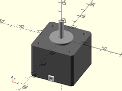

Masks and models for NEMA stepper motors and mounts.

# Table of Contents

- [Functions](#functions)
    - [`nema_motor_width(size)`](#nema_motor_widthsize)
    - [`nema_motor_plinth_height(size)`](#nema_motor_plinth_heightsize)
    - [`nema_motor_plinth_diam(size)`](#nema_motor_plinth_diamsize)
    - [`nema_motor_screw_spacing(size)`](#nema_motor_screw_spacingsize)
    - [`nema_motor_screw_size(size)`](#nema_motor_screw_sizesize)
    - [`nema_motor_screw_depth(size)`](#nema_motor_screw_depthsize)
- [Modules](#modules)
    - [`nema11_stepper()`](#nema11_stepper)
    - [`nema14_stepper()`](#nema14_stepper)
    - [`nema17_stepper()`](#nema17_stepper)
    - [`nema23_stepper()`](#nema23_stepper)
    - [`nema34_stepper()`](#nema34_stepper)
    - [`nema17_mount_holes()`](#nema17_mount_holes)

# Functions

## nema\_motor\_width(size)
Returns the width in mm of the given NEMA motor size.

## nema\_motor\_plinth\_height(size)
Returns the face plinth height in mm for the given NEMA motor size.

## nema\_motor\_plinth\_diam(size)
Returns the face plinth diameter in mm for the given NEMA motor size.

## nema\_motor\_screw\_spacing(size)
Returns the spacing between screws in mm for the given NEMA motor size.

## nema\_motor\_screw\_size(size)
Returns the screw size in mm for the given NEMA motor size.

## nema\_motor\_screw\_depth(size)
Returns the screwhole depth in mm of the given NEMA motor size.

# Modules

## nema11\_stepper()
Creates a model for rendering a NEMA 11 stepper motor.

Arg        | What it is
---------- | ---------------------------
h          | height (length) of the stepper motor.
shaft      | Diameter of the shaft.
shaft\_len | Length of the shaft that protrudes from the motor.

## nema14\_stepper()
Creates a model for rendering a NEMA 14 stepper motor.

Arg        | What it is
---------- | ---------------------------
h          | height (length) of the stepper motor.
shaft      | Diameter of the shaft.
shaft\_len | Length of the shaft that protrudes from the motor.

## nema17\_stepper()
Creates a model for rendering a NEMA 17 stepper motor.

Arg        | What it is
---------- | ---------------------------
h          | height (length) of the stepper motor.
shaft      | Diameter of the shaft.
shaft\_len | Length of the shaft that protrudes from the motor.

## nema23\_stepper()
Creates a model for rendering a NEMA 23 stepper motor.

Arg        | What it is
---------- | ---------------------------
h          | height (length) of the stepper motor.
shaft      | Diameter of the shaft.
shaft\_len | Length of the shaft that protrudes from the motor.

## nema34\_stepper()
Creates a model for rendering a NEMA 34 stepper motor.

Arg        | What it is
---------- | ---------------------------
h          | height (length) of the stepper motor.
shaft      | Diameter of the shaft.
shaft\_len | Length of the shaft that protrudes from the motor.

## nema17\_mount\_holes()
Creates a mask shape for mounting a NEMA 17 motor.

Arg        | What it is
---------- | ---------------------------
depth      | Depth of hole to make.
l          | Length of adjustable screw slots.
slop       | Slight adjustment value to make motors fit in holes.

