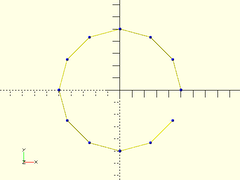
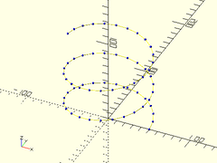
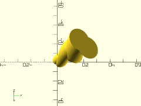
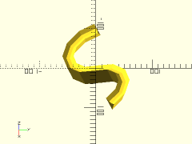
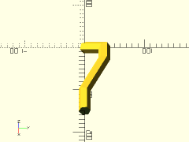
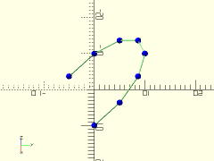
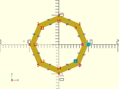

# Library File paths.scad

Polylines, polygons and paths.
To use, add the following lines to the beginning of your file:
```
include <BOSL/constants.scad>
use <BOSL/paths.scad>
```

---

# Table of Contents

1. [Functions](#functions)
    - [`simplify2d_path()`](#simplify2d_path)
    - [`simplify3d_path()`](#simplify3d_path)
    - [`path2d_regular_ngon()`](#path2d_regular_ngon)
    - [`path3d_spiral()`](#path3d_spiral)
    - [`points_along_path3d()`](#points_along_path3d)

2. [2D Modules](#2d-modules)
    - [`modulated_circle()`](#modulated_circle)

3. [3D Modules](#3d-modules)
    - [`extrude_from_to()`](#extrude_from_to)
    - [`extrude_2d_hollow()`](#extrude_2d_hollow)
    - [`extrude_2dpath_along_spiral()`](#extrude_2dpath_along_spiral)
    - [`extrude_2dpath_along_3dpath()`](#extrude_2dpath_along_3dpath)
    - [`extrude_2d_shapes_along_3dpath()`](#extrude_2d_shapes_along_3dpath)
    - [`trace_polyline()`](#trace_polyline)
    - [`debug_polygon()`](#debug_polygon)

---

# 1. Functions

### simplify2d\_path()

**Usage**:
- simplify2d\_path(path, [eps])

**Description**:
Takes a 2D polyline and removes unnecessary collinear points.

Argument        | What it does
--------------- | ------------------------------
`path`          | A list of 2D path points.
`eps`           | Largest angle delta between segments to count as colinear.  Default: 1e-6

---

### simplify3d\_path()

**Usage**:
- simplify3d\_path(path, [eps])

**Description**:
Takes a 3D polyline and removes unnecessary collinear points.

Argument        | What it does
--------------- | ------------------------------
`path`          | A list of 3D path points.
`eps`           | Largest angle delta between segments to count as colinear.  Default: 1e-6

---

### path2d\_regular\_ngon()

**Usage**:
- path2d\_regular\_ngon(n, r|d, [cp], [scale]);

**Description**:
Returns a 2D open counter-clockwise path of the vertices of a regular polygon of `n` sides.

Argument        | What it does
--------------- | ------------------------------
`n`             | Number of polygon sides.
`r`             | Radius of regular polygon.
`d`             | Radius of regular polygon.
`cp`            | Centerpoint of regular polygon. Default: `[0,0]`
`scale`         | [X,Y] scaling factors for each axis.  Default: `[1,1]`

**Example**:

    trace_polyline(path2d_regular_ngon(n=12, r=50), N=1, showpts=true);



---

### path3d\_spiral()

**Usage**:
- path3d\_spiral(turns, h, n, r|d, [cp], [scale]);

**Description**:
Returns a 3D spiral path.

Argument        | What it does
--------------- | ------------------------------
`h`             | Height of spiral.
`turns`         | Number of turns in spiral.
`n`             | Number of spiral sides.
`r`             | Radius of spiral.
`d`             | Radius of spiral.
`cp`            | Centerpoint of spiral. Default: `[0,0]`
`scale`         | [X,Y] scaling factors for each axis.  Default: `[1,1]`

**Example**:

    trace_polyline(path3d_spiral(turns=2.5, h=100, n=24, r=50), N=1, showpts=true);



---

### points\_along\_path3d()

**Usage**:
- points\_along\_path3d(polyline, path);

**Description**:
Calculates the vertices needed to create a `polyhedron()` of the
extrusion of `polyline` along `path`.  The closed 2D path shold be
centered on the XY plane. The 2D path is extruded perpendicularly
along the 3D path.  Produces a list of 3D vertices.  Vertex count
is `len(polyline)*len(path)`.  Gives all the reoriented vertices
for `polyline` at the first point in `path`, then for the second,
and so on.

Argument        | What it does
--------------- | ------------------------------
`polyline`      | A closed list of 2D path points.
`path`          | A list of 3D path points.

---

# 2. 2D Modules

### modulated\_circle()

**Description**:
Creates a 2D polygon circle, modulated by one or more superimposed sine waves.

Argument        | What it does
--------------- | ------------------------------
`r`             | radius of the base circle.
`sines`         | array of [amplitude, frequency] pairs, where the frequency is the number of times the cycle repeats around the circle.

**Example**:

    modulated_circle(r=40, sines=[[3, 11], [1, 31]], $fn=6);


---

# 3. 3D Modules

### extrude\_from\_to()

**Description**:
Extrudes a 2D shape between the points pt1 and pt2.  Takes as children a set of 2D shapes to extrude.

Argument        | What it does
--------------- | ------------------------------
`pt1`           | starting point of extrusion.
`pt2`           | ending point of extrusion.
`convexity`     | max number of times a line could intersect a wall of the 2D shape being extruded.
`twist`         | number of degrees to twist the 2D shape over the entire extrusion length.
`scale`         | scale multiplier for end of extrusion compared the start.
`slices`        | Number of slices along the extrusion to break the extrusion into.  Useful for refining `twist` extrusions.

**Example**:

    extrude_from_to([0,0,0], [10,20,30], convexity=4, twist=360, scale=3.0, slices=40) {
        xspread(3) circle(3, $fn=32);
    }



---

### extrude\_2d\_hollow()

**Description**:
Similar to linear\_extrude(), except the result is a hollow shell.

Argument        | What it does
--------------- | ------------------------------
`wall`          | thickness of shell wall.
`height`        | height of extrusion.
`twist`         | degrees of twist, from bottom to top.
`slices`        | how many slices to use when making extrusion.

**Example**:

    extrude_2d_hollow(wall=2, height=100, twist=90, slices=50)
        circle(r=40, $fn=6);


---

### extrude\_2dpath\_along\_spiral()

**Description**:
Takes a closed 2D polyline path, centered on the XY plane, and
extrudes it along a 3D spiral path of a given radius, height and twist.

Argument        | What it does
--------------- | ------------------------------
`polyline`      | Array of points of a polyline path, to be extruded.
`h`             | height of the spiral to extrude along.
`r`             | radius of the spiral to extrude along.
`twist`         | number of degrees of rotation to spiral up along height.

**Example**:

    poly = [[-10,0], [-3,-5], [3,-5], [10,0], [0,-30]];
    extrude_2dpath_along_spiral(poly, h=200, r=50, twist=1080, $fn=36);


---

### extrude\_2dpath\_along\_3dpath()

**Description**:
Takes a closed 2D path `polyline`, centered on the XY plane, and extrudes it perpendicularly along a 3D path `path`, forming a solid.

Argument        | What it does
--------------- | ------------------------------
`polyline`      | Array of points of a polyline path, to be extruded.
`path`          | Array of points of a polyline path, to extrude along.
`ang`           | Angle in degrees to rotate 2D polyline before extrusion.
`convexity`     | max number of surfaces any single ray could pass through.

**Example**:

    shape = [[0,-10], [5,-3], [5,3], [0,10], [30,0]];
    path = concat(
        [for (a=[30:30:180]) [50*cos(a)+50, 50*sin(a), 20*sin(a)]],
        [for (a=[330:-30:180]) [50*cos(a)-50, 50*sin(a), 20*sin(a)]]
    );
    extrude_2dpath_along_3dpath(shape, path, ang=140);



---

### extrude\_2d\_shapes\_along\_3dpath()

**Description**:
Extrudes 2D children along a 3D polyline path.  This may be slow.

Argument        | What it does
--------------- | ------------------------------
`path`          | array of points for the bezier path to extrude along.
`convexity`     | maximum number of walls a ran can pass through.
`clipsize`      | increase if artifacts are left.  Default: 1000

**Example**:

    path = [ [0, 0, 0], [33, 33, 33], [66, 33, 40], [100, 0, 0], [150,0,0] ];
    extrude_2d_shapes_along_3dpath(path) circle(r=10, $fn=6);



---

### trace\_polyline()

**Description**:
Renders lines between each point of a polyline path.
Can also optionally show the individual vertex points.

Argument        | What it does
--------------- | ------------------------------
`pline`         | The array of points in the polyline.
`showpts`       | If true, draw vertices and control points.
`N`             | Mark the first and every Nth vertex after in a different color and shape.
`size`          | Diameter of the lines drawn.
`color`         | Color to draw the lines (but not vertices) in.

**Example**:

    polyline = [for (a=[0:30:210]) 10*[cos(a), sin(a), sin(a)]];
    trace_polyline(polyline, showpts=true, size=0.5, color="lightgreen");



---

### debug\_polygon()

**Description**:
A drop-in replacement for `polygon()` that renders and labels the path points.

Argument        | What it does
--------------- | ------------------------------
`points`        | The array of 2D polygon vertices.
`paths`         | The path connections between the vertices.
`convexity`     | The max number of walls a ray can pass through the given polygon paths.

**Example**:

    debug_polygon(
        points=concat(
            path2d_regular_ngon(r=10, n=8),
            path2d_regular_ngon(r=8, n=8)
        ),
        paths=[
            [for (i=[0:7]) i],
            [for (i=[15:-1:8]) i]
        ]
    );



---

