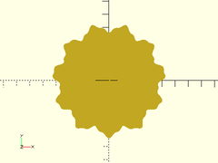
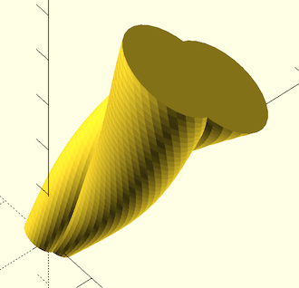
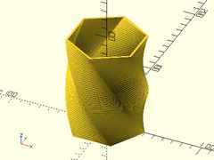
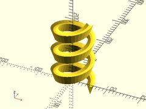
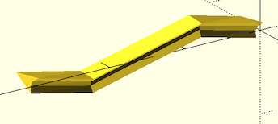

2D and 3D polyline paths
To use, add the following line to the beginning of your file:

    use <BOSL/paths.scad>

# Table of Contents

- [Functions](#functions)
    - [`simplify2d_path(path)`](#simplify2d_pathpath)
    - [`simplify3d_path(path)`](#simplify3d_pathpath)
    - [`points_along_path3d(polyline, path)`](#points_along_path3dpolyline-path)
- [Modules](#modules)
    - [`modulated_circle()`](#modulated_circle)
    - [`extrude_from_to() { ... }`](#extrude_from_to---)
    - [`extrude_2d_hollow()`](#extrude_2d_hollow)
    - [`extrude_2dpath_along_spiral()`](#extrude_2dpath_along_spiral)
    - [`extrude_2dpath_along_3dpath()`](#extrude_2dpath_along_3dpath)

# Functions

## simplify2d\_path(path)
Takes a 2D polyline and removes uneccessary collinear points.

## simplify3d\_path(path)
Takes a 3D polyline and removes uneccessary collinear points.

## points\_along\_path3d(polyline, path)
Returns an array of vertexes for the polyhedron created by drawing the given
2D path perpendicularly along the given 3D path.

Args     | What it is
-------- | --------------------------
polyline | The 2D polyline to drag along the 3D path.
path     | The 3D polyline path to follow.

# Modules

## modulated\_circle()
Creates a 2D polygon circle, modulated by one or more superimposed sine waves.

Args     | What it is
-------- | --------------------------
r        | Radius of the base circle.
sines    | Array of [amplitude, frequency] pairs, where the frequency is the number of times the cycle repeats around the circle.

Example:

    modulated_circle(r=40, sines=[[3, 11], [1, 31]], $fn=6);

## extrude\_from\_to() { ... }
Extrudes a 2D shape between the points pt1 and pt2.
Takes as children a set of 2D shapes to extrude.

Args       | What it is
---------- | --------------------------
pt1        | Starting point of extrusion.
pt2        | Ending point of extrusion.
convexity  | Max number of times a line could intersect a wall of the 2D shape being extruded.
twist      | Number of degrees to twist the 2D shape over the entire extrusion length.
scale      | Scale multiplier for end of extrusion compared the start.
slices     | Number of slices along the extrusion to break the extrusion into.  Useful for refining `twist` extrusions.

Example:

    extrude_from_to([0,0,0], [10,20,30], convexity=4, twist=180, scale=3.0, slices=40) {
        xspread(3) circle(3, $fn=32);
    }

## extrude\_2d\_hollow()
Similar to `linear_extrude()`, except the result is a hollow shell.

Args     | What it is
-------- | --------------------------
wall     | Thickness of shell wall.
height   | Height of extrusion.
twist    | Degrees of twist, from bottom to top.
slices   | How many slices to use when making extrusion.

Example:

    extrude_2d_hollow(wall=2, height=100, twist=90, slices=50)
        circle(r=40, center=true, $fn=6);

## extrude\_2dpath\_along\_spiral()
Takes a closed 2D polyline path, centered on the XY plane, and
extrudes it along a 3D spiral path of a given radius, height and twist.

Args     | What it is
-------- | --------------------------
polyline | Array of points of a polyline path, to be extruded.
h        | Height of the spiral to extrude along.
r        | Radius of the spiral to extrude along.
twist    | Number of degrees of rotation to spiral up along height.

Example:

    poly = [[-10,0], [-3,-5], [3,-5], [10,0], [0,-30]];
    extrude_2dpath_along_spiral(poly, h=200, r=50, twist=1000, $fn=36);

## extrude\_2dpath\_along\_3dpath()
Takes a closed 2D polyline path, centered on the XY plane, and
extrudes it perpendicularly along a 3D polyline path, forming a solid.

Args      | What it is
--------- | --------------------------
polyline  | Array of points of a polyline path, to be extruded.
path      | Array of points of a polyline path, to extrude along.
convexity | Max number of surfaces any single ray can pass through.

Example:

    shape = [[-10,0], [-3,-5], [3,-5], [10,0], [0,-30]];
    path = [ [0, 0, 0], [100, 33, 33], [200, -33, -33], [300, 0, 0] ];
    extrude_2dpath_along_3dpath(shape, path);

