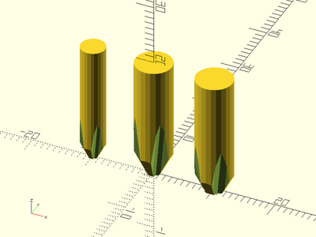

An attempt at modelling Phillips drive tips.
To use, add the following line to the beginning of your file:

    use <BOSL/phillips_drive.scad>

# Table of Contents

- [Phillips driver bits.](#phillips-driver-bits)
    - [`phillips_drive(size, shaft, l)`](#phillips_drivesize-shaft-l)

# Phillips driver bits.

## phillips\_drive(size, shaft, l)
Creates a model of a phillips driver bit of a given named size.
These are my best guess reverse-engineered measurements of
the tip diameters of various phillips screwdriver sizes.

Args  | What it does
----- | --------------
size  | The size of the bit.  "#1", "#2", or "#3"
shaft | The diameter of the drive bit's shaft.
l     | The length of the drive bit.

Example:

    xdistribute(10) {
       phillips_drive(size="#1", shaft=4, l=30);
       phillips_drive(size="#2", shaft=6, l=30);
       phillips_drive(size="#3", shaft=6, l=30);
    }

