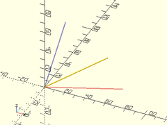
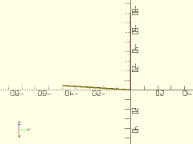

# Library File quaternions.scad

Support for Quaternions.
To use, add the following line to the beginning of your file:
```
use <BOSL/quaternions.scad>
```

---

# Table of Contents

1. [Quaternions](#quaternions)
    - [`Quat()`](#quat)
    - [`QuatX()`](#quatx)
    - [`QuatY()`](#quaty)
    - [`QuatZ()`](#quatz)
    - [`QuatXYZ()`](#quatxyz)
    - [`Q_Ident()`](#q_ident)
    - [`Q_Add_S()`](#q_add_s)
    - [`Q_Sub_S()`](#q_sub_s)
    - [`Q_Mul_S()`](#q_mul_s)
    - [`Q_Div_S()`](#q_div_s)
    - [`Q_Add()`](#q_add)
    - [`Q_Sub()`](#q_sub)
    - [`Q_Mul()`](#q_mul)
    - [`Q_Dot()`](#q_dot)
    - [`Q_Neg()`](#q_neg)
    - [`Q_Conj()`](#q_conj)
    - [`Q_Norm()`](#q_norm)
    - [`Q_Normalize()`](#q_normalize)
    - [`Q_Dist()`](#q_dist)
    - [`Q_Slerp()`](#q_slerp)
    - [`Q_Matrix3()`](#q_matrix3)
    - [`Q_Matrix4()`](#q_matrix4)
    - [`Q_Axis()`](#q_axis)
    - [`Q_Angle()`](#q_angle)
    - [`Q_Rot_Vector()`](#q_rot_vector)
    - [`Qrot()`](#qrot)

---

# 1. Quaternions

Quaternions are fast methods of storing and calculating arbitrary rotations.
Quaternions contain information on both axis of rotation, and rotation angle.
You can chain multiple rotation together by multiplying quaternions together.
They don't suffer from the gimbal-lock issues that [X,Y,Z] rotation angles do.
Quaternions are stored internally as a 4-value vector:
`[X, Y, Z, W]  =  W + Xi + Yj + Zk`

### Quat()

**Usage**:
- Quat(ax, ang);

**Description**:
Create a new Quaternion from axis and angle of rotation.

Argument        | What it does
--------------- | ------------------------------
`ax`            | Vector of axis of rotation.
`ang`           | Number of degrees to rotate around the axis counter-clockwise, when facing the origin.

---

### QuatX()

**Usage**:
- QuatX(a);

**Description**:
Create a new Quaternion for rotating around the X axis [1,0,0].

Argument        | What it does
--------------- | ------------------------------
`a`             | Number of degrees to rotate around the axis counter-clockwise, when facing the origin.

---

### QuatY()

**Usage**:
- QuatY(a);

**Description**:
Create a new Quaternion for rotating around the Y axis [0,1,0].

Argument        | What it does
--------------- | ------------------------------
`a`             | Number of degrees to rotate around the axis counter-clockwise, when facing the origin.

---

### QuatZ()

**Usage**:
- QuatZ(a);

**Description**:
Create a new Quaternion for rotating around the Z axis [0,0,1].

Argument        | What it does
--------------- | ------------------------------
`a`             | Number of degrees to rotate around the axis counter-clockwise, when facing the origin.

---

### QuatXYZ()

**Usage**:
- QuatXYZ([X,Y,Z])

**Description**:
Creates a quaternion from standard [X,Y,Z] rotation angles in degrees.

Argument        | What it does
--------------- | ------------------------------
`a`             | The triplet of rotation angles, [X,Y,Z]

---

### Q\_Ident()

**Description**:
Returns the "Identity" zero-rotation Quaternion.

---

### Q\_Add\_S()

**Usage**:
- Q\_Add\_S(q, s)

**Description**:
Adds a scalar value `s` to the W part of a quaternion `q`.

---

### Q\_Sub\_S()

**Usage**:
- Q\_Sub\_S(q, s)

**Description**:
Subtracts a scalar value `s` from the W part of a quaternion `q`.

---

### Q\_Mul\_S()

**Usage**:
- Q\_Mul\_S(q, s)

**Description**:
Multiplies each part of a quaternion `q` by a scalar value `s`.

---

### Q\_Div\_S()

**Usage**:
- Q\_Div\_S(q, s)

**Description**:
Divides each part of a quaternion `q` by a scalar value `s`.

---

### Q\_Add()

**Usage**:
- Q\_Add(a, b)

**Description**:
Adds each part of two quaternions together.

---

### Q\_Sub()

**Usage**:
- Q\_Sub(a, b)

**Description**:
Subtracts each part of quaternion `b` from quaternion `a`.

---

### Q\_Mul()

**Usage**:
- Q\_Mul(a, b)

**Description**:
Multiplies quaternion `a` by quaternion `b`.

---

### Q\_Dot()

**Usage**:
- Q\_Dot(a, b)

**Description**:
Calculates the dot product between quaternions `a` and `b`.

---

### Q\_Neg()

**Usage**:
- Q\_Neg(q)

**Description**:
Returns the negative of quaternion `q`.

---

### Q\_Conj()

**Usage**:
- Q\_Conj(q)

**Description**:
Returns the conjugate of quaternion `q`.

---

### Q\_Norm()

**Usage**:
- Q\_Norm(q)

**Description**:
Returns the `norm()` "length" of quaternion `q`.

---

### Q\_Normalize()

**Usage**:
- Q\_Normalize(q)

**Description**:
Normalizes quaternion `q`, so that norm([W,X,Y,Z]) == 1.

---

### Q\_Dist()

**Usage**:
- Q\_Dist(q1, q2)

**Description**:
Returns the "distance" between two quaternions.

---

### Q\_Slerp()

**Usage**:
- Q\_Slerp(q1, q2, u);

**Description**:
Returns a quaternion that is a spherical interpolation between two quaternions.

Argument        | What it does
--------------- | ------------------------------
`q1`            | The first quaternion. (u=0)
`q2`            | The second quaternion. (u=1)
`u`             | The proportional value, from 0 to 1, of what part of the interpolation to return.

**Example**:

    a = QuatY(15);
    b = QuatY(75);
    color("blue",0.25) Qrot(a) cylinder(d=1, h=80);
    color("red",0.25) Qrot(b) cylinder(d=1, h=80);
    Qrot(Q_Slerp(a, b, 0.6)) cylinder(d=1, h=80);



---

### Q\_Matrix3()

**Usage**:
- Q\_Matrix3(q);

**Description**:
Returns the 3x3 rotation matrix for the given normalized quaternion q.

---

### Q\_Matrix4()

**Usage**:
- Q\_Matrix4(q);

**Description**:
Returns the 4x4 rotation matrix for the given normalized quaternion q.

---

### Q\_Axis()

**Usage**:
- Q\_Axis(q)

**Description**:
Returns the axis of rotation of a normalized quaternion `q`.

---

### Q\_Angle()

**Usage**:
- Q\_Angle(q)

---

### Q\_Rot\_Vector()

**Usage**:
- Q\_Rot\_Vector(v,q);

**Description**:
Returns the vector `v` after rotating it by the quaternion `q`.

---

### Qrot()

**Usage**:
- Qrot(q) ...

**Description**:
Rotate all children by the rotation stored in quaternion `q`.

**Example**:

    q = QuatXYZ([45,35,10]);
    color("red",0.25) cylinder(d=1,h=80);
    Qrot(q) cylinder(d=1,h=80);



---

