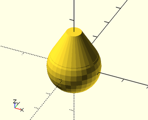
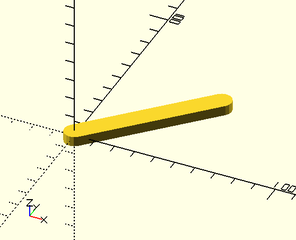
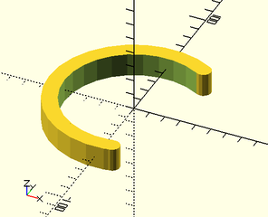
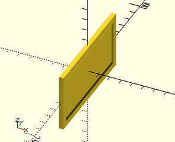
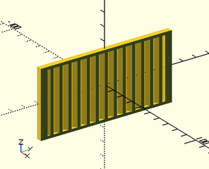

Common useful shapes and structured objects.

## nil()
For when you MUST pass a child to a module, but you want it to be nothing.

## upcube()
Makes a cube that is centered in X and Y axes, and has its bottom
aligned with Z=0.

Arg      | What it does
-------- | --------------------------
size     | size of cube [X,Y,Z].  (Default: [1,1,1])

Example:

    upcube([4, 5, 3]);

## chamfcube()
Makes a cube with chamfered edges.

Arg          | What it does
------------ | --------------------------
size         | size of cube [X,Y,Z].  (Default: [1,1,1])
chamfer      | chamfer inset along axis.  (Default: 0.25)
chamfaxes    | Array [X, Y, Z] of boolean values to specify which axis edges should be chamfered.
chamfcorners | boolean to specify if corners should be flat chamferred.

Example:

    chamfcube(size=[10,20,30], chamfer=1, chamfaxes=[1,1,1], chamfcorners=true);

## rrect()
Makes a cube with rounded (filletted) vertical edges.

Arg      | What it does
-------- | --------------------------
size     | size of cube [X,Y,Z].  (Default: [1,1,1])
r        | radius of edge/corner rounding.  (Default: 0.25)
center   | if true, object will be centered.  If false, sits on top of XY plane.

Examples:

    rrect(size=[9,4,1], r=1, center=true);
    rrect(size=[5,7,3], r=1, $fn=24);

## rcube()
Makes a cube with rounded (filletted) edges and corners.

Arg      | What it does
-------- | --------------------------
size     | size of cube [X,Y,Z].  (Default: [1,1,1])
r        | radius of edge/corner rounding.  (Default: 0.25)
center   | if true, object will be centered.  If false, sits on top of XY plane.

Examples:

    rcube(size=[9,4,1], r=0.333, $fn=24);
    rcube(size=[5,7,3], r=1, center=true);

## chamf\_cyl(), chamferred\_cylinder()
Creates a cylinder with chamferred edges.

Arg       | What it does
--------- | -----------------------------------
h         | height of cylinder. (Default: 1.0)
r         | radius of cylinder. (Default: 1.0)
d         | diameter of cylinder. (use instead of r)
chamfer   | radial inset of the edge chamfer. (Default: 0.25)
chamfedge | length of the chamfer edge. (Use instead of chamfer)
center    | boolean.  If true, cylinder is centered. (Default: false)
top       | boolean.  If true, chamfer the top edges. (Default: True)
bottom    | boolean.  If true, chamfer the bottom edges. (Default: True)

Example:

    chamf_cyl(h=50, d=40, chamfer=5, angle=45, bottom=false, center=true);
    chamferred_cylinder(h=50, r=20, chamfedge=10, angle=30, center=true);

## rcylinder(), filleted\_cylinder()
Creates a cylinder with filletted (rounded) ends.

Arg     | What it does
------- | -----------------------------------
h       | height of cylinder. (Default: 1.0)
r       | radius of cylinder. (Default: 1.0)
d       | diameter of cylinder. (Use instead of r)
fillet  | radius of the edge filleting. (Default: 0.25)
center  | boolean.  If true, cylinder is centered. (Default: false)

Example:

    rcylinder(h=50, r=20, fillet=5, center=true, $fa=1, $fs=1);

## pyramid()
Creates a pyramidal prism with a given number of sides.

Arg     | What it does
------- | -----------------------------------
n       | number of pyramid sides.
h       | height of the pyramid.
l       | length of one side of the pyramid. (optional)
r       | radius of the base of the pyramid. (optional)
d       | diameter of the base of the pyramid. (optional)
circum  | base circumscribes the circle of the given radius or diam.

Example:

    pyramid(h=10, l=5, n=4);
    pyramid(h=10, r=5, n=5);
    pyramid(h=3, d=4, n=6, circum=true);

## prism()
Creates a vertical prism with a given number of sides.

Arg     | What it does
------- | -----------------------------------
n       | number of sides.
h       | height of the prism.
l       | length of one side of the prism. (optional)
r       | radius of the prism. (optional)
d       | diameter of the prism. (optional)
circum  | prism circumscribes the circle of the given radius or diam.

Example:

    prism(n=6, h=3, d=4, circum=true);

## right\_triangle()
Creates a right triangle, with the hypotenuse on the right (X+) side.

Arg     | What it does
------- | -----------------------------------
size    | [width, thickness, height]
center  | true if triangle will be centered.

Examples:

    right_triangle([4, 1, 6], center=true);
    right_triangle([4, 1, 9]);

## trapezoid()
Creates a trapezoidal prism.

Arg     | What it does
------- | -----------------------------------
size1   | [width, length] of the bottom of the prism.
size2   | [width, length] of the top of the prism.
h       | Height of the prism.
center  | vertically center the prism if true.  Sits on top of XY plane if false.

Example:

    trapezoid(size1=[2,6], size2=[4,0], h=4, center=false);

    trapezoid(size1=[1,4], size2=[4,1], h=4, center=false);

## teardrop2d()
Makes a 2D teardrop shape. Useful for extruding into 3D printable holes.

Arg    | What it does
------ | -----------------------------------
r      | radius of circular part of teardrop.  (Default: 1)
d      | diameter of spherical portion of bottom. (Use instead of r)
ang    | angle of hat walls from the Y axis.  (Default: 45 degrees)
cap\_h | if given, height above center where the shape will be truncated.

Example:

    teardrop2d(r=30, ang=30);
    teardrop2d(r=35, ang=45, cap_h=40);

## teardrop()
Makes a teardrop shape in the XZ plane. Useful for 3D printable holes.

Arg    | What it does
------ | -----------------------------------
r      | radius of circular part of teardrop.  (Default: 1)
d      | diameter of spherical portion of bottom. (Use instead of r)
h      | thickness of teardrop. (Default: 1)
cap\_h | if given, height above center where the shape will be truncated.

Example:

    teardrop(r=3, h=2, ang=30);

## onion()
Created a sphere with a conical hat, to make a 3D teardrop.

Arg    | What it does
------ | -----------------------------------
r      | radius of spherical portion of the bottom. (Default: 1)
d      | diameter of spherical portion of bottom. (Use instead of r)
h      | height above sphere center to truncate teardrop shape. (Default: 1)
maxang | angle of cone on top from vertical.

Example:

    onion(h=15, r=10, maxang=30);

## tube()
Makes a hollow tube with the given outer size and wall thickness.

Arg    | What it does
------ | -----------------------------------
h      | height of tube. (Default: 1)
r      | Outer radius of tube.  (Default: 1)
r1     | Outer radius of bottom of tube.  (Default: value of r)
r2     | Outer radius of top of tube.  (Default: value of r)
wall   | horizontal thickness of tube wall. (Default 0.5)

Example:

    tube(h=6, r=4, wall=2, $fn=6);
    tube(h=3, r1=5, r2=7, wall=2, center=true);
    tube(h=3, r=4, wall=1, center=true);

## torus()
Creates a torus shape.

Arg    | What it does
------ | -----------------------------------
r      | major radius of torus ring. (use with of 'r2', or 'd2')
r2     | minor radius of torus ring. (use with of 'r', or 'd')
d      | major diameter of torus ring. (use with of 'r2', or 'd2')
d2     | minor diameter of torus ring. (use with of 'r', or 'd')
or     | outer radius of the torus. (use with 'ir', or 'id')
ir     | inside radius of the torus. (use with 'or', or 'od')
od     | outer diameter of the torus. (use with 'ir' or 'id')
id     | inside diameter of the torus. (use with 'or' or 'od')

Example:

    torus(r=30, r2=5);
    torus(d=50, r2=5);
    torus(d=60, d2=15);
    torus(od=60, ir=15);
    torus(or=30, ir=20, $fa=1, $fs=1);

## slot()
Makes a linear slot with rounded ends, appropriate for bolts to slide along.

Arg    | What it does
------ | -----------------------------------
p1     | center of starting circle of slot.  (Default: [0,0,0])
p2     | center of ending circle of slot.  (Default: [1,0,0])
l      | length of slot along the X axis.  Use instead of p1 and p2.
h      | height of slot shape. (default: 1.0)
r      | radius of slot circle. (default: 0.5)
r1     | bottom radius of slot cone. (use instead of r)
r2     | top radius of slot cone. (use instead of r)
d      | diameter of slot circle. (default: 1.0)
d1     | bottom diameter of slot cone. (use instead of d)
d2     | top diameter of slot cone. (use instead of d)
center | if true (default) centers vertically.  Else, drops flush with XY plane.

Examples:

    slot(l=50, h=5, d1=8, d2=10, center=false);
    slot([0,0,0], [50,50,0], h=5, d=10);

## arced\_slot()
Makes an arced slot, appropriate for bolts to slide along.

Arg    | What it does
------ | -----------------------------------
cp     | centerpoint of slot arc. (default: [0, 0, 0])
h      | height of slot arc shape. (default: 1.0)
r      | radius of slot arc. (default: 0.5)
d      | diameter of slot arc. (default: 1.0)
sr     | radius of slot channel. (default: 0.5)
sd     | diameter of slot channel. (default: 0.5)
sr1    | bottom radius of slot channel cone. (use instead of sr)
sr2    | top radius of slot channel cone. (use instead of sr)
sd1    | bottom diameter of slot channel cone. (use instead of sd)
sd2    | top diameter of slot channel cone. (use instead of sd)
sa     | starting angle. (Default: 0.0)
ea     | ending angle. (Default: 90.0)

Examples:

    arced_slot(r=100, h=10, sd1=30, sd2=10, sa=45, ea=180, $fa=5, $fs=2);
    arced_slot(d=100, h=15, sd=10, sa=60, ea=280);

## narrowing\_strut()
Makes a rectangular strut with the top side narrowing in a triangle.
The shape created may be likened to an extruded home plate from baseball.
This is useful for constructing parts that minimize the need to support
overhangs.

Arg    | What it does
------ | -----------------------------------
w      | Width (thickness) of the strut.
l      | Length of the strut.
wall   | height of rectangular portion of the strut.
ang    | angle that the trianglar side will converge at.

Example:

    narrowing_strut(w=10, l=100, wall=5, ang=30);

## thinning\_wall()
Makes a rectangular wall which thins to a smaller width in the center,
with angled supports to prevent critical overhangs.

Arg    | What it does
------ | -----------------------------------
h      | height of wall.
l      | length of wall.
thick  | thickness of wall.
ang    | maximum overhang angle of diagonal brace.
strut  | the width of the diagonal brace.
wall   | the thickness of the thinned portion of the wall.

Example:

    thinning_wall(h=50, l=100, thick=4, ang=30, strut=5, wall=2);

## thinning\_triangle()
Makes a triangular wall with thick edges, which thins to a smaller width in
the center, with angled supports to prevent critical overhangs.

Arg      | What it does
-------- | -----------------------------------
h        | height of wall.
l        | length of wall.
thick    | thickness of wall.
ang      | maximum overhang angle of diagonal brace.
strut    | the width of the diagonal brace.
wall     | the thickness of the thinned portion of the wall.
diagonly | boolean, which denotes only the diagonal brace should be thick.

Examples:

    thinning_triangle(h=50, l=100, thick=4, ang=30, strut=5, wall=2, diagonly=true);
    thinning_triangle(h=60, l=75, thick=4, ang=30, strut=5, wall=2);

## thinning\_brace()
Makes a triangular wall which thins to a smaller width in the center,
with angled supports to prevent critical overhangs.  Basically an alias
of `thinning_triangle()`, with `diagonly` set to true.

Arg    | What it does
------ | -----------------------------------
h      | height of wall.
l      | length of wall.
thick  | thickness of wall.
ang    | maximum overhang angle of diagonal brace.
strut  | the width of the diagonal brace.
wall   | the thickness of the thinned portion of the wall.

Example:

    thinning_brace(h=50, l=100, thick=4, ang=30, strut=5, wall=2);

## sparse\_strut3d()
Makes an open rectangular strut with X-shaped cross-bracing, designed with 3D printing in mind.

Arg         | What it does
----------- | -----------------------------------
h           | Z size of strut.
w           | X size of strut.
l           | Y size of strut.
thick       | thickness of strut walls.
maxang      | maximum overhang angle of cross-braces.
max\_bridge | maximum bridging distance between cross-braces.
strut       | the width of the cross-braces.

Example:

    sparse_strut3d(h=40, w=40, l=120, thick=4, maxang=30, strut=5, max_bridge=20);

## sparse\_strut()
Makes an open rectangular strut with X-shaped cross-bracing, designed with 3D printing in mind.

Arg         | What it does
----------- | -----------------------------------
h           | height of strut wall.
l           | length of strut wall.
thick       | thickness of strut wall.
maxang      | maximum overhang angle of cross-braces.
max\_bridge | maximum bridging distance between cross-braces.
strut       | the width of the cross-braces.

Example:

    sparse_strut(h=40, l=120, thick=4, maxang=30, strut=5, max_bridge=20);

## corrugated\_wall()
Makes a corrugated wall which relieves contraction stress while still
providing support strength.  Designed with 3D printing in mind.

Arg    | What it does
------ | -----------------------------------
h      | height of strut wall.
l      | length of strut wall.
thick  | thickness of strut wall.
strut  | the width of the cross-braces.
wall   | thickness of corrugations.

Example:

    corrugated_wall(h=50, l=100, thick=4, strut=5, wall=2);

