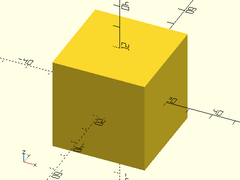
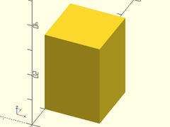
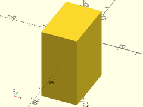
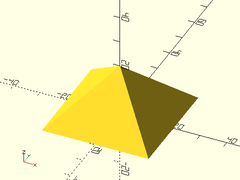
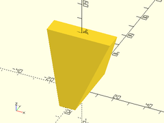
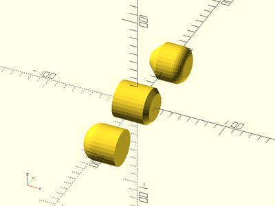

# Library File shapes.scad

Common useful shapes and structured objects.
To use, add the following lines to the beginning of your file:
```
include <BOSL/constants.scad>
use <BOSL/shapes.scad>
```

---

# Table of Contents

1. [Cuboids](#1-cuboids)
    - [`cuboid()`](#cuboid)
    - [`span_cube()`](#span_cube)
    - [`leftcube()`](#leftcube)
    - [`rightcube()`](#rightcube)
    - [`fwdcube()`](#fwdcube)
    - [`backcube()`](#backcube)
    - [`downcube()`](#downcube)
    - [`upcube()`](#upcube)

2. [Prismoids](#2-prismoids)
    - [`prismoid()`](#prismoid)
    - [`rounded_prismoid()`](#rounded_prismoid)
    - [`right_triangle()`](#right_triangle)

3. [Cylindroids](#3-cylindroids)
    - [`cyl()`](#cyl)
    - [`downcyl()`](#downcyl)
    - [`xcyl()`](#xcyl)
    - [`ycyl()`](#ycyl)
    - [`zcyl()`](#zcyl)
    - [`tube()`](#tube)
    - [`torus()`](#torus)

4. [Spheroids](#4-spheroids)
    - [`staggered_sphere()`](#staggered_sphere)

5. [3D Printing Shapes](#5-3d-printing-shapes)
    - [`teardrop2d()`](#teardrop2d)
    - [`teardrop()`](#teardrop)
    - [`onion()`](#onion)
    - [`narrowing_strut()`](#narrowing_strut)
    - [`thinning_wall()`](#thinning_wall)
    - [`braced_thinning_wall()`](#braced_thinning_wall)
    - [`thinning_triangle()`](#thinning_triangle)
    - [`sparse_strut()`](#sparse_strut)
    - [`sparse_strut3d()`](#sparse_strut3d)
    - [`corrugated_wall()`](#corrugated_wall)

6. [Miscellaneous](#6-miscellaneous)
    - [`nil()`](#nil)
    - [`noop()`](#noop)
    - [`pie_slice()`](#pie_slice)
    - [`interior_fillet()`](#interior_fillet)
    - [`slot()`](#slot)
    - [`arced_slot()`](#arced_slot)

7. [Deprecations](#7-deprecations)
    - [`cube2pt()`](#cube2pt)
    - [`offsetcube()`](#offsetcube)
    - [`chamfcube()`](#chamfcube)
    - [`rrect()`](#rrect)
    - [`rcube()`](#rcube)
    - [`trapezoid()`](#trapezoid)
    - [`pyramid()`](#pyramid)
    - [`prism()`](#prism)
    - [`chamferred_cylinder()`](#chamferred_cylinder)
    - [`chamf_cyl()`](#chamf_cyl)
    - [`filleted_cylinder()`](#filleted_cylinder)
    - [`rcylinder()`](#rcylinder)
    - [`thinning_brace()`](#thinning_brace)

---

# 1. Cuboids

### cuboid()

**Description**:
Creates a cube or cuboid object, with optional chamfering or filleting/rounding.

Argument        | What it does
--------------- | ------------------------------
`size`          | The size of the cube.
`chamfer`       | Size of chamfer, inset from sides.  Default: No chamferring.
`fillet`        | Radius of fillet for edge rounding.  Default: No filleting.
`edges`         | Edges to chamfer/fillet.  Use `EDGE` constants from constants.scad. Default: `EDGES_ALL`
`trimcorners`   | If true, rounds or chamfers corners where three chamferred/filleted edges meet.  Default: `true`
`p1`            | Align the cuboid's corner at `p1`, if given.  Forces `align=V_UP+V_BACK+V_RIGHT`.
`p2`            | If given with `p1`, defines the cornerpoints of the cuboid.
`align`         | The side of the origin to align to.  Use `V_` constants from `constants.scad`.  Default: `V_CENTER`
`center`        | If given, overrides `align`.  A true value sets `align=V_CENTER`, false sets `align=V_UP+V_BACK+V_RIGHT`.

**Example 1**: Simple regular cube.

    cuboid(40);



**Example 2**: Cube with minimum cornerpoint given.

    cuboid(20, p1=[10,0,0]);


**Example 3**: Rectangular cube, with given X, Y, and Z sizes.

    cuboid([20,40,50]);


**Example 4**: Rectangular cube defined by opposing cornerpoints.

    cuboid(p1=[0,10,0], p2=[20,30,30]);



**Example 5**: Rectangular cube with chamferred edges and corners.

    cuboid([30,40,50], chamfer=5);


**Example 6**: Rectangular cube with chamferred edges, without trimmed corners.

    cuboid([30,40,50], chamfer=5, trimcorners=false);


**Example 7**: Rectangular cube with rounded edges and corners.

    cuboid([30,40,50], fillet=10);


**Example 8**: Rectangular cube with rounded edges, without trimmed corners.

    cuboid([30,40,50], fillet=10, trimcorners=false);


**Example 9**: Rectangular cube with only some edges chamferred.

    cuboid([30,40,50], chamfer=5, edges=EDGE_TOP_FR+EDGE_TOP_RT+EDGE_FR_RT, $fn=24);


**Example 10**: Rectangular cube with only some edges rounded.

    cuboid([30,40,50], fillet=5, edges=EDGE_TOP_FR+EDGE_TOP_RT+EDGE_FR_RT, $fn=24);


---

### span\_cube()

**Description**:
Creates a cube that spans the X, Y, and Z ranges given.

Argument        | What it does
--------------- | ------------------------------
`xspan`         | [min, max] X axis range.
`yspan`         | [min, max] Y axis range.
`zspan`         | [min, max] Z axis range.

**Example**:

    span_cube([0,15], [5,10], [0, 10]);


---

### leftcube()

**Usage**:
- leftcube(size);

**Description**:
Makes a cube that is aligned on the left side of the origin.

Argument        | What it does
--------------- | ------------------------------
`size`          | The size of the cube to make.

**Example**:

    leftcube([20,30,40]);


---

### rightcube()

**Usage**:
- rightcube(size);

**Description**:
Makes a cube that is aligned on the right side of the origin.

Argument        | What it does
--------------- | ------------------------------
`size`          | The size of the cube to make.

**Example**:

    rightcube([20,30,40]);


---

### fwdcube()

**Usage**:
- fwdcube(size);

**Description**:
Makes a cube that is aligned on the front side of the origin.

Argument        | What it does
--------------- | ------------------------------
`size`          | The size of the cube to make.

**Example**:

    fwdcube([20,30,40]);



---

### backcube()

**Usage**:
- backcube(size);

**Description**:
Makes a cube that is aligned on the front side of the origin.

Argument        | What it does
--------------- | ------------------------------
`size`          | The size of the cube to make.

**Example**:

    backcube([20,30,40]);


---

### downcube()

**Usage**:
- downcube(size);

**Description**:
Makes a cube that is aligned on the bottom side of the origin.

Argument        | What it does
--------------- | ------------------------------
`size`          | The size of the cube to make.

**Example**:

    downcube([20,30,40]);


---

### upcube()

**Usage**:
- upcube(size);

**Description**:
Makes a cube that is aligned on the top side of the origin.

Argument        | What it does
--------------- | ------------------------------
`size`          | The size of the cube to make.

**Example**:

    upcube([20,30,40]);


---

# 2. Prismoids

### prismoid()

**Usage**:
- prismoid(size1, size2, h, [shift], [orient], [align|center]);

**Description**:
Creates a rectangular prismoid shape.

Argument        | What it does
--------------- | ------------------------------
`size1`         | [width, length] of the axis-negative end of the prism.
`size2`         | [width, length] of the axis-positive end of the prism.
`h`             | Height of the prism.
`shift`         | [x, y] amount to shift the center of the top with respect to the center of the bottom.
`orient`        | Orientation of the prismoid.  Use the `ORIENT_` constants from `constants.scad`.  Default: `ORIENT_Z`.
`align`         | Alignment of the prismoid by the axis-negative (size1) end.  Use the `V_` constants from `constants.scad`.  Default: `ALIGN_POS`.
`center`        | If given, overrides `align`.  A true value sets `align=V_CENTER`, false sets `align=ALIGN_POS`.

**Example 1**: Rectangular Pyramid

    prismoid(size1=[40,40], size2=[0,0], h=20);



**Example 2**: Prism

    prismoid(size1=[40,40], size2=[0,40], h=20);


**Example 3**: Truncated Pyramid

    prismoid(size1=[35,50], size2=[20,30], h=20);


**Example 4**: Wedge

    prismoid(size1=[60,35], size2=[30,0], h=30);


**Example 5**: Truncated Tetrahedron

    prismoid(size1=[10,40], size2=[40,10], h=40);



**Example 6**: Inverted Truncated Pyramid

    prismoid(size1=[15,5], size2=[30,20], h=20);


**Example 7**: Right Prism

    prismoid(size1=[30,60], size2=[0,60], shift=[-15,0], h=30);


**Example 8**: Shifting/Skewing

    prismoid(size1=[50,30], size2=[20,20], h=20, shift=[15,5]);


---

### rounded\_prismoid()

**Description**:
Creates a rectangular prismoid shape with rounded vertical edges.

Argument        | What it does
--------------- | ------------------------------
`size1`         | [width, length] of the bottom of the prism.
`size2`         | [width, length] of the top of the prism.
`h`             | Height of the prism.
`r`             | radius of vertical edge fillets.
`r1`            | radius of vertical edge fillets at bottom.
`r2`            | radius of vertical edge fillets at top.
`shift`         | [x, y] amount to shift the center of the top with respect to the center of the bottom.
`orient`        | Orientation of the prismoid.  Use the `ORIENT_` constants from `constants.scad`.  Default: `ORIENT_Z`.
`align`         | Alignment of the prismoid by the axis-negative (`size1`) end.  Use the `V_` constants from `constants.scad`.  Default: `V_UP`.
`center`        | vertically center the prism.  Overrides `align`.

**Example 1**: Rounded Pyramid

    rounded_prismoid(size1=[40,40], size2=[0,0], h=25, r=5);


**Example 2**: Centered Rounded Pyramid

    rounded_prismoid(size1=[40,40], size2=[0,0], h=25, r=5, center=true);


**Example 3**: Disparate Top and Bottom Radii

    rounded_prismoid(size1=[40,60], size2=[40,60], h=20, r1=3, r2=10, $fn=24);


**Example 4**: Shifting/Skewing

    rounded_prismoid(size1=[50,30], size2=[20,20], h=20, shift=[15,5], r=5);


---

### right\_triangle()

**Usage**:
- right\_triangle(size, [orient], [align|center]);

**Description**:
Creates a 3D right triangular prism.

Argument        | What it does
--------------- | ------------------------------
`size`          | [width, thickness, height]
`orient`        | The axis to place the hypotenuse along.  Only accepts `ORIENT_X`, `ORIENT_Y`, or `ORIENT_Z` from `constants.scad`.  Default: `ORIENT_Y`.
`align`         | The side of the origin to align to.  Use `V_` constants from `constants.scad`.  Default: `V_UP+V_BACK+V_RIGHT`.
`center`        | If given, overrides `align`.  A true value sets `align=V_CENTER`, false sets `align=V_UP+V_BACK+V_RIGHT`.

**Example 1**: Centered

    right_triangle([60, 10, 40], center=true);


**Example 2**: *Non*-Centered

    right_triangle([60, 10, 40]);


---

# 3. Cylindroids

### cyl()

**Normal Cylinders**:
- cyl(l|h, r|d, [circum], [realign], [orient], [align], [center]);
- cyl(l|h, r1|d1, r2/d2, [circum], [realign], [orient], [align], [center]);

**Chamferred Cylinders**:
- cyl(l|h, r|d, chamfer, [chamfang], [from\_end], [circum], [realign], [orient], [align], [center]);
- cyl(l|h, r|d, chamfer1, [chamfang1], [from\_end], [circum], [realign], [orient], [align], [center]);
- cyl(l|h, r|d, chamfer2, [chamfang2], [from\_end], [circum], [realign], [orient], [align], [center]);
- cyl(l|h, r|d, chamfer1, chamfer2, [chamfang1], [chamfang2], [from\_end], [circum], [realign], [orient], [align], [center]);

**Rounded/Filleted Cylinders**:
- cyl(l|h, r|d, fillet, [circum], [realign], [orient], [align], [center]);
- cyl(l|h, r|d, fillet1, [circum], [realign], [orient], [align], [center]);
- cyl(l|h, r|d, fillet2, [circum], [realign], [orient], [align], [center]);
- cyl(l|h, r|d, fillet1, fillet2, [circum], [realign], [orient], [align], [center]);

**Description**:
Creates cylinders in various alignments and orientations,
with optional fillets and chamfers. You can use `r` and `l`
interchangably, and all variants allow specifying size
by either `r`|`d`, or `r1`|`d1` and `r2`|`d2`.
Note that that chamfers and fillets cannot cross the
midpoint of the cylinder's length.

Argument        | What it does
--------------- | ------------------------------
`l` / `h`       | Length of cylinder along oriented axis. (Default: 1.0)
`r`             | Radius of cylinder.
`r1`            | Radius of the negative (X-, Y-, Z-) end of cylinder.
`r2`            | Radius of the positive (X+, Y+, Z+) end of cylinder.
`d`             | Diameter of cylinder.
`d1`            | Diameter of the negative (X-, Y-, Z-) end of cylinder.
`d2`            | Diameter of the positive (X+, Y+, Z+) end of cylinder.
`circum`        | If true, cylinder should circumscribe the circle of the given size.  Otherwise inscribes.  Default: `false`
`chamfer`       | The size of the chamfers on the ends of the cylinder.  Default: none.
`chamfer1`      | The size of the chamfer on the axis-negative end of the cylinder.  Default: none.
`chamfer2`      | The size of the chamfer on the axis-positive end of the cylinder.  Default: none.
`chamfang`      | The angle in degrees of the chamfers on the ends of the cylinder.
`chamfang1`     | The angle in degrees of the chamfer on the axis-negative end of the cylinder.
`chamfang2`     | The angle in degrees of the chamfer on the axis-positive end of the cylinder.
`from_end`      | If true, chamfer is measured from the end of the cylinder, instead of inset from the edge.  Default: `false`.
`fillet`        | The radius of the fillets on the ends of the cylinder.  Default: none.
`fillet1`       | The radius of the fillet on the axis-negative end of the cylinder.
`fillet2`       | The radius of the fillet on the axis-positive end of the cylinder.
`realign`       | If true, rotate the cylinder by half the angle of one face.
`orient`        | Orientation of the cylinder.  Use the `ORIENT_` constants from `constants.scad`.  Default: vertical.
`align`         | Alignment of the cylinder.  Use the `V_` constants from `constants.scad`.  Default: centered.
`center`        | If given, overrides `align`.  A true value sets `align=V_CENTER`, false sets `align=ALIGN_POS`.

**Example 1**: By Radius

    xdistribute(30) {
        cyl(l=40, r=10);
        cyl(l=40, r1=10, r2=5);
    }


**Example 2**: By Diameter

    xdistribute(30) {
        cyl(l=40, d=25);
        cyl(l=40, d1=25, d2=10);
    }


**Example 3**: Chamferring

    xdistribute(60) {
        // Shown Left to right.
        cyl(l=40, d=40, chamfer=7);  // Default chamfang=45
        cyl(l=40, d=40, chamfer=7, chamfang=30, from_end=false);
        cyl(l=40, d=40, chamfer=7, chamfang=30, from_end=true);
    }


**Example 4**: Rounding/Filleting

    cyl(l=40, d=40, fillet=10);


**Example 5**: Heterogenous Chamfers and Fillets

    ydistribute(80) {
        // Shown Front to Back.
        cyl(l=40, d=40, fillet1=15, orient=ORIENT_X);
        cyl(l=40, d=40, chamfer2=5, orient=ORIENT_X);
        cyl(l=40, d=40, chamfer1=12, fillet2=10, orient=ORIENT_X);
    }



**Example 6**: Putting it all together

    cyl(l=40, d1=25, d2=15, chamfer1=10, chamfang1=30, from_end=true, fillet2=5);


---

### downcyl()

**Usage**:
- downcyl(l|h, r|d);
- downcyl(l|h, r1|d1, r2|d2);

**Description**:
Creates a cylinder aligned below the origin.

Argument        | What it does
--------------- | ------------------------------
`l` / `h`       | Length of cylinder. (Default: 1.0)
`r`             | Radius of cylinder.
`r1`            | Bottom radius of cylinder.
`r2`            | Top radius of cylinder.
`d`             | Diameter of cylinder. (use instead of r)
`d1`            | Bottom diameter of cylinder.
`d2`            | Top diameter of cylinder.

**Example 1**: Cylinder

    downcyl(r=20, h=40);


**Example 2**: Cone

    downcyl(r1=10, r2=20, h=40);


---

### xcyl()

**Usage**:
- xcyl(l|h, r|d, [align|center]);
- xcyl(l|h, r1|d1, r2|d2, [align|center]);

**Description**:
Creates a cylinder oriented along the X axis.

Argument        | What it does
--------------- | ------------------------------
`l` / `h`       | Length of cylinder along oriented axis. (Default: `1.0`)
`r`             | Radius of cylinder.
`r1`            | Optional radius of left (X-) end of cylinder.
`r2`            | Optional radius of right (X+) end of cylinder.
`d`             | Optional diameter of cylinder. (use instead of `r`)
`d1`            | Optional diameter of left (X-) end of cylinder.
`d2`            | Optional diameter of right (X+) end of cylinder.
`align`         | The side of the origin to align to.  Use `V_` constants from `constants.scad`. Default: `V_CENTER`
`center`        | If given, overrides `align`.  A `true` value sets `align=V_CENTER`, `false` sets `align=ALIGN_POS`.

**Example 1**: By Radius

    ydistribute(50) {
        xcyl(l=35, r=10);
        xcyl(l=35, r1=15, r2=5);
    }


**Example 2**: By Diameter

    ydistribute(50) {
        xcyl(l=35, d=20);
        xcyl(l=35, d1=30, d2=10);
    }


---

### ycyl()

**Usage**:
- ycyl(l|h, r|d, [align|center]);
- ycyl(l|h, r1|d1, r2|d2, [align|center]);

**Description**:
Creates a cylinder oriented along the Y axis.

Argument        | What it does
--------------- | ------------------------------
`l` / `h`       | Length of cylinder along oriented axis. (Default: `1.0`)
`r`             | Radius of cylinder.
`r1`            | Radius of front (Y-) end of cone.
`r2`            | Radius of back (Y+) end of one.
`d`             | Diameter of cylinder.
`d1`            | Diameter of front (Y-) end of one.
`d2`            | Diameter of back (Y+) end of one.
`align`         | The side of the origin to align to.  Use `V_` constants from `constants.scad`. Default: `V_CENTER`
`center`        | Overrides `align` if given.  If true, `align=V_CENTER`, if false, `align=ALIGN_POS`.

**Example 1**: By Radius

    xdistribute(50) {
        ycyl(l=35, r=10);
        ycyl(l=35, r1=15, r2=5);
    }


**Example 2**: By Diameter

    xdistribute(50) {
        ycyl(l=35, d=20);
        ycyl(l=35, d1=30, d2=10);
    }


---

### zcyl()

**Usage**:
- zcyl(l|h, r|d, [align|center]);
- zcyl(l|h, r1|d1, r2|d2, [align|center]);

**Description**:
Creates a cylinder oriented along the Z axis.

Argument        | What it does
--------------- | ------------------------------
`l` / `h`       | Length of cylinder along oriented axis. (Default: 1.0)
`r`             | Radius of cylinder.
`r1`            | Radius of front (Y-) end of cone.
`r2`            | Radius of back (Y+) end of one.
`d`             | Diameter of cylinder.
`d1`            | Diameter of front (Y-) end of one.
`d2`            | Diameter of back (Y+) end of one.
`align`         | The side of the origin to align to.  Use `V_` constants from `constants.scad`. Default: `V_CENTER`
`center`        | Overrides `align` if given.  If true, `align=V_CENTER`, if false, `align=ALIGN_POS`.

**Example 1**: By Radius

    xdistribute(50) {
        zcyl(l=35, r=10);
        zcyl(l=35, r1=15, r2=5);
    }


**Example 2**: By Diameter

    xdistribute(50) {
        zcyl(l=35, d=20);
        zcyl(l=35, d1=30, d2=10);
    }


---

### tube()

**Usage**:
- tube(h, ir|id, wall, [realign], [orient], [align]);
- tube(h, or|od, wall, [realign], [orient], [align]);
- tube(h, ir|id, or|od, [realign], [orient], [align]);
- tube(h, ir1|id1, ir2|id2, wall, [realign], [orient], [align]);
- tube(h, or1|od1, or2|od2, wall, [realign], [orient], [align]);
- tube(h, ir1|id1, ir2|id2, or1|od1, or2|od2, [realign], [orient], [align]);

**Description**:
Makes a hollow tube with the given outer size and wall thickness.

Argument        | What it does
--------------- | ------------------------------
`h`             | height of tube. (Default: 1)
`or`            | Outer radius of tube.
`or1`           | Outer radius of bottom of tube.  (Default: value of r)
`or2`           | Outer radius of top of tube.  (Default: value of r)
`od`            | Outer diameter of tube.
`od1`           | Outer diameter of bottom of tube.
`od2`           | Outer diameter of top of tube.
`wall`          | horizontal thickness of tube wall. (Default 0.5)
`ir`            | Inner radius of tube.
`ir1`           | Inner radius of bottom of tube.
`ir2`           | Inner radius of top of tube.
`id`            | Inner diameter of tube.
`id1`           | Inner diameter of bottom of tube.
`id2`           | Inner diameter of top of tube.
`realign`       | If true, rotate the tube by half the angle of one face.
`orient`        | Orientation of the tube.  Use the `ORIENT_` constants from `constants.scad`.  Default: vertical.
`align`         | Alignment of the tube.  Use the `V_` constants from `constants.scad`.  Default: centered.

**Example 1**: These all Produce the Same Tube

    tube(h=30, or=40, wall=5);
    tube(h=30, ir=35, wall=5);
    tube(h=30, or=40, ir=35);
    tube(h=30, od=80, id=70);


**Example 2**: These all Produce the Same Conical Tube

    tube(h=30, or1=40, or2=25, wall=5);
    tube(h=30, ir1=35, or2=20, wall=5);
    tube(h=30, or1=40, or2=25, ir1=35, ir2=20);


**Example 3**: Circular Wedge

    tube(h=30, or1=40, or2=30, ir1=20, ir2=30);


---

### torus()

**Usage**:
- torus(r|d, r2|d2, [orient], [align]);
- torus(or|od, ir|id, [orient], [align]);

Argument        | What it does
--------------- | ------------------------------
`r`             | major radius of torus ring. (use with of 'r2', or 'd2')
`r2`            | minor radius of torus ring. (use with of 'r', or 'd')
`d`             | major diameter of torus ring. (use with of 'r2', or 'd2')
`d2`            | minor diameter of torus ring. (use with of 'r', or 'd')
`or`            | outer radius of the torus. (use with 'ir', or 'id')
`ir`            | inside radius of the torus. (use with 'or', or 'od')
`od`            | outer diameter of the torus. (use with 'ir' or 'id')
`id`            | inside diameter of the torus. (use with 'or' or 'od')
`orient`        | Orientation of the torus.  Use the `ORIENT_` constants from `constants.scad`.  Default: `ORIENT_Z`.
`align`         | Alignment of the torus.  Use the `V_` constants from `constants.scad`.  Default: `V_CENTER`.

**Example**:

    // These all produce the same torus.
    torus(r=22.5, r2=7.5);
    torus(d=45, d2=15);
    torus(or=30, ir=15);
    torus(od=60, id=30);


---

# 4. Spheroids

### staggered\_sphere()

**Usage**:
- staggered\_sphere(r|d, [circum])

**Description**:
An alternate construction to the standard `sphere()` built-in, with different triangulation.

Argument        | What it does
--------------- | ------------------------------
`r`             | Radius of the sphere.
`d`             | Diameter of the sphere.
`circum`        | If true, circumscribes the perfect sphere of the given size.

**Example**:

    staggered_sphere(d=100, circum=true, $fn=10);


---

# 5. 3D Printing Shapes

### teardrop2d()

**Usage**:
- teardrop2d(r|d, [ang], [cap\_h]);

**Description**:
Makes a 2D teardrop shape. Useful for extruding into 3D printable holes.

Argument        | What it does
--------------- | ------------------------------
`r`             | radius of circular part of teardrop.  (Default: 1)
`d`             | diameter of spherical portion of bottom. (Use instead of r)
`ang`           | angle of hat walls from the Y axis.  (Default: 45 degrees)
`cap_h`         | if given, height above center where the shape will be truncated.

**Example 1**: Typical Shape

    teardrop2d(r=30, ang=30);


**Example 2**: Crop Cap

    teardrop2d(r=30, ang=30, cap_h=40);


**Example 3**: Close Crop

    teardrop2d(r=30, ang=30, cap_h=20);


---

### teardrop()

**Usage**:
- teardrop(r|d, l|h, [ang], [cap\_h], [orient], [align])

**Description**:
Makes a teardrop shape in the XZ plane. Useful for 3D printable holes.

Argument        | What it does
--------------- | ------------------------------
`r`             | Radius of circular part of teardrop.  (Default: 1)
`d`             | Diameter of circular portion of bottom. (Use instead of r)
`l`             | Thickness of teardrop. (Default: 1)
`ang`           | Angle of hat walls from the Z axis.  (Default: 45 degrees)
`cap_h`         | If given, height above center where the shape will be truncated.
`orient`        | Orientation of the shape.  Use the `ORIENT_` constants from `constants.scad`.  Default: `ORIENT_Y`.
`align`         | Alignment of the shape.  Use the `V_` constants from `constants.scad`.  Default: `V_CENTER`.

**Example 1**: Typical Shape

    teardrop(r=30, h=10, ang=30);


**Example 2**: Crop Cap

    teardrop(r=30, h=10, ang=30, cap_h=40);


**Example 3**: Close Crop

    teardrop(r=30, h=10, ang=30, cap_h=20);


---

### onion()

**Usage**:
- onion(r|d, [maxang], [cap\_h], [orient], [align]);

**Description**:
Creates a sphere with a conical hat, to make a 3D teardrop.

Argument        | What it does
--------------- | ------------------------------
`r`             | radius of spherical portion of the bottom. (Default: 1)
`d`             | diameter of spherical portion of bottom.
`cap_h`         | height above sphere center to truncate teardrop shape.
`maxang`        | angle of cone on top from vertical.
`orient`        | Orientation of the shape.  Use the `ORIENT_` constants from `constants.scad`.  Default: `ORIENT_Y`.
`align`         | Alignment of the shape.  Use the `V_` constants from `constants.scad`.  Default: `V_CENTER`.

**Example 1**: Typical Shape

    onion(r=30, maxang=30);


**Example 2**: Crop Cap

    onion(r=30, maxang=30, cap_h=40);


**Example 3**: Close Crop

    onion(r=30, maxang=30, cap_h=20);


---

### narrowing\_strut()

**Usage**:
- narrowing\_strut(w, l, wall, [ang], [orient], [align]);

**Description**:
Makes a rectangular strut with the top side narrowing in a triangle.
The shape created may be likened to an extruded home plate from baseball.
This is useful for constructing parts that minimize the need to support
overhangs.

Argument        | What it does
--------------- | ------------------------------
`w`             | Width (thickness) of the strut.
`l`             | Length of the strut.
`wall`          | height of rectangular portion of the strut.
`ang`           | angle that the trianglar side will converge at.
`orient`        | Orientation of the length axis of the shape.  Use the `ORIENT_` constants from `constants.scad`.  Default: `ORIENT_Y`.
`align`         | Alignment of the shape.  Use the `V_` constants from `constants.scad`.  Default: `V_CENTER`.

**Example**:

    narrowing_strut(w=10, l=100, wall=5, ang=30);


---

### thinning\_wall()

**Usage**:
- thinning\_wall(h, l, thick, [ang], [strut], [wall], [orient], [align]);

**Description**:
Makes a rectangular wall which thins to a smaller width in the center,
with angled supports to prevent critical overhangs.

Argument        | What it does
--------------- | ------------------------------
`h`             | height of wall.
`l`             | length of wall.  If given as a vector of two numbers, specifies bottom and top lengths, respectively.
`thick`         | thickness of wall.
`ang`           | maximum overhang angle of diagonal brace.
`strut`         | the width of the diagonal brace.
`wall`          | the thickness of the thinned portion of the wall.
`orient`        | Orientation of the length axis of the wall.  Use the `ORIENT_` constants from `constants.scad`.  Default: `ORIENT_X`.
`align`         | Alignment of the shape.  Use the `V_` constants from `constants.scad`.  Default: `V_CENTER`.

**Example 1**: Typical Shape

    thinning_wall(h=50, l=80, thick=4);


**Example 2**: Trapezoidal

    thinning_wall(h=50, l=[80,50], thick=4);


---

### braced\_thinning\_wall()

**Usage**:
- braced\_thinning\_wall(h, l, thick, [ang], [strut], [wall], [orient], [align]);

**Description**:
Makes a rectangular wall with cross-bracing, which thins to a smaller width in the center,
with angled supports to prevent critical overhangs.

Argument        | What it does
--------------- | ------------------------------
`h`             | height of wall.
`l`             | length of wall.
`thick`         | thickness of wall.
`ang`           | maximum overhang angle of diagonal brace.
`strut`         | the width of the diagonal brace.
`wall`          | the thickness of the thinned portion of the wall.
`orient`        | Orientation of the length axis of the wall.  Use the `ORIENT_` constants from `constants.scad`.  Default: `ORIENT_Y`.
`align`         | Alignment of the shape.  Use the `V_` constants from `constants.scad`.  Default: `V_CENTER`.

**Example**: Typical Shape

    braced_thinning_wall(h=50, l=100, thick=5);


---

### thinning\_triangle()

**Usage**:
- thinning\_triangle(h, l, thick, [ang], [strut], [wall], [diagonly], [orient], [align|center]);

**Description**:
Makes a triangular wall with thick edges, which thins to a smaller width in
the center, with angled supports to prevent critical overhangs.

Argument        | What it does
--------------- | ------------------------------
`h`             | height of wall.
`l`             | length of wall.
`thick`         | thickness of wall.
`ang`           | maximum overhang angle of diagonal brace.
`strut`         | the width of the diagonal brace.
`wall`          | the thickness of the thinned portion of the wall.
`diagonly`      | boolean, which denotes only the diagonal side (hypotenuse) should be thick.
`orient`        | Orientation of the length axis of the shape.  Use the `ORIENT_` constants from `constants.scad`.  Default: `ORIENT_Y`.
`align`         | Alignment of the shape.  Use the `V_` constants from `constants.scad`.  Default: `V_CENTER`.
`center`        | If true, centers shape.  If false, overrides `align` with `V_UP+V_BACK`.

**Example 1**: Centered

    thinning_triangle(h=50, l=80, thick=4, ang=30, strut=5, wall=2, center=true);


**Example 2**: All Braces

    thinning_triangle(h=50, l=80, thick=4, ang=30, strut=5, wall=2, center=false);


**Example 3**: Diagonal Brace Only

    thinning_triangle(h=50, l=80, thick=4, ang=30, strut=5, wall=2, diagonly=true, center=false);


---

### sparse\_strut()

**Usage**:
- sparse\_strut(h, l, thick, [strut], [maxang], [max\_bridge], [orient], [align])

**Description**:
Makes an open rectangular strut with X-shaped cross-bracing, designed to reduce
the need for support material in 3D printing.

Argument        | What it does
--------------- | ------------------------------
`h`             | height of strut wall.
`l`             | length of strut wall.
`thick`         | thickness of strut wall.
`maxang`        | maximum overhang angle of cross-braces.
`max_bridge`    | maximum bridging distance between cross-braces.
`strut`         | the width of the cross-braces.
`orient`        | Orientation of the length axis of the shape.  Use the `ORIENT_` constants from `constants.scad`.  Default: `ORIENT_Y`.
`align`         | Alignment of the shape.  Use the `V_` constants from `constants.scad`.  Default: `V_CENTER`.

**Example 1**: Typical Shape

    sparse_strut(h=40, l=100, thick=3);


**Example 2**: Thinner Strut

    sparse_strut(h=40, l=100, thick=3, strut=2);


**Example 3**: Larger maxang

    sparse_strut(h=40, l=100, thick=3, strut=2, maxang=45);


**Example 4**: Longer max\_bridge

    sparse_strut(h=40, l=100, thick=3, strut=2, maxang=45, max_bridge=30);


---

### sparse\_strut3d()

**Usage**:
- sparse\_strut3d(h, w, l, [thick], [maxang], [max\_bridge], [strut], [orient], [align]);

**Description**:
Makes an open rectangular strut with X-shaped cross-bracing, designed to reduce the
need for support material in 3D printing.

Argument        | What it does
--------------- | ------------------------------
`h`             | Z size of strut.
`w`             | X size of strut.
`l`             | Y size of strut.
`thick`         | thickness of strut walls.
`maxang`        | maximum overhang angle of cross-braces.
`max_bridge`    | maximum bridging distance between cross-braces.
`strut`         | the width of the cross-braces.
`orient`        | Orientation of the length axis of the shape.  Use the `ORIENT_` constants from `constants.scad`.  Default: `ORIENT_Y`.
`align`         | Alignment of the shape.  Use the `V_` constants from `constants.scad`.  Default: `V_CENTER`.

**Example 1**: Typical Shape

    sparse_strut3d(h=30, w=30, l=100);


**Example 2**: Thinner strut

    sparse_strut3d(h=30, w=30, l=100, strut=2);


**Example 3**: Larger maxang

    sparse_strut3d(h=30, w=30, l=100, strut=2, maxang=50);


**Example 4**: Smaller max\_bridge

    sparse_strut3d(h=30, w=30, l=100, strut=2, maxang=50, max_bridge=20);


---

### corrugated\_wall()

**Usage**:
- corrugated\_wall(h, l, thick, [strut], [wall], [orient], [align]);

**Description**:
Makes a corrugated wall which relieves contraction stress while still
providing support strength.  Designed with 3D printing in mind.

Argument        | What it does
--------------- | ------------------------------
`h`             | height of strut wall.
`l`             | length of strut wall.
`thick`         | thickness of strut wall.
`strut`         | the width of the cross-braces.
`wall`          | thickness of corrugations.
`orient`        | Orientation of the length axis of the shape.  Use the `ORIENT_` constants from `constants.scad`.  Default: `ORIENT_Y`.
`align`         | Alignment of the shape.  Use the `V_` constants from `constants.scad`.  Default: `V_CENTER`.

**Example 1**: Typical Shape

    corrugated_wall(h=50, l=100);


**Example 2**: Wider Strut

    corrugated_wall(h=50, l=100, strut=8);


**Example 3**: Thicker Wall

    corrugated_wall(h=50, l=100, strut=8, wall=3);


---

# 6. Miscellaneous

### nil()

**Description**:
Useful when you MUST pass a child to a module, but you want it to be nothing.

---

### noop()

**Description**:
Passes through the children passed to it, with no action at all.
Useful while debugging when you want to replace a command.

---

### pie\_slice()

**Usage**:
- pie\_slice(ang, l|h, r|d, [orient], [align|center]);
- pie\_slice(ang, l|h, r1|d1, r2|d2, [orient], [align|center]);

**Description**:
Creates a pie slice shape.

Argument        | What it does
--------------- | ------------------------------
`ang`           | pie slice angle in degrees.
`h`             | height of pie slice.
`r`             | radius of pie slice.
`r1`            | bottom radius of pie slice.
`r2`            | top radius of pie slice.
`d`             | diameter of pie slice.
`d1`            | bottom diameter of pie slice.
`d2`            | top diameter of pie slice.
`orient`        | Orientation of the pie slice.  Use the `ORIENT_` constants from `constants.scad`.  Default: `ORIENT_Z`.
`align`         | Alignment of the pie slice.  Use the `V_` constants from `constants.scad`.  Default: `V_CENTER`.
`center`        | If given, overrides `align`.  A true value sets `align=V_CENTER`, false sets `align=ALIGN_POS`.

**Example 1**: Cylindrical Pie Slice

    pie_slice(ang=45, l=20, r=30);


**Example 2**: Conical Pie Slice

    pie_slice(ang=60, l=20, d1=50, d2=70);


---

### interior\_fillet()

**Usage**:
- interior\_fillet(l, r, [ang], [overlap], [orient], [align]);

**Description**:
Creates a shape that can be unioned into a concave joint between two faces, to fillet them.
Center this part along the concave edge to be chamferred and union it in.

Argument        | What it does
--------------- | ------------------------------
`l`             | length of edge to fillet.
`r`             | radius of fillet.
`ang`           | angle between faces to fillet.
`overlap`       | overlap size for unioning with faces.
`orient`        | Orientation of the fillet.  Use the `ORIENT_` constants from `constants.scad`.  Default: `ORIENT_X`.
`align`         | Alignment of the fillet.  Use the `V_` or `ALIGN_` constants from `constants.scad`.  Default: `V_CENTER`.

**Example 1**:

    union() {
        translate([0,2,-4]) upcube([20, 4, 24]);
        translate([0,-10,-4]) upcube([20, 20, 4]);
        color("green") interior_fillet(l=20, r=10, orient=ORIENT_XNEG);
    }


**Example 2**:

    interior_fillet(l=40, r=10, orient=ORIENT_Y_90);


---

### slot()

**Usage**:
- slot(h, l, r|d, [orient], [align|center]);
- slot(h, p1, p2, r|d, [orient], [align|center]);
- slot(h, l, r1|d1, r2|d2, [orient], [align|center]);
- slot(h, p1, p2, r1|d1, r2|d2, [orient], [align|center]);

**Description**:
Makes a linear slot with rounded ends, appropriate for bolts to slide along.

Argument        | What it does
--------------- | ------------------------------
`p1`            | center of starting circle of slot.
`p2`            | center of ending circle of slot.
`l`             | length of slot along the X axis.
`h`             | height of slot shape. (default: 10)
`r`             | radius of slot circle. (default: 5)
`r1`            | bottom radius of slot cone.
`r2`            | top radius of slot cone.
`d`             | diameter of slot circle.
`d1`            | bottom diameter of slot cone.
`d2`            | top diameter of slot cone.

**Example 1**: Between Two Points

    slot([0,0,0], [50,50,0], r1=5, r2=10, h=5);


**Example 2**: By Length

    slot(l=50, r1=5, r2=10, h=5);


---

### arced\_slot()

**Usage**:
- arced\_slot(h, r|d, sr|sd, [sa], [ea], [orient], [align|center], [$fn2]);
- arced\_slot(h, r|d, sr1|sd1, sr2|sd2, [sa], [ea], [orient], [align|center], [$fn2]);

**Description**:
Makes an arced slot, appropriate for bolts to slide along.

Argument        | What it does
--------------- | ------------------------------
`cp`            | centerpoint of slot arc. (default: [0, 0, 0])
`h`             | height of slot arc shape. (default: 1.0)
`r`             | radius of slot arc. (default: 0.5)
`d`             | diameter of slot arc. (default: 1.0)
`sr`            | radius of slot channel. (default: 0.5)
`sd`            | diameter of slot channel. (default: 0.5)
`sr1`           | bottom radius of slot channel cone. (use instead of sr)
`sr2`           | top radius of slot channel cone. (use instead of sr)
`sd1`           | bottom diameter of slot channel cone. (use instead of sd)
`sd2`           | top diameter of slot channel cone. (use instead of sd)
`sa`            | starting angle. (Default: 0.0)
`ea`            | ending angle. (Default: 90.0)
`orient`        | Orientation of the arced slot.  Use the `ORIENT_` constants from `constants.scad`.  Default: `ORIENT_Z`.
`align`         | Alignment of the arced slot.  Use the `V_` constants from `constants.scad`.  Default: `V_CENTER`.
`center`        | If true, centers vertically.  If false, drops flush with XY plane.  Overrides `align`.
`$fn2`          | The $fn value to use on the small round endcaps.  The major arcs are still based on $fn.  Default: $fn

**Example 1**: Typical Arced Slot

    arced_slot(d=60, h=5, sd=10, sa=60, ea=280);


**Example 2**: Conical Arced Slot

    arced_slot(r=60, h=5, sd1=10, sd2=15, sa=45, ea=180);


---

# 7. Deprecations

### cube2pt()

**DEPRECATED, use `cuboid(p1,p2)` instead.**

**Usage**:
- cube2pt(p1,p2)

**Description**:
Creates a cube between two points.

Argument        | What it does
--------------- | ------------------------------
`p1`            | Coordinate point of one cube corner.
`p2`            | Coordinate point of opposite cube corner.

---

### offsetcube()

**DEPRECATED, use `cuboid(..., align)` instead.**

**Description**:
Makes a cube that is offset along the given vector by half the cube's size.
For example, if `v=[-1,1,0]`, the cube's front right edge will be centered at the origin.

Argument        | What it does
--------------- | ------------------------------
`size`          | size of cube.
`v`             | vector to offset along.

---

### chamfcube()

**DEPRECATED, use `cuboid(..., chamfer, edges, trimcorners)` instead.**

**Description**:
Makes a cube with chamfered edges.

Argument        | What it does
--------------- | ------------------------------
`size`          | Size of cube [X,Y,Z].  (Default: `[1,1,1]`)
`chamfer`       | Chamfer inset along axis.  (Default: `0.25`)
`chamfaxes`     | Array [X,Y,Z] of boolean values to specify which axis edges should be chamfered.
`chamfcorners`  | Boolean to specify if corners should be flat chamferred.

---

### rrect()

**DEPRECATED, use `cuboid(..., fillet, edges)` instead.**

**Description**:
Makes a cube with rounded (filletted) vertical edges. The `r` size will be
limited to a maximum of half the length of the shortest XY side.

Argument        | What it does
--------------- | ------------------------------
`size`          | Size of cube [X,Y,Z].  (Default: `[1,1,1]`)
`r`             | Radius of edge/corner rounding.  (Default: `0.25`)
`center`        | If true, object will be centered.  If false, sits on top of XY plane.

---

### rcube()

**DEPRECATED, use `cuboid(..., fillet)` instead.**

**Description**:
Makes a cube with rounded (filletted) edges and corners.  The `r` size will be
limited to a maximum of half the length of the shortest cube side.

Argument        | What it does
--------------- | ------------------------------
`size`          | Size of cube [X,Y,Z].  (Default: `[1,1,1]`)
`r`             | Radius of edge/corner rounding.  (Default: `0.25`)
`center`        | If true, object will be centered.  If false, sits on top of XY plane.

---

### trapezoid()

**DEPRECATED, use `prismoid()` instead.**

**Usage**:
- trapezoid(size1, size2, h, [shift], [orient], [align|center]);

**Description**:
Creates a rectangular prismoid shape.

Argument        | What it does
--------------- | ------------------------------
`size1`         | [width, length] of the axis-negative end of the prism.
`size2`         | [width, length] of the axis-positive end of the prism.
`h`             | Height of the prism.
`shift`         | [x, y] amount to shift the center of the top with respect to the center of the bottom.
`orient`        | Orientation of the prismoid.  Use the `ORIENT_` constants from `constants.scad`.  Default: `ORIENT_Z`.
`align`         | Alignment of the prismoid by the axis-negative (size1) end.  Use the `V_` constants from `constants.scad`.  Default: `V_UP`
`center`        | If given, overrides `align`.  A true value sets `align=V_CENTER`, false sets `align=V_UP`.

---

### pyramid()

**DEPRECATED, use `cyl(, r2=0, $fn=N)` instead.**

**Usage**:
- pyramid(n, h, l|r|d, [circum]);

**Description**:
Creates a pyramidal prism with a given number of sides.

Argument        | What it does
--------------- | ------------------------------
`n`             | number of pyramid sides.
`h`             | height of the pyramid.
`l`             | length of one side of the pyramid. (optional)
`r`             | radius of the base of the pyramid. (optional)
`d`             | diameter of the base of the pyramid. (optional)
`circum`        | base circumscribes the circle of the given radius or diam.

---

### prism()

**DEPRECATED, use `cyl(..., $fn=N)` instead.**

**Usage**:
- prism(n, h, l|r|d, [circum]);

**Description**:
Creates a vertical prism with a given number of sides.

Argument        | What it does
--------------- | ------------------------------
`n`             | number of sides.
`h`             | height of the prism.
`l`             | length of one side of the prism. (optional)
`r`             | radius of the prism. (optional)
`d`             | diameter of the prism. (optional)
`circum`        | prism circumscribes the circle of the given radius or diam.

---

### chamferred\_cylinder()

**DEPRECATED, use `cyl(..., chamfer)` instead.**

**Usage**:
- chamferred\_cylinder(h, r|d, chamfer|chamfedge, [top], [bottom], [center])

**Description**:
Creates a cylinder with chamferred (bevelled) edges.

Argument        | What it does
--------------- | ------------------------------
`h`             | height of cylinder. (Default: 1.0)
`r`             | radius of cylinder. (Default: 1.0)
`d`             | diameter of cylinder. (use instead of r)
`chamfer`       | radial inset of the edge chamfer. (Default: 0.25)
`chamfedge`     | length of the chamfer edge. (Use instead of chamfer)
`top`           | boolean.  If true, chamfer the top edges. (Default: True)
`bottom`        | boolean.  If true, chamfer the bottom edges. (Default: True)
`center`        | boolean.  If true, cylinder is centered. (Default: false)

---

### chamf\_cyl()

**DEPRECATED, use `cyl(..., chamfer)` instead.**

**Usage**:
- chamf\_cyl(h, r|d, chamfer|chamfedge, [top], [bottom], [center])

**Description**:
Creates a cylinder with chamferred (bevelled) edges.  Basically a shortcut of `chamferred_cylinder()`

Argument        | What it does
--------------- | ------------------------------
`h`             | height of cylinder. (Default: 1.0)
`r`             | radius of cylinder. (Default: 1.0)
`d`             | diameter of cylinder. (use instead of r)
`chamfer`       | radial inset of the edge chamfer. (Default: 0.25)
`chamfedge`     | length of the chamfer edge. (Use instead of chamfer)
`top`           | boolean.  If true, chamfer the top edges. (Default: True)
`bottom`        | boolean.  If true, chamfer the bottom edges. (Default: True)
`center`        | boolean.  If true, cylinder is centered. (Default: false)

---

### filleted\_cylinder()

**DEPRECATED, use `cyl(..., fillet)` instead.**

**Usage**:
- filleted\_cylinder(h, r|d, fillet, [center]);

**Description**:
Creates a cylinder with filletted (rounded) ends.

Argument        | What it does
--------------- | ------------------------------
`h`             | height of cylinder. (Default: 1.0)
`r`             | radius of cylinder. (Default: 1.0)
`d`             | diameter of cylinder. (Use instead of r)
`fillet`        | radius of the edge filleting. (Default: 0.25)
`center`        | boolean.  If true, cylinder is centered. (Default: false)

---

### rcylinder()

**DEPRECATED, use `cyl(..., fillet)` instead.**

**Usage**:
- rcylinder(h, r|d, fillet, [center]);

**Description**:
Creates a cylinder with filletted (rounded) ends.
Basically a shortcut for `filleted_cylinder()`.

Argument        | What it does
--------------- | ------------------------------
`h`             | height of cylinder. (Default: 1.0)
`r`             | radius of cylinder. (Default: 1.0)
`d`             | diameter of cylinder. (Use instead of r)
`fillet`        | radius of the edge filleting. (Default: 0.25)
`center`        | boolean.  If true, cylinder is centered. (Default: false)

---

### thinning\_brace()

**DEPRECATED, use `thinning_triangle(..., diagonly=true)` instead.**

**Usage**:
- thinning\_brace(h, l, thick, [ang], [strut], [wall], [center])

**Description**:
Makes a triangular wall which thins to a smaller width in the center,
with angled supports to prevent critical overhangs.  Basically an alias
of thinning\_triangle(), with diagonly=true.

Argument        | What it does
--------------- | ------------------------------
`h`             | height of wall.
`l`             | length of wall.
`thick`         | thickness of wall.
`ang`           | maximum overhang angle of diagonal brace.
`strut`         | the width of the diagonal brace.
`wall`          | the thickness of the thinned portion of the wall.

---

