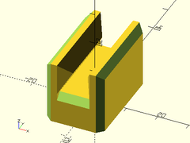
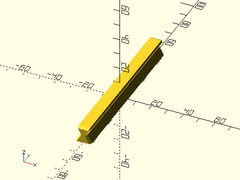

# Library File sliders.scad

Simple V-groove based sliders and rails.
To use, add these lines to the beginning of your file:
```
include <BOSL/constants.scad>
use <BOSL/sliders.scad>
```

---

# Table of Contents

1. [Modules](#1-modules)
    - [`slider()`](#slider)
    - [`rail()`](#rail)

---

# 1. Modules

### slider()

**Usage**:
- slider(l, w, h, [base], [wall], [ang], [slop], [orient], [align])

**Description**:
Creates a slider to match a V-groove rail.

Argument        | What it does
--------------- | ------------------------------
`l`             | Length (long axis) of slider.
`w`             | Width of slider.
`h`             | Height of slider.
`base`          | Height of slider base.
`wall`          | Width of wall behind each side of the slider.
`ang`           | Overhang angle for slider, to facilitate supportless printig.
`slop`          | Printer-specific slop value to make parts fit exactly.
`orient`        | Orientation of the slider.  Use the `ORIENT_` constants from `constants.scad`.  Default: `ORIENT_Y`.
`align`         | Alignment of the slider.  Use the `V_` constants from `constants.scad`.  Default: `V_UP`.

**Example**:

    slider(l=30, base=10, wall=4, slop=0.2, orient=ORIENT_Y);



---

### rail()

**Usage**:
- rail(l, w, h, [chamfer], [ang], [orient], [align])

**Description**:
Creates a V-groove rail.

Argument        | What it does
--------------- | ------------------------------
`l`             | Length (long axis) of slider.
`w`             | Width of slider.
`h`             | Height of slider.
`chamfer`       | Size of chamfer at end of rail.
`ang`           | Overhang angle for slider, to facilitate supportless printig.
`orient`        | Orientation of the rail.  Use the `ORIENT_` constants from `constants.scad`.  Default: `ORIENT_Y`.
`align`         | Alignment of the rail.  Use the `V_` constants from `constants.scad`.  Default: `V_UP`.

**Example**:

    rail(l=100, w=10, h=10);



---

