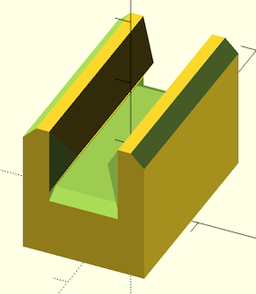
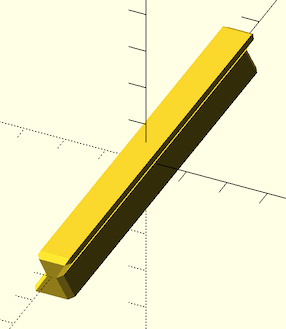

Sliders and Rails.

# Modules

## slider()
Creates a slider.

Arg   | What it is
----- | -------------------------
l     | Length of the slider, that goes along the axis of the rail.
w     | Width of the slider.
h     | Height of the V groove of the rail to match.
base  | Height of base that the slider sits on.
wall  | Thickness of the walls around the slider.
ang   | Overhang angle of the V groove slider.
slop  | Slight adjustment for vagarities of individual printers.

Example:
    slider(l=30, base=10, wall=4, slop=0.2);

## rail()
Creates a rail that a slider can slide along.

Arg     | What it is
------- | -------------------------
l       | Length of the slider, that goes along the axis of the rail.
w       | Width of the slider.
h       | Height of the V groove of the rail.
chamfer | Amount to chamfer edges of the rail.
ang     | Overhang angle of the V groove.

Example:

    rail(l=100, w=10, h=10);

