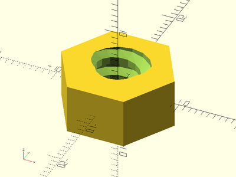
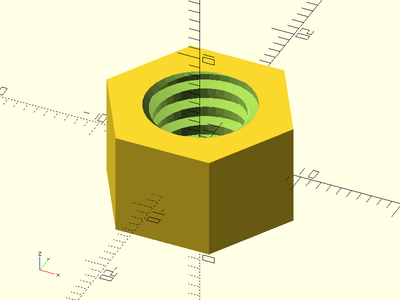

Generic Threaded Screw Rods and Nuts.

# Table of Contents

- [Generic Trapezoidal Threaded Rods And Nuts](#generic-trapezoidal-threaded-rods-and-nuts)
    - [`trapezoidal_threaded_rod()`](#trapezoidal_threaded_rod)
    - [`trapezoidal_threaded_nut()`](#trapezoidal_threaded_nut)
- [Metric and UTS (American) Triangular Threaded Rods And Nuts](#metric-and-uts-american-triangular-threaded-rods-and-nuts)
    - [`threaded_rod()`](#threaded_rod)
    - [`threaded_nut()`](#threaded_nut)
- [ACME Threaded Rods And Nuts](#acme-threaded-rods-and-nuts)
    - [`acme_threaded_rod()`](#acme_threaded_rod)
    - [`acme_threaded_nut()`](#acme_threaded_nut)
- [Standard Metric Trapezoidal Threaded Rods And Nuts](#standard-metric-trapezoidal-threaded-rods-and-nuts)
    - [`metric_trapezoidal_threaded_rod()`](#metric_trapezoidal_threaded_rod)
    - [`metric_trapezoidal_threaded_nut()`](#metric_trapezoidal_threaded_nut)
- [Standard Square-Profile Threaded Rods And Nuts](#standard-square-profile-threaded-rods-and-nuts)
    - [`square_threaded_rod()`](#square_threaded_rod)
    - [`square_threaded_nut()`](#square_threaded_nut)

# Generic Trapezoidal Threaded Rods And Nuts

## trapezoidal\_threaded\_rod()
Constructs a generic trapezoidal-profile threaded screw rod.  This method makes
much smoother threads than the naive `linear_extrude()` method.

- For metric trapezoidal threads, use `thread_angle=15` and `thread_depth=pitch/2`.
- For ACME trapezoidal threads, use `thread_angle=14.5` and `thread_depth=pitch/2`.
- For square threads, use `thread_angle=0` and `thread_depth=pitch/2`.
- For normal screw threads, use `thread_angle=30` and `thread_depth=pitch*3*sqrt(3)/8`.

Arg           | What it does
------------- | ------------------------------
d             | Outer diameter of threaded rod.
l             | Length of threaded rod.
pitch         | Thread pitch.
thread\_depth | Depth of threads.  Default: pitch/2
thread\_angle | Trapezoidal angle of threads.  Default: 15 degrees.
starts        | The number of lead starts.  Default: 1
left\_handed  | If true, create left-handed threads.  Default: false
bevel         | If true, bevel the thread ends.  Default: false
center        | If true (default), centers rod at origin.  If false, sits it on top of the XY plane.

Example:

    trapezoidal_threaded_rod(l=25, d=10, pitch=2, thread_angle=15, starts=3, $fa=1, $fs=1);

## trapezoidal\_threaded\_nut()
Constructs a generic trapezoidal-profile threaded nut.

- For metric trapezoidal threads, use `thread_angle=15` and `thread_depth=pitch/2`.
- For ACME trapezoidal threads, use `thread_angle=14.5` and `thread_depth=pitch/2`.
- For square threads, use `thread_angle=0` and `thread_depth=pitch/2`.
- For normal screw threads, use `thread_angle=30` and `thread_depth=pitch*3*sqrt(3)/8`.

Arg           | What it does
------------- | ------------------------------
od            | Outer diameter of threaded nut.
id            | Diameter of threaded rod to make a nut for.
h             | Height/Thickness of the nut.
pitch         | Thread pitch.
thread\_depth | Depth of threads.  Default = pitch/2
thread\_angle | Trapezoidal angle of threads.  Default = 15 degrees.
left\_handed  | If true, create left-handed threads.  Default = false
starts        | The number of lead starts.  Default = 1
bevel         | If true, bevel the threaded holes.  Default: true
slop          | Slop to make the printed parts fit tightly.  Default = 0.2

Examples:

    trapezoidal_threaded_nut(od=17.4, id=10, h=10, pitch=2, thread_angle=15, starts=3, $fa=1, $fs=1);

# Metric and UTS (American) Triangular Threaded Rods And Nuts

## threaded\_rod()
Constructs an standard triangular threaded metric or UTS screw rod.
This method makes much smoother threads than the naive `linear_extrude` method.

Arg           | What it does
------------- | ------------------------------
d             | Outer diameter of threaded rod.
l             | Length of threaded rod.
pitch         | Thread pitch.
left\_handed  | If true, create left-handed threads.  Default = false
bevel         | If true, bevel the thread ends.  Default: false

Example:

    threaded_rod(d=10, l=30, pitch=1.25, left_handed=true);

## threaded\_nut()
Constructs a standard metric or UTS (American) triangular threaded nut.

Arg           | What it does
------------- | ------------------------------
od            | Outer diameter of threaded nut.
id            | Diameter of threaded rod to make a nut for.
h             | Height/Thickness of the nut.
pitch         | Thread pitch.
left\_handed  | If true, create left-handed threads.  Default = false
bevel         | If true, bevel the threaded holes.  Default: false
slop          | Slop to make the printed parts fit tightly.  Default = 0.2

Examples:

    threaded_nut(od=16, id=8, l=8, pitch=1.25, left_handed=true, slop=0.2, $fa=1, $fs=1);

# ACME Threaded Rods And Nuts

## acme\_threaded\_rod()
Constructs an acme threaded screw rod.  This method makes much
smoother threads than the naive `linear_extrude` method.

Arg           | What it does
------------- | ------------------------------
d             | Outer diameter of threaded rod.
l             | Length of threaded rod.
pitch         | Thread pitch.
thread\_depth | Depth of threads.  Default = pitch/2
thread\_angle | Trapezoidal angle of threads.  Default = 14.5 degrees.
starts        | The number of lead starts.  Default = 1
left\_handed  | If true, create left-handed threads.  Default = false
bevel         | If true, bevel the thread ends.  Default: false

Example:

    acme_threaded_rod(d=10, l=40, pitch=2, starts=3, $fa=1, $fs=1);

## acme\_threaded\_nut()
Constructs an acme threaded nut.

Arg           | What it does
------------- | ------------------------------
od            | Outer diameter of threaded nut.
id            | Diameter of threaded rod to make a nut for.
h             | Height/Thickness of the nut.
pitch         | Thread pitch.
thread\_depth | Depth of threads.  Default = pitch/2
thread\_angle | Trapezoidal angle of threads.  Default = 14.5 degrees.
starts        | The number of lead starts.  Default = 1
left\_handed  | If true, create left-handed threads.  Default = false
bevel         | If true, bevel the threaded holes.  Default: false
slop          | Slop to make the printed parts fit tightly.  Default = 0.2

Examples:

    acme_threaded_nut(od=16, id=10, h=10, pitch=2, starts=3, slop=0.2, $fa=1, $fs=1);

# Standard Metric Trapezoidal Threaded Rods And Nuts

## metric\_trapezoidal\_threaded\_rod()
Constructs an standard metric trapezoidal threaded screw rod.  This method
makes much smoother threads than the naive `linear_extrude` method.

Arg           | What it does
------------- | ------------------------------
d             | Outer diameter of threaded rod.
l             | Length of threaded rod.
pitch         | Thread pitch.
left\_handed  | If true, create left-handed threads.  Default = false
bevel         | If true, bevel the thread ends.  Default: false
starts        | The number of lead starts.  Default = 1

Example:

    metric_trapezoidal_threaded_rod(d=10, l=30, pitch=2, left_handed=true, $fa=1, $fs=1);

## metric\_trapezoidal\_threaded\_nut()
Constructs a standard metric trapezoidal threaded nut.

Arg           | What it does
------------- | ------------------------------
od            | Outer diameter of threaded nut.
id            | Diameter of threaded rod to make a nut for.
h             | Height/Thickness of the nut.
pitch         | Thread pitch.
left\_handed  | If true, create left-handed threads.  Default = false
bevel         | If true, bevel the threaded holes.  Default: false
starts        | The number of lead starts.  Default = 1
slop          | Slop to make the printed parts fit tightly.  Default = 0.2

Examples:

    metric_trapezoidal_threaded_nut(od=16, d=10, h=10, pitch=2, left_handed=true, bevel=true, $fa=1, $fs=1);

# Standard Square-Profile Threaded Rods And Nuts

## square\_threaded\_rod()
Constructs a standard square-profile threaded screw rod.  This method
makes much smoother threads than the naive `linear_extrude` method.

Arg           | What it does
------------- | ------------------------------
d             | Outer diameter of threaded rod.
l             | Length of threaded rod.
pitch         | Thread pitch.
left\_handed  | If true, create left-handed threads.  Default = false
bevel         | If true, bevel the thread ends.  Default: false
starts        | The number of lead starts.  Default = 1

Example:

    square_threaded_rod(d=10, l=30, pitch=2, starts=2, $fn=32);

## square\_threaded\_nut()
Constructs a standard square-profile threaded nut.

Arg           | What it does
------------- | ------------------------------
od            | Outer diameter of threaded nut.
id            | Diameter of threaded rod to make a nut for.
h             | Height/Thickness of the nut.
pitch         | Thread pitch.
left\_handed  | If true, create left-handed threads.  Default = false
bevel         | If true, bevel the threaded holes.  Default: false
starts        | The number of lead starts.  Default = 1
slop          | Slop to make the printed parts fit tightly.  Default = 0.2

Examples:

    square_threaded_nut(od=16, id=10, h=10, pitch=2, starts=2, slop=0.15, $fn=32);

