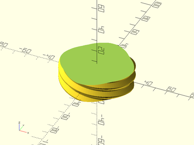
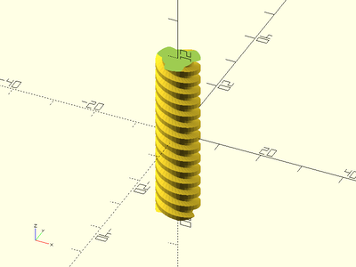
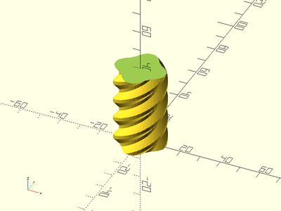
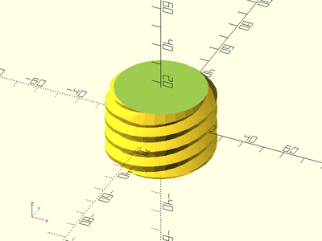
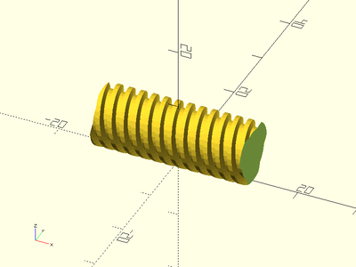
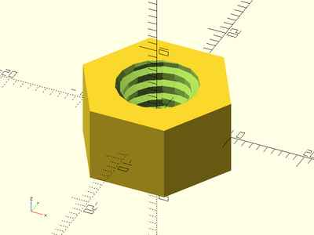
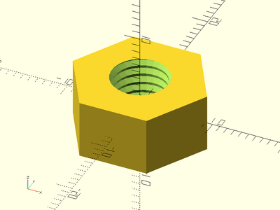
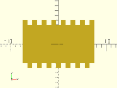

# Library File threading.scad

Triangular and Trapezoidal-Threaded Screw Rods and Nuts.
To use, add the following lines to the beginning of your file:
```
include <BOSL/constants.scad>
use <BOSL/threading.scad>
```

---

# Table of Contents

1. [Generic Trapezoidal Threading](#generic-trapezoidal-threading)
    - [`trapezoidal_threaded_rod()`](#trapezoidal_threaded_rod)
    - [`trapezoidal_threaded_nut()`](#trapezoidal_threaded_nut)

2. [Triangular Threading](#triangular-threading)
    - [`threaded_rod()`](#threaded_rod)
    - [`threaded_nut()`](#threaded_nut)

3. [Metric Trapezoidal Threading](#metric-trapezoidal-threading)
    - [`metric_trapezoidal_threaded_rod()`](#metric_trapezoidal_threaded_rod)
    - [`metric_trapezoidal_threaded_nut()`](#metric_trapezoidal_threaded_nut)

4. [ACME Trapezoidal Threading](#acme-trapezoidal-threading)
    - [`acme_threaded_rod()`](#acme_threaded_rod)
    - [`acme_threaded_nut()`](#acme_threaded_nut)

5. [Square Threading](#square-threading)
    - [`square_threaded_rod()`](#square_threaded_rod)
    - [`square_threaded_nut()`](#square_threaded_nut)

---

# 1. Generic Trapezoidal Threading

### trapezoidal\_threaded\_rod()

**Description**:
Constructs a generic trapezoidal threaded screw rod.  This method makes
much smoother threads than the naive linear\_extrude method.
For metric trapezoidal threads, use thread\_angle=15 and thread\_depth=pitch/2.
For ACME threads, use thread\_angle=14.5 and thread\_depth=pitch/2.
For square threads, use thread\_angle=0 and thread\_depth=pitch/2.
For normal screw threads, use thread\_angle=30 and thread\_depth=pitch*3*sqrt(3)/8.

Argument        | What it does
--------------- | ------------------------------
`d`             | Outer diameter of threaded rod.
`l`             | Length of threaded rod.
`pitch`         | Length between threads.
`thread_depth`  | Depth of the threads.  Default=pitch/2
`thread_angle`  | The pressure angle profile angle of the threads.  Default = 14.5 degree ACME profile.
`left_handed`   | If true, create left-handed threads.  Default = false
`bevel`         | if true, bevel the thread ends.  Default: true
`starts`        | The number of lead starts.  Default = 1
`orient`        | Orientation of the rod.  Use the `ORIENT_` constants from `constants.scad`.  Default: `ORIENT_Z`.
`align`         | Alignment of the rod.  Use the `V_` constants from `constants.scad`.  Default: `V_CENTER`.
`center`        | If given, overrides `align`.  A true value sets `align=V_CENTER`, false sets `align=ALIGN_POS`.

**Example 1**:

    trapezoidal_threaded_rod(d=10, l=100, pitch=2, thread_angle=15, $fn=32);


**Example 2**:

    trapezoidal_threaded_rod(d=3/8*25.4, l=20, pitch=1/8*25.4, thread_angle=29, $fn=32);


**Example 3**:

    trapezoidal_threaded_rod(d=60, l=16, pitch=8, thread_depth=3, thread_angle=45, left_handed=true, $fa=2, $fs=2);


**Example 4**:

    trapezoidal_threaded_rod(d=60, l=16, pitch=8, thread_depth=3, thread_angle=45, left_handed=true, starts=4, $fa=2, $fs=2);



**Example 5**:

    trapezoidal_threaded_rod(d=16, l=40, pitch=2, thread_angle=30);


**Example 6**:

    trapezoidal_threaded_rod(d=10, l=40, pitch=3, thread_angle=15, left_handed=true, starts=3, $fn=36);



**Example 7**:

    trapezoidal_threaded_rod(d=25, l=100, pitch=10, thread_depth=8/3, thread_angle=50, starts=4, center=false, $fa=2, $fs=2);



**Example 8**:

    trapezoidal_threaded_rod(d=50, l=75, pitch=8, thread_angle=30, starts=3, bevel=true);



**Example 9**:

    trapezoidal_threaded_rod(l=25, d=10, pitch=2, thread_angle=15, starts=3, $fa=1, $fs=1, orient=ORIENT_X, align=ALIGN_POS);



---

### trapezoidal\_threaded\_nut()

**Description**:
Constructs a hex nut for a threaded screw rod.  This method makes
much smoother threads than the naive linear\_extrude method.
For metric screw threads, use thread\_angle=30 and leave out thread\_depth argument.
For SAE screw threads, use thread\_angle=30 and leave out thread\_depth argument.
For metric trapezoidal threads, use thread\_angle=15 and thread\_depth=pitch/2.
For ACME threads, use thread\_angle=14.5 and thread\_depth=pitch/2.
For square threads, use thread\_angle=0 and thread\_depth=pitch/2.

Argument        | What it does
--------------- | ------------------------------
`od`            | diameter of the nut.
`id`            | diameter of threaded rod to screw onto.
`h`             | height/thickness of nut.
`pitch`         | Length between threads.
`thread_depth`  | Depth of the threads.  Default=pitch/2.
`thread_angle`  | The pressure angle profile angle of the threads.  Default = 14.5 degree ACME profile.
`left_handed`   | if true, create left-handed threads.  Default = false
`starts`        | The number of lead starts.  Default = 1
`slop`          | printer slop calibration to allow for tight fitting of parts.  default=0.2
`bevel`         | if true, bevel the thread ends.  Default: true
`orient`        | Orientation of the nut.  Use the `ORIENT_` constants from `constants.scad`.  Default: `ORIENT_Z`.
`align`         | Alignment of the nut.  Use the `V_` constants from `constants.scad`.  Default: `V_CENTER`.

**Example 1**:

    trapezoidal_threaded_nut(od=16, id=8, h=8, pitch=2, slop=0.2, align=V_UP);


**Example 2**:

    trapezoidal_threaded_nut(od=17.4, id=10, h=10, pitch=2, slop=0.2, left_handed=true);



**Example 3**:

    trapezoidal_threaded_nut(od=17.4, id=10, h=10, pitch=2, thread_angle=15, starts=3, $fa=1, $fs=1);


---

# 2. Triangular Threading

### threaded\_rod()

**Description**:
Constructs a standard metric or UTS threaded screw rod.  This method
makes much smoother threads than the naive linear\_extrude method.

Argument        | What it does
--------------- | ------------------------------
`d`             | Outer diameter of threaded rod.
`l`             | length of threaded rod.
`pitch`         | Length between threads.
`left_handed`   | if true, create left-handed threads.  Default = false
`bevel`         | if true, bevel the thread ends.  Default: false
`orient`        | Orientation of the rod.  Use the `ORIENT_` constants from `constants.scad`.  Default: `ORIENT_Z`.
`align`         | Alignment of the rod.  Use the `V_` constants from `constants.scad`.  Default: `V_CENTER`.

**Example**:

    threaded_rod(d=10, l=30, pitch=1.25, left_handed=true, $fa=1, $fs=1);


---

### threaded\_nut()

**Description**:
Constructs a hex nut for a metric or UTS threaded screw rod.  This method
makes much smoother threads than the naive linear\_extrude method.

Argument        | What it does
--------------- | ------------------------------
`od`            | diameter of the nut.
`id`            | diameter of threaded rod to screw onto.
`h`             | height/thickness of nut.
`pitch`         | Length between threads.
`left_handed`   | if true, create left-handed threads.  Default = false
`bevel`         | if true, bevel the thread ends.  Default: false
`slop`          | printer slop calibration to allow for tight fitting of parts.  default=0.2
`orient`        | Orientation of the nut.  Use the `ORIENT_` constants from `constants.scad`.  Default: `ORIENT_Z`.
`align`         | Alignment of the nut.  Use the `V_` constants from `constants.scad`.  Default: `V_CENTER`.

**Example**:

    threaded_nut(od=16, id=8, h=8, pitch=1.25, left_handed=true, slop=0.2, $fa=1, $fs=1);



---

# 3. Metric Trapezoidal Threading

### metric\_trapezoidal\_threaded\_rod()

**Description**:
Constructs a metric trapezoidal threaded screw rod.  This method makes much
smoother threads than the naive linear\_extrude method.

Argument        | What it does
--------------- | ------------------------------
`d`             | Outer diameter of threaded rod.
`l`             | length of threaded rod.
`pitch`         | Length between threads.
`left_handed`   | if true, create left-handed threads.  Default = false
`bevel`         | if true, bevel the thread ends.  Default: false
`starts`        | The number of lead starts.  Default = 1
`orient`        | Orientation of the rod.  Use the `ORIENT_` constants from `constants.scad`.  Default: `ORIENT_Z`.
`align`         | Alignment of the rod.  Use the `V_` constants from `constants.scad`.  Default: `V_CENTER`.

**Example**:

    metric_trapezoidal_threaded_rod(d=10, l=30, pitch=2, left_handed=true, $fa=1, $fs=1);


---

### metric\_trapezoidal\_threaded\_nut()

**Description**:
Constructs a hex nut for a metric trapezoidal threaded screw rod.  This method
makes much smoother threads than the naive linear\_extrude method.

Argument        | What it does
--------------- | ------------------------------
`od`            | diameter of the nut.
`id`            | diameter of threaded rod to screw onto.
`h`             | height/thickness of nut.
`pitch`         | Length between threads.
`left_handed`   | if true, create left-handed threads.  Default = false
`bevel`         | if true, bevel the thread ends.  Default: false
`starts`        | The number of lead starts.  Default = 1
`slop`          | printer slop calibration to allow for tight fitting of parts.  default=0.2
`orient`        | Orientation of the nut.  Use the `ORIENT_` constants from `constants.scad`.  Default: `ORIENT_Z`.
`align`         | Alignment of the nut.  Use the `V_` constants from `constants.scad`.  Default: `V_CENTER`.

**Example**:

    metric_trapezoidal_threaded_nut(od=16, id=10, h=10, pitch=2, left_handed=true, bevel=true, $fa=1, $fs=1);


---

# 4. ACME Trapezoidal Threading

### acme\_threaded\_rod()

**Description**:
Constructs an ACME trapezoidal threaded screw rod.  This method makes
much smoother threads than the naive linear\_extrude method.

Argument        | What it does
--------------- | ------------------------------
`d`             | Outer diameter of threaded rod.
`l`             | length of threaded rod.
`pitch`         | Length between threads.
`thread_depth`  | Depth of the threads.  Default = pitch/2
`thread_angle`  | The pressure angle profile angle of the threads.  Default = 14.5 degrees
`starts`        | The number of lead starts.  Default = 1
`left_handed`   | if true, create left-handed threads.  Default = false
`bevel`         | if true, bevel the thread ends.  Default: false
`orient`        | Orientation of the rod.  Use the `ORIENT_` constants from `constants.scad`.  Default: `ORIENT_Z`.
`align`         | Alignment of the rod.  Use the `V_` constants from `constants.scad`.  Default: `V_CENTER`.

**Example 1**:

    acme_threaded_rod(d=3/8*25.4, l=20, pitch=1/8*25.4, $fn=32);


**Example 2**:

    acme_threaded_rod(d=10, l=40, pitch=2, starts=3, $fa=1, $fs=1);


---

### acme\_threaded\_nut()

**Description**:
Constructs a hex nut for an ACME threaded screw rod.  This method makes
much smoother threads than the naive linear\_extrude method.

Argument        | What it does
--------------- | ------------------------------
`od`            | diameter of the nut.
`id`            | diameter of threaded rod to screw onto.
`h`             | height/thickness of nut.
`pitch`         | Length between threads.
`thread_depth`  | Depth of the threads.  Default=pitch/2
`thread_angle`  | The pressure angle profile angle of the threads.  Default = 14.5 degree ACME profile.
`left_handed`   | if true, create left-handed threads.  Default = false
`bevel`         | if true, bevel the thread ends.  Default: false
`slop`          | printer slop calibration to allow for tight fitting of parts.  default=0.2
`orient`        | Orientation of the nut.  Use the `ORIENT_` constants from `constants.scad`.  Default: `ORIENT_Z`.
`align`         | Alignment of the nut.  Use the `V_` constants from `constants.scad`.  Default: `V_CENTER`.

**Example 1**:

    acme_threaded_nut(od=16, id=3/8*25.4, h=8, pitch=1/8*25.4, slop=0.2);


**Example 2**:

    acme_threaded_nut(od=16, id=10, h=10, pitch=2, starts=3, slop=0.2, $fa=1, $fs=1);


---

# 5. Square Threading

### square\_threaded\_rod()

**Description**:
Constructs a square profile threaded screw rod.  This method makes
much smoother threads than the naive linear\_extrude method.

Argument        | What it does
--------------- | ------------------------------
`d`             | Outer diameter of threaded rod.
`l`             | length of threaded rod.
`pitch`         | Length between threads.
`left_handed`   | if true, create left-handed threads.  Default = false
`bevel`         | if true, bevel the thread ends.  Default: false
`starts`        | The number of lead starts.  Default = 1
`orient`        | Orientation of the rod.  Use the `ORIENT_` constants from `constants.scad`.  Default: `ORIENT_Z`.
`align`         | Alignment of the rod.  Use the `V_` constants from `constants.scad`.  Default: `V_CENTER`.

**Example**:

    square_threaded_rod(d=10, l=30, pitch=2, starts=2, $fn=32);



---

### square\_threaded\_nut()

**Description**:
Constructs a hex nut for a square profile threaded screw rod.  This method
makes much smoother threads than the naive linear\_extrude method.

Argument        | What it does
--------------- | ------------------------------
`od`            | diameter of the nut.
`id`            | diameter of threaded rod to screw onto.
`h`             | height/thickness of nut.
`pitch`         | Length between threads.
`left_handed`   | if true, create left-handed threads.  Default = false
`bevel`         | if true, bevel the thread ends.  Default: false
`starts`        | The number of lead starts.  Default = 1
`slop`          | printer slop calibration to allow for tight fitting of parts.  default=0.2
`orient`        | Orientation of the nut.  Use the `ORIENT_` constants from `constants.scad`.  Default: `ORIENT_Z`.
`align`         | Alignment of the nut.  Use the `V_` constants from `constants.scad`.  Default: `V_CENTER`.

**Example**:

    square_threaded_nut(od=16, id=10, h=10, pitch=2, starts=2, slop=0.15, $fn=32);


---

