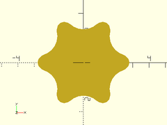
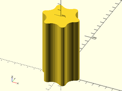

Torx driver bits.

## Functions

### torx\_outer\_diam(size)
Given a Torx size, returns the outer diameter of the Torx profile.

### torx\_inner\_diam(size)
Given a Torx size, returns the inner diameter of the Torx profile.

### torx\_depth(size)
Given a Torx size, returns the typical drive depth.

### torx\_tip\_radius(size)
Given a Torx size, returns the minor tip rounding radius of the Torx profile.

### torx\_rounding\_radius(size)
Given a Torx size, returns the major rounding radius of the Torx profile.

## Modules

### torx\_drive2d(size)
Given a Torx bit size, creates a torx bit 2D profile.

| Args | What it does |
| ---- | ------------ |
| size | Torx size.   |

Example:

    torx_drive2d(size=30, $fs=1, $fa=1);

### torx\_drive(size, l, center)

Creates a torx bit tip.

Args   | What it does
------ | ----------------------
size   | Torx size.
l      | Length of bit.
center | If true, centers bit vertically.

Example:

    torx_drive(size=30, l=10, $fs=1, $fa=1);

