# Library File transforms.scad

This is the file that the most commonly used transformations, distributors, and mutator are in.
To use, add the following lines to the beginning of your file:
```
include <BOSL/constants.scad>
use <BOSL/transforms.scad>
```

---

# Table of Contents

1. [Translations](#translations)
    - [`move()`](#move)
    - [`xmove()`](#xmove)
    - [`ymove()`](#ymove)
    - [`zmove()`](#zmove)
    - [`left()`](#left)
    - [`right()`](#right)
    - [`fwd() / forward()`](#fwd--forward)
    - [`back()`](#back)
    - [`down()`](#down)
    - [`up()`](#up)

2. [Rotations](#rotations)
    - [`rot()`](#rot)
    - [`xrot()`](#xrot)
    - [`yrot()`](#yrot)
    - [`zrot()`](#zrot)

3. [Scaling and Mirroring](#scaling-and-mirroring)
    - [`xscale()`](#xscale)
    - [`yscale()`](#yscale)
    - [`zscale()`](#zscale)
    - [`xflip()`](#xflip)
    - [`yflip()`](#yflip)
    - [`zflip()`](#zflip)

4. [Skewing](#skewing)
    - [`skew_xy() / skew_z()`](#skew_xy--skew_z)
    - [`skew_yz() / skew_x()`](#skew_yz--skew_x)
    - [`skew_xz() / skew_y()`](#skew_xz--skew_y)

5. [Translational Distributors](#translational-distributors)
    - [`place_copies()`](#place_copies)
    - [`spread()`](#spread)
    - [`xspread()`](#xspread)
    - [`yspread()`](#yspread)
    - [`zspread()`](#zspread)
    - [`distribute()`](#distribute)
    - [`xdistribute()`](#xdistribute)
    - [`ydistribute()`](#ydistribute)
    - [`zdistribute()`](#zdistribute)
    - [`grid2d()`](#grid2d)
    - [`grid3d()`](#grid3d)

6. [Rotational Distributors](#rotational-distributors)
    - [`rot_copies()`](#rot_copies)
    - [`xrot_copies()`](#xrot_copies)
    - [`yrot_copies()`](#yrot_copies)
    - [`zrot_copies()`](#zrot_copies)
    - [`xring()`](#xring)
    - [`yring()`](#yring)
    - [`zring()`](#zring)
    - [`arc_of()`](#arc_of)
    - [`ovoid_spread()`](#ovoid_spread)

7. [Reflectional Distributors](#reflectional-distributors)
    - [`mirror_copy()`](#mirror_copy)
    - [`xflip_copy()`](#xflip_copy)
    - [`yflip_copy()`](#yflip_copy)
    - [`zflip_copy()`](#zflip_copy)

8. [Mutators](#mutators)
    - [`half_of()`](#half_of)
    - [`top_half()`](#top_half)
    - [`bottom_half()`](#bottom_half)
    - [`left_half()`](#left_half)
    - [`right_half()`](#right_half)
    - [`front_half()`](#front_half)
    - [`back_half()`](#back_half)
    - [`chain_hull()`](#chain_hull)
    - [`extrude_arc()`](#extrude_arc)

9. [Miscellaneous](#miscellaneous)
    - [`orient_and_align()`](#orient_and_align)

10. [Deprecations](#deprecations)
    - [`translate_copies()`](#translate_copies)
    - [`line_of()`](#line_of)
    - [`grid_of()`](#grid_of)

---

# 1. Translations

### move()

**Usage**:
- move([x], [y], [z]) ...
- move([x,y,z]) ...

**Description**:
Moves/translates children.

Argument        | What it does
--------------- | ------------------------------
`x`             | X axis translation.
`y`             | Y axis translation.
`z`             | Z axis translation.

**Example 1**:

    #sphere(d=10);
    move([0,20,30]) sphere(d=10);


**Example 2**:

    #sphere(d=10);
    move(y=20) sphere(d=10);


**Example 3**:

    #sphere(d=10);
    move(x=-10, y=-5) sphere(d=10);


---

### xmove()

**Usage**:
- xmove(x) ...

**Description**:
Moves/translates children the given amount along the X axis.

Argument        | What it does
--------------- | ------------------------------
`x`             | Amount to move right along the X axis.  Negative values move left.

**Example**:

    #sphere(d=10);
    xmove(20) sphere(d=10);


---

### ymove()

**Usage**:
- ymove(y) ...

**Description**:
Moves/translates children the given amount along the Y axis.

Argument        | What it does
--------------- | ------------------------------
`y`             | Amount to move back along the Y axis.  Negative values move forward.

**Example**:

    #sphere(d=10);
    ymove(20) sphere(d=10);


---

### zmove()

**Usage**:
- zmove(z) ...

**Description**:
Moves/translates children the given amount along the Z axis.

Argument        | What it does
--------------- | ------------------------------
`z`             | Amount to move up along the Z axis.  Negative values move down.

**Example**:

    #sphere(d=10);
    zmove(20) sphere(d=10);


---

### left()

**Usage**:
- left(x) ...

**Description**:
Moves children left (in the X- direction) by the given amount.

Argument        | What it does
--------------- | ------------------------------
`x`             | Scalar amount to move left.

**Example**:

    #sphere(d=10);
    left(20) sphere(d=10);


---

### right()

**Usage**:
- right(x) ...

**Description**:
Moves children right (in the X+ direction) by the given amount.

Argument        | What it does
--------------- | ------------------------------
`x`             | Scalar amount to move right.

**Example**:

    #sphere(d=10);
    right(20) sphere(d=10);


---

### fwd() / forward()

**Usage**:
- fwd(y) ...
- forward(y) ...

**Description**:
Moves children forward (in the Y- direction) by the given amount.

Argument        | What it does
--------------- | ------------------------------
`y`             | Scalar amount to move forward.

**Example**:

    #sphere(d=10);
    fwd(20) sphere(d=10);

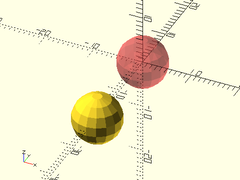

---

### back()

**Usage**:
- back(y) ...

**Description**:
Moves children back (in the Y+ direction) by the given amount.

Argument        | What it does
--------------- | ------------------------------
`y`             | Scalar amount to move back.

**Example**:

    #sphere(d=10);
    back(20) sphere(d=10);


---

### down()

**Usage**:
- down(z) ...

**Description**:
Moves children down (in the Z- direction) by the given amount.

Argument        | What it does
--------------- | ------------------------------
`z`             | Scalar amount to move down.

**Example**:

    #sphere(d=10);
    down(20) sphere(d=10);

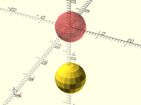

---

### up()

**Usage**:
- up(z) ...

**Description**:
Moves children up (in the Z+ direction) by the given amount.

Argument        | What it does
--------------- | ------------------------------
`z`             | Scalar amount to move up.

**Example**:

    #sphere(d=10);
    up(20) sphere(d=10);


---

# 2. Rotations

### rot()

**Usage**:
- rot(a, [cp], [reverse]) ...
- rot([X,Y,Z], [cp], [reverse]) ...
- rot(a, v, [cp], [reverse]) ...
- rot(from, to, [a], [reverse]) ...

**Description**:
Rotates children around an arbitrary axis by the given number of degrees.
Can be used as a drop-in replacement for `rotate()`, with extra features.

Argument        | What it does
--------------- | ------------------------------
`a`             | Scalar angle or vector of XYZ rotation angles to rotate by, in degrees.
`v`             | vector for the axis of rotation.  Default: [0,0,1] or V\_UP
`cp`            | centerpoint to rotate around. Default: [0,0,0]
`from`          | Starting vector for vector-based rotations.
`to`            | Target vector for vector-based rotations.
`reverse`       | If true, exactly reverses the rotation, including axis rotation ordering.  Default: false

**Example 1**:

    #cube([2,4,9]);
    rot([30,60,0], cp=[0,0,9]) cube([2,4,9]);


**Example 2**:

    #cube([2,4,9]);
    rot(30, v=[1,1,0], cp=[0,0,9]) cube([2,4,9]);


**Example 3**:

    #cube([2,4,9]);
    rot(from=V_UP, to=V_LEFT+V_BACK) cube([2,4,9]);


---

### xrot()

**Usage**:
- xrot(a, [cp]) ...

**Description**:
Rotates children around the X axis by the given number of degrees.

Argument        | What it does
--------------- | ------------------------------
`a`             | angle to rotate by in degrees.
`cp`            | centerpoint to rotate around. Default: [0,0,0]

**Example**:

    #cylinder(h=50, r=10, center=true);
    xrot(90) cylinder(h=50, r=10, center=true);


---

### yrot()

**Usage**:
- yrot(a, [cp]) ...

**Description**:
Rotates children around the Y axis by the given number of degrees.

Argument        | What it does
--------------- | ------------------------------
`a`             | angle to rotate by in degrees.
`cp`            | centerpoint to rotate around. Default: [0,0,0]

**Example**:

    #cylinder(h=50, r=10, center=true);
    yrot(90) cylinder(h=50, r=10, center=true);

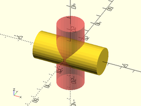

---

### zrot()

**Usage**:
- zrot(a, [cp]) ...

**Description**:
Rotates children around the Z axis by the given number of degrees.

Argument        | What it does
--------------- | ------------------------------
`a`             | angle to rotate by in degrees.
`cp`            | centerpoint to rotate around. Default: [0,0,0]

**Example**:

    #cube(size=[60,20,40], center=true);
    zrot(90) cube(size=[60,20,40], center=true);

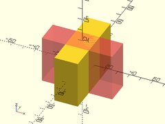

---

# 3. Scaling and Mirroring

### xscale()

**Usage**:
- xscale(x) ...

**Description**:
Scales children by the given factor on the X axis.

Argument        | What it does
--------------- | ------------------------------
`x`             | Factor to scale by along the X axis.

**Example**:

    xscale(3) sphere(r=10);


---

### yscale()

**Usage**:
- yscale(y) ...

**Description**:
Scales children by the given factor on the Y axis.

Argument        | What it does
--------------- | ------------------------------
`y`             | Factor to scale by along the Y axis.

**Example**:

    yscale(3) sphere(r=10);


---

### zscale()

**Usage**:
- zscale(z) ...

**Description**:
Scales children by the given factor on the Z axis.

Argument        | What it does
--------------- | ------------------------------
`z`             | Factor to scale by along the Z axis.

**Example**:

    zscale(3) sphere(r=10);


---

### xflip()

**Usage**:
- xflip([cp]) ...

**Description**:
Mirrors the children along the X axis, like `mirror([1,0,0])` or `xscale(-1)`

Argument        | What it does
--------------- | ------------------------------
`cp`            | A point that lies on the plane of reflection.

**Example 1**:

    xflip() yrot(90) cylinder(d1=10, d2=0, h=20);
    color("blue", 0.25) cube([0.01,15,15], center=true);
    color("red", 0.333) yrot(90) cylinder(d1=10, d2=0, h=20);


**Example 2**:

    xflip(cp=[-5,0,0]) yrot(90) cylinder(d1=10, d2=0, h=20);
    color("blue", 0.25) left(5) cube([0.01,15,15], center=true);
    color("red", 0.333) yrot(90) cylinder(d1=10, d2=0, h=20);


---

### yflip()

**Usage**:
- yflip([cp]) ...

**Description**:
Mirrors the children along the Y axis, like `mirror([0,1,0])` or `yscale(-1)`

Argument        | What it does
--------------- | ------------------------------
`cp`            | A point that lies on the plane of reflection.

**Example 1**:

    yflip() xrot(90) cylinder(d1=10, d2=0, h=20);
    color("blue", 0.25) cube([15,0.01,15], center=true);
    color("red", 0.333) xrot(90) cylinder(d1=10, d2=0, h=20);


**Example 2**:

    yflip(cp=[0,5,0]) xrot(90) cylinder(d1=10, d2=0, h=20);
    color("blue", 0.25) back(5) cube([15,0.01,15], center=true);
    color("red", 0.333) xrot(90) cylinder(d1=10, d2=0, h=20);


---

### zflip()

**Usage**:
- zflip([cp]) ...

**Description**:
Mirrors the children along the Z axis, like `mirror([0,0,1])` or `zscale(-1)`

Argument        | What it does
--------------- | ------------------------------
`cp`            | A point that lies on the plane of reflection.

**Example 1**:

    zflip() cylinder(d1=10, d2=0, h=20);
    color("blue", 0.25) cube([15,15,0.01], center=true);
    color("red", 0.333) cylinder(d1=10, d2=0, h=20);

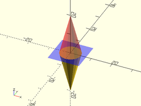

**Example 2**:

    zflip(cp=[0,0,-5]) cylinder(d1=10, d2=0, h=20);
    color("blue", 0.25) down(5) cube([15,15,0.01], center=true);
    color("red", 0.333) cylinder(d1=10, d2=0, h=20);


---

# 4. Skewing

### skew\_xy() / skew\_z()

**Usage**:
- skew\_xy([xa], [ya]) ...
- skew\_z([xa], [ya]) ...

**Description**:
Skews children on the X-Y plane, keeping constant in Z.

Argument        | What it does
--------------- | ------------------------------
`xa`            | skew angle towards the X direction.
`ya`            | skew angle towards the Y direction.

**Example**:

    #cube(size=10);
    skew_xy(xa=30, ya=15) cube(size=10);


---

### skew\_yz() / skew\_x()

**Usage**:
- skew\_yz([ya], [za]) ...
- skew\_x([ya], [za]) ...

**Description**:
Skews children on the Y-Z plane, keeping constant in X.

Argument        | What it does
--------------- | ------------------------------
`ya`            | skew angle towards the Y direction.
`za`            | skew angle towards the Z direction.

**Example**:

    #cube(size=10);
    skew_yz(ya=30, za=15) cube(size=10);


---

### skew\_xz() / skew\_y()

**Usage**:
- skew\_xz([xa], [za]) ...
- skew\_y([xa], [za]) ...

**Description**:
Skews children on the X-Z plane, keeping constant in Y.

Argument        | What it does
--------------- | ------------------------------
`xa`            | skew angle towards the X direction.
`za`            | skew angle towards the Z direction.

**Example**:

    #cube(size=10);
    skew_xz(xa=15, za=-10) cube(size=10);


---

# 5. Translational Distributors

### place\_copies()

**Usage**:
- place\_copies(a) ...

**Description**:
Makes copies of the given children at each of the given offsets.

Argument        | What it does
--------------- | ------------------------------
`a`             | array of XYZ offset vectors. Default [[0,0,0]]

**Side Effects**:
- `$pos` is set to the relative centerpoint of each child copy, and can be used to modify each child individually.

**Example**:

    #sphere(r=10);
    place_copies([[-25,-25,0], [25,-25,0], [0,0,50], [0,25,0]]) sphere(r=10);


---

### spread()

**Usage**:
- spread(l, [n], [p1]) ...
- spread(l, spacing, [p1]) ...
- spread(spacing, [n], [p1]) ...
- spread(p1, p2, [n]) ...
- spread(p1, p2, spacing) ...

**Description**:
Evenly distributes `n` copies of the children along a line.

Argument        | What it does
--------------- | ------------------------------
`p1`            | Starting point of line.
`p2`            | Ending point of line.
`l`             | Length to spread copies over.
`spacing`       | A 3D vector indicating which direction and distance to place each subsequent copy at.
`n`             | Number of copies to distribute along the line. (Default: 2)

**Side Effects**:
- `$pos` is set to the relative centerpoint of each child copy, and can be used to modify each child individually.
- `$idx` is set to the index number of each child being copied.

**Example 1**:

    spread([0,0,0], [5,5,20], n=6) cube(size=[3,2,1],center=true);


**Example 2**:

    spread(l=40, n=6) cube(size=[3,2,1],center=true);


**Example 3**:

    spread(l=[15,30], n=6) cube(size=[3,2,1],center=true);

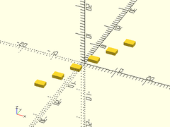

**Example 4**:

    spread(l=40, spacing=10) cube(size=[3,2,1],center=true);


**Example 5**:

    spread(spacing=[5,5,0], n=5) cube(size=[3,2,1],center=true);


---

### xspread()

**Usage**:
- xspread(spacing, [n], [p1]) ...
- xspread(l, [n], [p1]) ...

**Description**:
Spreads out `n` copies of the children along the X axis.

Argument        | What it does
--------------- | ------------------------------
`spacing`       | spacing between copies. (Default: 1.0)
`n`             | Number of copies to spread out. (Default: 2)
`l`             | Length to spread copies over.
`p1`            | Starting point of line if given.  If not, line is centered at origin.

**Side Effects**:
- `$pos` is set to the relative centerpoint of each child copy, and can be used to modify each child individually.
- `$idx` is set to the index number of each child being copied.

**Example 1**:

    xspread(20) sphere(3);


**Example 2**:

    xspread(20, n=3) sphere(3);


**Example 3**:

    xspread(spacing=15, l=50) sphere(3);

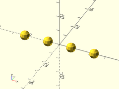

**Example 4**:

    xspread(n=5, l=40, p1=[0,0]) sphere(3);


---

### yspread()

**Usage**:
- yspread(spacing, [n], [p1]) ...
- yspread(l, [n], [p1]) ...

**Description**:
Spreads out `n` copies of the children along the Y axis.

Argument        | What it does
--------------- | ------------------------------
`spacing`       | spacing between copies. (Default: 1.0)
`n`             | Number of copies to spread out. (Default: 2)
`l`             | Length to spread copies over.
`p1`            | Starting point of line if given.  If not, line is centered at origin.

**Side Effects**:
- `$pos` is set to the relative centerpoint of each child copy, and can be used to modify each child individually.
- `$idx` is set to the index number of each child being copied.

**Example 1**:

    yspread(20) sphere(3);


**Example 2**:

    yspread(20, n=3) sphere(3);


**Example 3**:

    yspread(spacing=15, l=50) sphere(3);


**Example 4**:

    yspread(n=5, l=40, p1=[0,0]) sphere(3);


---

### zspread()

**Usage**:
- zspread(spacing, [n], [p1]) ...
- zspread(l, [n], [p1]) ...

**Description**:
Spreads out `n` copies of the children along the Z axis.

Argument        | What it does
--------------- | ------------------------------
`spacing`       | spacing between copies. (Default: 1.0)
`n`             | Number of copies to spread out. (Default: 2)
`l`             | Length to spread copies over.
`p1`            | Starting point of line if given.  If not, line is centered at origin.

**Side Effects**:
- `$pos` is set to the relative centerpoint of each child copy, and can be used to modify each child individually.
- `$idx` is set to the index number of each child being copied.

**Example 1**:

    zspread(20) sphere(3);


**Example 2**:

    zspread(20, n=3) sphere(3);


**Example 3**:

    zspread(spacing=15, l=50) sphere(3);


**Example 4**:

    zspread(n=5, l=40, p1=[0,0]) sphere(3);

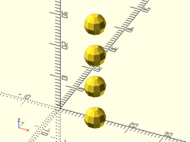

---

### distribute()

**Usage**:
- distribute(spacing, dir, [sizes]) ...
- distribute(l, dir, [sizes]) ...

**Description**:
Spreads out each individual child along the direction `dir`.
This is useful for laying out groups of disparate objects
where you only really care about the spacing between them.

Argument        | What it does
--------------- | ------------------------------
`spacing`       | Spacing to add between each child. (Default: 10.0)
`sizes`         | Array containing how much space each child will need.
`dir`           | Vector direction to distribute copies along.
`l`             | Length to distribute copies along.

**Example**:

    distribute(sizes=[100, 30, 50], dir=V_UP) {
        sphere(r=50);
        cube([10,20,30], center=true);
        cylinder(d=30, h=50, center=true);
    }


---

### xdistribute()

**Usage**:
- xdistribute(spacing, [sizes]) ...
- xdistribute(l, [sizes]) ...

**Description**:
Spreads out each individual child along the X axis.
This is useful for laying out groups of disparate objects
where you only really care about the spacing between them.

Argument        | What it does
--------------- | ------------------------------
`spacing`       | spacing between each child. (Default: 10.0)
`sizes`         | Array containing how much space each child will need.
`l`             | Length to distribute copies along.

**Example**:

    xdistribute(sizes=[100, 10, 30], spacing=40) {
        sphere(r=50);
        cube([10,20,30], center=true);
        cylinder(d=30, h=50, center=true);
    }


---

### ydistribute()

**Usage**:
- ydistribute(spacing, [sizes])
- ydistribute(l, [sizes])

**Description**:
Spreads out each individual child along the Y axis.
This is useful for laying out groups of disparate objects
where you only really care about the spacing between them.

Argument        | What it does
--------------- | ------------------------------
`spacing`       | spacing between each child. (Default: 10.0)
`sizes`         | Array containing how much space each child will need.
`l`             | Length to distribute copies along.

**Example**:

    ydistribute(sizes=[30, 20, 100], spacing=40) {
        cylinder(d=30, h=50, center=true);
        cube([10,20,30], center=true);
        sphere(r=50);
    }


---

### zdistribute()

**Usage**:
- zdistribute(spacing, [sizes])
- zdistribute(l, [sizes])

**Description**:
Spreads out each individual child along the Z axis.
This is useful for laying out groups of disparate objects
where you only really care about the spacing between them.

Argument        | What it does
--------------- | ------------------------------
`spacing`       | spacing between each child. (Default: 10.0)
`sizes`         | Array containing how much space each child will need.
`l`             | Length to distribute copies along.

**Example**:

    zdistribute(sizes=[30, 20, 100], spacing=40) {
        cylinder(d=30, h=50, center=true);
        cube([10,20,30], center=true);
        sphere(r=50);
    }


---

### grid2d()

**Usage**:
- grid2d(size, spacing, [stagger], [scale], [in\_poly], [orient], [align]) ...
- grid2d(size, cols, rows, [stagger], [scale], [in\_poly], [orient], [align]) ...
- grid2d(spacing, cols, rows, [stagger], [scale], [in\_poly], [orient], [align]) ...
- grid2d(spacing, in\_poly, [stagger], [scale], [orient], [align]) ...
- grid2d(cols, rows, in\_poly, [stagger], [scale], [orient], [align]) ...

**Description**:
Makes a square or hexagonal grid of copies of children.

Argument        | What it does
--------------- | ------------------------------
`size`          | The [X,Y] size to spread the copies over.
`spacing`       | Distance between copies in [X,Y] or scalar distance.
`cols`          | How many columns of copies to make.  If staggered, count both staggered and unstaggered columns.
`rows`          | How many rows of copies to make.  If staggered, count both staggered and unstaggered rows.
`stagger`       | If true, make a staggered (hexagonal) grid.  If false, make square grid.  If "alt", makes alternate staggered pattern.  Default: false
`scale`         | [X,Y] scaling factors to reshape grid.
`in_poly`       | If given a list of polygon points, only creates copies whose center would be inside the polygon.
`orient`        | Orientation axis for the grid.  Orientation is NOT applied to individual children.
`align`         | Alignment of the grid.  Alignment is NOT applies to individual children.

**Side Effects**:
- `$pos` is set to the relative centerpoint of each child copy, and can be used to modify each child individually.
- `$col` is set to the integer column number for each child.
- `$row` is set to the integer row number for each child.

**Example 1**:

    grid2d(size=50, spacing=10, stagger=false) cylinder(d=10, h=1);


**Example 2**:

    grid2d(spacing=10, rows=7, cols=13, stagger=true) cylinder(d=6, h=5);


**Example 3**:

    grid2d(spacing=10, rows=7, cols=13, stagger="alt") cylinder(d=6, h=5);


**Example 4**:

    grid2d(size=50, rows=11, cols=11, stagger=true) cylinder(d=5, h=1);


**Example 5**:

    poly = [[-25,-25], [25,25], [-25,25], [25,-25]];
    grid2d(spacing=5, stagger=true, in_poly=poly)
       zrot(180/6) cylinder(d=5, h=1, $fn=6);
    %polygon(poly);


**Example 6**:

    // Makes a grid of hexagon pillars whose tops are all
    // angled to reflect light at [0,0,50], if they were shiny.
    hexregion = [for (a = [0:60:359.9]) 50.01*[cos(a), sin(a)]];
    grid2d(spacing=10, stagger=true, in_poly=hexregion) {
        // Note: You must use for(var=[val]) or let(var=val)
        // to set vars from $pos or other special vars in this scope.
        let (ref_v = (normalize([0,0,50]-point3d($pos)) + V_UP)/2)
            half_of(v=-ref_v, cp=[0,0,5])
                zrot(180/6)
                    cylinder(h=20, d=10/cos(180/6)+0.01, $fn=6);
    }


---

### grid3d()

**Usage**:
- grid3d(n, spacing) ...
- grid3d(n=[Xn,Yn,Zn], spacing=[dX,dY,dZ]) ...
- grid3d([xa], [ya], [za]) ...

**Description**:
Makes a 3D grid of duplicate children.

Argument        | What it does
--------------- | ------------------------------
`xa`            | array or range of X-axis values to offset by. (Default: [0])
`ya`            | array or range of Y-axis values to offset by. (Default: [0])
`za`            | array or range of Z-axis values to offset by. (Default: [0])
`n`             | Optional number of copies to have per axis.
`spacing`       | spacing of copies per axis. Use with `n`.

**Example 1**:

    grid3d(xa=[0:25:50],ya=[0,40],za=[-20:40:20]) sphere(r=5);

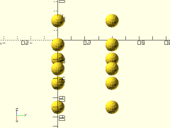

**Example 2**:

    grid3d(n=[3, 4, 2], spacing=[60, 50, 40]) sphere(r=10);


**Example 3**:

    grid3d(ya=[-60:40:60],za=[0,70]) sphere(r=10);


**Example 4**:

    grid3d(n=3, spacing=30) sphere(r=10);


**Example 5**:

    grid3d(n=[3, 1, 2], spacing=30) sphere(r=10);


**Example 6**:

    grid3d(n=[3, 4], spacing=[80, 60]) sphere(r=10);


**Example 7**:

    grid3d(n=[10, 10, 10], spacing=50) color($idx/9) cube(50, center=true);


---

# 6. Rotational Distributors

### rot\_copies()

**Usage**:
- rot\_copies(rots, [cp], [sa], [delta], [subrot]) ...
- rot\_copies(rots, v, [cp], [sa], [delta], [subrot]) ...
- rot\_copies(n, [v], [cp], [sa], [delta], [subrot]) ...

**Description**:
Given a number of XYZ rotation angles, or a list of angles and an axis `v`,
rotates copies of the children to each of those angles.

Argument        | What it does
--------------- | ------------------------------
`rots`          | A list of [X,Y,Z] rotation angles in degrees.  If `v` is given, this will be a list of scalar angles in degrees to rotate around `v`.
`v`             | If given, this is the vector to rotate around.
`cp`            | Centerpoint to rotate around.
`n`             | Optional number of evenly distributed copies, rotated around the ring.
`sa`            | Starting angle, in degrees.  For use with `n`.  Angle is in degrees counter-clockwise.
`delta`         | [X,Y,Z] amount to move away from cp before rotating.  Makes rings of copies.
`subrot`        | If false, don't sub-rotate children as they are copied around the ring.

**Side Effects**:
- `$ang` is set to the rotation angle (or XYZ rotation triplet) of each child copy, and can be used to modify each child individually.
- `$idx` is set to the index value of each child copy.

**Example 1**:

    #cylinder(h=20, r1=5, r2=0);
    rot_copies([[45,0,0],[0,45,90],[90,-45,270]]) cylinder(h=20, r1=5, r2=0);


**Example 2**:

    rot_copies([45, 90, 135], v=V_DOWN+V_BACK)
        yrot(90) cylinder(h=20, r1=5, r2=0);
    color("red",0.333) yrot(90) cylinder(h=20, r1=5, r2=0);


**Example 3**:

    rot_copies(n=6, v=V_DOWN+V_BACK)
        yrot(90) cylinder(h=20, r1=5, r2=0);
    color("red",0.333) yrot(90) cylinder(h=20, r1=5, r2=0);


**Example 4**:

    rot_copies(n=6, v=V_DOWN+V_BACK, delta=[10,0,0])
        yrot(90) cylinder(h=20, r1=5, r2=0);
    color("red",0.333) yrot(90) cylinder(h=20, r1=5, r2=0);


**Example 5**:

    rot_copies(n=6, v=V_UP+V_FWD, delta=[10,0,0], sa=45)
        yrot(90) cylinder(h=20, r1=5, r2=0);
    color("red",0.333) yrot(90) cylinder(h=20, r1=5, r2=0);


**Example 6**:

    rot_copies(n=6, v=V_DOWN+V_BACK, delta=[20,0,0], subrot=false)
        yrot(90) cylinder(h=20, r1=5, r2=0);
    color("red",0.333) yrot(90) cylinder(h=20, r1=5, r2=0);


---

### xrot\_copies()

**Usage**:
- xrot\_copies(rots, [r], [cp], [sa], [subrot]) ...
- xrot\_copies(n, [r], [cp], [sa], [subrot]) ...

**Description**:
Given an array of angles, rotates copies of the children
to each of those angles around the X axis.

Argument        | What it does
--------------- | ------------------------------
`rots`          | Optional array of rotation angles, in degrees, to make copies at.
`cp`            | Centerpoint to rotate around.
`n`             | Optional number of evenly distributed copies to be rotated around the ring.
`sa`            | Starting angle, in degrees.  For use with `n`.  Angle is in degrees counter-clockwise from Y+, when facing the origin from X+.  First unrotated copy is placed at that angle.
`r`             | Radius to move children back, away from cp, before rotating.  Makes rings of copies.
`subrot`        | If false, don't sub-rotate children as they are copied around the ring.

**Side Effects**:
- `$ang` is set to the rotation angle of each child copy, and can be used to modify each child individually.

**Example 1**:

    xrot_copies([180, 270, 315])
        cylinder(h=20, r1=5, r2=0);
    color("red",0.333) cylinder(h=20, r1=5, r2=0);


**Example 2**:

    xrot_copies(n=6)
        cylinder(h=20, r1=5, r2=0);
    color("red",0.333) cylinder(h=20, r1=5, r2=0);


**Example 3**:

    xrot_copies(n=6, r=10)
        xrot(-90) cylinder(h=20, r1=5, r2=0);
    color("red",0.333) xrot(-90) cylinder(h=20, r1=5, r2=0);


**Example 4**:

    xrot_copies(n=6, r=10, sa=45)
        xrot(-90) cylinder(h=20, r1=5, r2=0);
    color("red",0.333) xrot(-90) cylinder(h=20, r1=5, r2=0);


**Example 5**:

    xrot_copies(n=6, r=20, subrot=false)
        xrot(-90) cylinder(h=20, r1=5, r2=0, center=true);
    color("red",0.333) xrot(-90) cylinder(h=20, r1=5, r2=0, center=true);

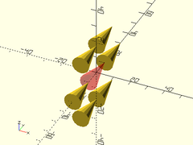

---

### yrot\_copies()

**Usage**:
- yrot\_copies(rots, [r], [cp], [sa], [subrot]) ...
- yrot\_copies(n, [r], [cp], [sa], [subrot]) ...

**Description**:
Given an array of angles, rotates copies of the children
to each of those angles around the Y axis.

Argument        | What it does
--------------- | ------------------------------
`rots`          | Optional array of rotation angles, in degrees, to make copies at.
`cp`            | Centerpoint to rotate around.
`n`             | Optional number of evenly distributed copies to be rotated around the ring.
`sa`            | Starting angle, in degrees.  For use with `n`.  Angle is in degrees counter-clockwise from X-, when facing the origin from Y+.
`r`             | Radius to move children left, away from cp, before rotating.  Makes rings of copies.
`subrot`        | If false, don't sub-rotate children as they are copied around the ring.

**Side Effects**:
- `$ang` is set to the rotation angle of each child copy, and can be used to modify each child individually.

**Example 1**:

    yrot_copies([180, 270, 315])
        cylinder(h=20, r1=5, r2=0);
    color("red",0.333) cylinder(h=20, r1=5, r2=0);


**Example 2**:

    yrot_copies(n=6)
        cylinder(h=20, r1=5, r2=0);
    color("red",0.333) cylinder(h=20, r1=5, r2=0);


**Example 3**:

    yrot_copies(n=6, r=10)
        yrot(-90) cylinder(h=20, r1=5, r2=0);
    color("red",0.333) yrot(-90) cylinder(h=20, r1=5, r2=0);


**Example 4**:

    yrot_copies(n=6, r=10, sa=45)
        yrot(-90) cylinder(h=20, r1=5, r2=0);
    color("red",0.333) yrot(-90) cylinder(h=20, r1=5, r2=0);


**Example 5**:

    yrot_copies(n=6, r=20, subrot=false)
        yrot(-90) cylinder(h=20, r1=5, r2=0, center=true);
    color("red",0.333) yrot(-90) cylinder(h=20, r1=5, r2=0, center=true);


---

### zrot\_copies()

**Usage**:
- zrot\_copies(rots, [r], [cp], [sa], [subrot]) ...
- zrot\_copies(n, [r], [cp], [sa], [subrot]) ...

**Description**:
Given an array of angles, rotates copies of the children
to each of those angles around the Z axis.

Argument        | What it does
--------------- | ------------------------------
`rots`          | Optional array of rotation angles, in degrees, to make copies at.
`cp`            | Centerpoint to rotate around.
`n`             | Optional number of evenly distributed copies to be rotated around the ring.
`sa`            | Starting angle, in degrees.  For use with `n`.  Angle is in degrees counter-clockwise from X+, when facing the origin from Z+.
`r`             | Radius to move children right, away from cp, before rotating.  Makes rings of copies.
`subrot`        | If false, don't sub-rotate children as they are copied around the ring.

**Side Effects**:
- `$ang` is set to the rotation angle of each child copy, and can be used to modify each child individually.

**Example 1**:

    zrot_copies([180, 270, 315])
        yrot(90) cylinder(h=20, r1=5, r2=0);
    color("red",0.333) yrot(90) cylinder(h=20, r1=5, r2=0);


**Example 2**:

    zrot_copies(n=6)
        yrot(90) cylinder(h=20, r1=5, r2=0);
    color("red",0.333) yrot(90) cylinder(h=20, r1=5, r2=0);


**Example 3**:

    zrot_copies(n=6, r=10)
        yrot(90) cylinder(h=20, r1=5, r2=0);
    color("red",0.333) yrot(90) cylinder(h=20, r1=5, r2=0);


**Example 4**:

    zrot_copies(n=6, r=20, sa=45)
        yrot(90) cylinder(h=20, r1=5, r2=0, center=true);
    color("red",0.333) yrot(90) cylinder(h=20, r1=5, r2=0, center=true);


**Example 5**:

    zrot_copies(n=6, r=20, subrot=false)
        yrot(-90) cylinder(h=20, r1=5, r2=0, center=true);
    color("red",0.333) yrot(-90) cylinder(h=20, r1=5, r2=0, center=true);


---

### xring()

**Usage**:
- xring(r, n, [sa], [cp], [rot]) ...

**Description**:
Distributes `n` copies of the given children on a circle of radius `r`
around the X axis.  If `rot` is true, each copy is rotated in place to keep
the same side towards the center.  The first, unrotated copy will be at the
starting angle `sa`.

Argument        | What it does
--------------- | ------------------------------
`n`             | number of copies of children to distribute around the circle. (Default: 2)
`r`             | radius of ring to distribute children around. (Default: 0)
`sa`            | start angle for first (unrotated) copy.  (Default: 0)
`rot`           | If true, rotate each copy to keep the same side towards the center of the ring.  Default: true.

**Side Effects**:
- `$ang` is set to the rotation angle of each child copy, and can be used to modify each child individually.
- `$idx` is set to the index value of each child copy.

**Example 1**:

    xring(n=6, r=10) xrot(-90) cylinder(h=20, r1=5, r2=0);


**Example 2**:

    xring(n=6, r=10, sa=45) xrot(-90) cylinder(h=20, r1=5, r2=0);


**Example 3**:

    xring(n=6, r=20, rot=false) cylinder(h=20, r1=6, r2=0, center=true);


---

### yring()

**Usage**:
- yring(r, n, [sa], [cp], [rot]) ...

**Description**:
Distributes `n` copies of the given children on a circle of radius `r`
around the Y axis.  If `rot` is true, each copy is rotated in place to keep
the same side towards the center.  The first, unrotated copy will be at the
starting angle `sa`.

Argument        | What it does
--------------- | ------------------------------
`n`             | number of copies of children to distribute around the circle. (Default: 2)
`r`             | radius of ring to distribute children around. (Default: 0)
`sa`            | start angle for first (unrotated) copy.  (Default: 0)
`rot`           | If true, rotate each copy to keep the same side towards the center of the ring.  Default: true.

**Side Effects**:
- `$ang` is set to the rotation angle of each child copy, and can be used to modify each child individually.
- `$idx` is set to the index value of each child copy.

**Example 1**:

    yring(n=6, r=10) yrot(-90) cylinder(h=20, r1=5, r2=0);


**Example 2**:

    yring(n=6, r=10, sa=45) yrot(-90) cylinder(h=20, r1=5, r2=0);


**Example 3**:

    yring(n=6, r=20, rot=false) cylinder(h=20, r1=6, r2=0, center=true);


---

### zring()

**Usage**:
- zring(r, n, [sa], [cp], [rot]) ...

**Description**:
Distributes `n` copies of the given children on a circle of radius `r`
around the Z axis.  If `rot` is true, each copy is rotated in place to keep
the same side towards the center.  The first, unrotated copy will be at the
starting angle `sa`.

Argument        | What it does
--------------- | ------------------------------
`n`             | Number of copies of children to distribute around the circle. (Default: 2)
`r`             | Radius of ring to distribute children around. (Default: 0)
`sa`            | Start angle for first (unrotated) copy.  (Default: 0)
`cp`            | Centerpoint of the ring.
`rot`           | If true, rotate each copy to keep the same side towards the center of the ring.  Default: true.

**Side Effects**:
- `$ang` is set to the relative angle from `cp` of each child copy, and can be used to modify each child individually.
- `$idx` is set to the index value of each child copy.

**Example 1**:

    zring(n=6, r=10) yrot(90) cylinder(h=20, r1=5, r2=0);


**Example 2**:

    zring(n=6, r=10, sa=45) yrot(90) cylinder(h=20, r1=5, r2=0);


**Example 3**:

    zring(n=6, r=20, rot=false) yrot(90) cylinder(h=20, r1=6, r2=0, center=true);


---

### arc\_of()

**Usage**:
- arc\_of(r|d, n, [sa], [ea], [rot]
- arc\_of(rx|dx, ry|dy, n, [sa], [ea], [rot]

**Description**:
Evenly distributes n duplicate children around an ovoid arc on the XY plane.

Argument        | What it does
--------------- | ------------------------------
`n`             | number of copies to distribute around the circle. (Default: 6)
`r`             | radius of circle (Default: 1)
`rx`            | radius of ellipse on X axis. Used instead of r.
`ry`            | radius of ellipse on Y axis. Used instead of r.
`d`             | diameter of circle. (Default: 2)
`dx`            | diameter of ellipse on X axis. Used instead of d.
`dy`            | diameter of ellipse on Y axis. Used instead of d.
`rot`           | whether to rotate the copied children.  (Default: false)
`sa`            | starting angle. (Default: 0.0)
`ea`            | ending angle. Will distribute copies CCW from sa to ea. (Default: 360.0)

**Side Effects**:
- `$ang` is set to the rotation angle of each child copy, and can be used to modify each child individually.
- `$pos` is set to the relative centerpoint of each child copy, and can be used to modify each child individually.
- `$idx` is set to the index value of each child copy.

**Example 1**:

    #cube(size=[10,3,3],center=true);
    arc_of(d=40, n=5) cube(size=[10,3,3],center=true);


**Example 2**:

    #cube(size=[10,3,3],center=true);
    arc_of(d=40, n=5, sa=45, ea=225) cube(size=[10,3,3],center=true);


**Example 3**:

    #cube(size=[10,3,3],center=true);
    arc_of(r=15, n=8, rot=false) cube(size=[10,3,3],center=true);


**Example 4**:

    #cube(size=[10,3,3],center=true);
    arc_of(rx=20, ry=10, n=8) cube(size=[10,3,3],center=true);


---

### ovoid\_spread()

**Usage**:
- ovoid\_spread(r|d, n, [cone\_ang], [scale], [perp]) ...

**Description**:
Spreads children semi-evenly over the surface of a sphere.

Argument        | What it does
--------------- | ------------------------------
`r`             | Radius of the sphere to distribute over
`d`             | Diameter of the sphere to distribute over
`n`             | How many copies to evenly spread over the surface.
`cone_ang`      | Angle of the cone, in degrees, to limit how much of the sphere gets covered.  For full sphere coverage, use 180.  Measured pre-scaling.  Default: 180
`scale`         | The [X,Y,Z] scaling factors to reshape the sphere being covered.
`perp`          | If true, rotate children to be perpendicular to the sphere surface.  Default: true

**Side Effects**:
- `$pos` is set to the relative post-scaled centerpoint of each child copy, and can be used to modify each child individually.
- `$theta` is set to the theta angle of the child from the center of the sphere.
- `$phi` is set to the pre-scaled phi angle of the child from the center of the sphere.
- `$rad` is set to the pre-scaled radial distance of the child from the center of the sphere.
- `$idx` is set to the index number of each child being copied.

**Example 1**:

    ovoid_spread(n=250, d=100, cone_ang=45, scale=[3,3,1])
        cylinder(d=10, h=10, center=false);


**Example 2**:

    ovoid_spread(n=500, d=100, cone_ang=180)
        color(normalize(point3d(vabs($pos))))
            cylinder(d=8, h=10, center=false);


---

# 7. Reflectional Distributors

### mirror\_copy()

**Usage**:
- mirror\_copy(v, [cp], [offset]) ...

**Description**:
Makes a copy of the children, mirrored across the given plane.

Argument        | What it does
--------------- | ------------------------------
`v`             | The normal vector of the plane to mirror across.
`offset`        | distance to offset away from the plane.
`cp`            | A point that lies on the mirroring plane.

**Side Effects**:
- `$orig` is true for the original instance of children.  False for the copy.
- `$idx` is set to the index value of each copy.

**Example 1**:

    mirror_copy([1,-1,0]) zrot(-45) yrot(90) cylinder(d1=10, d2=0, h=20);
    color("blue",0.25) zrot(-45) cube([0.01,15,15], center=true);


**Example 2**:

    mirror_copy([1,1,0], offset=5) rot(a=90,v=[-1,1,0]) cylinder(d1=10, d2=0, h=20);
    color("blue",0.25) zrot(45) cube([0.01,15,15], center=true);


**Example 3**:

    mirror_copy(V_UP+V_BACK, cp=[0,-5,-5]) rot(from=V_UP, to=V_BACK+V_UP) cylinder(d1=10, d2=0, h=20);
    color("blue",0.25) translate([0,-5,-5]) rot(from=V_UP, to=V_BACK+V_UP) cube([15,15,0.01], center=true);


---

### xflip\_copy()

**Usage**:
- xflip\_copy([cp], [offset]) ...

**Description**:
Makes a copy of the children, mirrored across the X axis.

Argument        | What it does
--------------- | ------------------------------
`offset`        | Distance to offset children right, before copying.
`cp`            | A point that lies on the mirroring plane.

**Side Effects**:
- `$orig` is true for the original instance of children.  False for the copy.
- `$idx` is set to the index value of each copy.

**Example 1**:

    xflip_copy() yrot(90) cylinder(h=20, r1=4, r2=0);
    color("blue",0.25) cube([0.01,15,15], center=true);


**Example 2**:

    xflip_copy(offset=5) yrot(90) cylinder(h=20, r1=4, r2=0);
    color("blue",0.25) cube([0.01,15,15], center=true);


**Example 3**:

    xflip_copy(cp=[-5,0,0]) yrot(90) cylinder(h=20, r1=4, r2=0);
    color("blue",0.25) left(5) cube([0.01,15,15], center=true);


---

### yflip\_copy()

**Usage**:
- yflip\_copy([cp], [offset]) ...

**Description**:
Makes a copy of the children, mirrored across the Y axis.

Argument        | What it does
--------------- | ------------------------------
`offset`        | Distance to offset children back, before copying.
`cp`            | A point that lies on the mirroring plane.

**Side Effects**:
- `$orig` is true for the original instance of children.  False for the copy.
- `$idx` is set to the index value of each copy.

**Example 1**:

    yflip_copy() xrot(-90) cylinder(h=20, r1=4, r2=0);
    color("blue",0.25) cube([15,0.01,15], center=true);


**Example 2**:

    yflip_copy(offset=5) xrot(-90) cylinder(h=20, r1=4, r2=0);
    color("blue",0.25) cube([15,0.01,15], center=true);


**Example 3**:

    yflip_copy(cp=[0,-5,0]) xrot(-90) cylinder(h=20, r1=4, r2=0);
    color("blue",0.25) fwd(5) cube([15,0.01,15], center=true);


---

### zflip\_copy()

**Usage**:
- zflip\_copy([cp], [offset]) ...
- `$idx` is set to the index value of each copy.

**Description**:
Makes a copy of the children, mirrored across the Z axis.

Argument        | What it does
--------------- | ------------------------------
`offset`        | Distance to offset children up, before copying.
`cp`            | A point that lies on the mirroring plane.

**Side Effects**:
- `$orig` is true for the original instance of children.  False for the copy.

**Example 1**:

    zflip_copy() cylinder(h=20, r1=4, r2=0);
    color("blue",0.25) cube([15,15,0.01], center=true);


**Example 2**:

    zflip_copy(offset=5) cylinder(h=20, r1=4, r2=0);
    color("blue",0.25) cube([15,15,0.01], center=true);

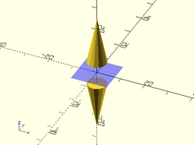

**Example 3**:

    zflip_copy(cp=[0,0,-5]) cylinder(h=20, r1=4, r2=0);
    color("blue",0.25) down(5) cube([15,15,0.01], center=true);


---

# 8. Mutators

### half\_of()

**Usage**:
- half\_of(v, [cp], [s]) ...

**Description**:
Slices an object at a cut plane, and masks away everything that is on one side.

Argument        | What it does
--------------- | ------------------------------
`v`             | Normal of plane to slice at.  Keeps everything on the side the normal points to.  Default: [0,0,1] (V\_UP)
`cp`            | A point that is on the cut plane.  This can be used to shift where it slices the object at.  Default: [0,0,0]
`s`             | Mask size to use.  Use a number larger than twice your object's largest axis.  If you make this too large, it messes with centering your view.  Default: 100

**Example 1**:

    half_of(V_DOWN+V_BACK, cp=[0,-10,0]) cylinder(h=40, r1=10, r2=0, center=false);


**Example 2**:

    half_of(V_DOWN+V_LEFT, s=200) sphere(d=150);


---

### top\_half()

**Usage**:
- top\_half([cp], [s]) ...

**Description**:
Slices an object at a horizontal X-Y cut plane, and masks away everything that is below it.

Argument        | What it does
--------------- | ------------------------------
`cp`            | A point that is on the cut plane.  This can be used to shift where it slices the object at.  Default: [0,0,0]
`s`             | Mask size to use.  Use a number larger than twice your object's largest axis.  If you make this too large, it messes with centering your view.  Default: 100

**Example 1**:

    top_half() sphere(r=20);


**Example 2**:

    top_half(cp=[0,0,-5]) sphere(r=20);

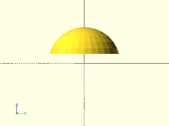

---

### bottom\_half()

**Usage**:
- bottom\_half([cp], [s]) ...

**Description**:
Slices an object at a horizontal X-Y cut plane, and masks away everything that is above it.

Argument        | What it does
--------------- | ------------------------------
`cp`            | A point that is on the cut plane.  This can be used to shift where it slices the object at.  Default: [0,0,0]
`s`             | Mask size to use.  Use a number larger than twice your object's largest axis.  If you make this too large, it messes with centering your view.  Default: 100

**Example 1**:

    bottom_half() sphere(r=20);


**Example 2**:

    bottom_half(cp=[0,0,10]) sphere(r=20);


---

### left\_half()

**Usage**:
- left\_half([cp], [s]) ...

**Description**:
Slices an object at a vertical Y-Z cut plane, and masks away everything that is right of it.

Argument        | What it does
--------------- | ------------------------------
`cp`            | A point that is on the cut plane.  This can be used to shift where it slices the object at.  Default: [0,0,0]
`s`             | Mask size to use.  Use a number larger than twice your object's largest axis.  If you make this too large, it messes with centering your view.  Default: 100

**Example 1**:

    left_half() sphere(r=20);


**Example 2**:

    left_half(cp=[8,0,0]) sphere(r=20);


---

### right\_half()

**Usage**:
- right\_half([cp], [s]) ...

**Description**:
Slices an object at a vertical Y-Z cut plane, and masks away everything that is left of it.

Argument        | What it does
--------------- | ------------------------------
`cp`            | A point that is on the cut plane.  This can be used to shift where it slices the object at.  Default: [0,0,0]
`s`             | Mask size to use.  Use a number larger than twice your object's largest axis.  If you make this too large, it messes with centering your view.  Default: 100

**Example 1**:

    right_half() sphere(r=20);


**Example 2**:

    right_half(cp=[-5,0,0]) sphere(r=20);


---

### front\_half()

**Usage**:
- front\_half([cp], [s]) ...

**Description**:
Slices an object at a vertical X-Z cut plane, and masks away everything that is behind it.

Argument        | What it does
--------------- | ------------------------------
`cp`            | A point that is on the cut plane.  This can be used to shift where it slices the object at.  Default: [0,0,0]
`s`             | Mask size to use.  Use a number larger than twice your object's largest axis.  If you make this too large, it messes with centering your view.  Default: 100

**Example 1**:

    front_half() sphere(r=20);


**Example 2**:

    front_half(cp=[0,5,0]) sphere(r=20);


---

### back\_half()

**Usage**:
- back\_half([cp], [s]) ...

**Description**:
Slices an object at a vertical X-Z cut plane, and masks away everything that is in front of it.

Argument        | What it does
--------------- | ------------------------------
`cp`            | A point that is on the cut plane.  This can be used to shift where it slices the object at.  Default: [0,0,0]
`s`             | Mask size to use.  Use a number larger than twice your object's largest axis.  If you make this too large, it messes with centering your view.  Default: 100

**Example 1**:

    back_half() sphere(r=20);


**Example 2**:

    back_half(cp=[0,-10,0]) sphere(r=20);


---

### chain\_hull()

**Usage**:
- chain\_hull() ...

**Description**:
Performs hull operations between consecutive pairs of children,
then unions all of the hull results.  This can be a very slow
operation, but it can provide results that are hard to get
otherwise.

**Example**:

    chain_hull() {
        cube(5, center=true);
        translate([30, 0, 0]) sphere(d=15);
        translate([60, 30, 0]) cylinder(d=10, h=20);
        translate([60, 60, 0]) cube([10,1,20], center=false);
    }


---

### extrude\_arc()

**Usage**:
- extrude\_arc(arc, r|d, [sa], [caps], [orient], [align], [masksize]) ...

**Description**:
Extrudes 2D shapes around a partial circle arc, with optional rounded caps.
This is mostly useful for backwards compatability with older OpenSCAD versions
without the `angle` argument in rotate\_extrude.

Argument        | What it does
--------------- | ------------------------------
`arc`           | Number of degrees to traverse.
`sa`            | Start angle in degrees.
`r`             | Radius of arc.
`d`             | Diameter of arc.
`orient`        | The axis to align to.  Use `ORIENT_` constants from `constants.scad`
`align`         | The side of the origin the part should be aligned with.  Use `V_` constants from `constants.scad`
`masksize`      | size of mask used to clear unused part of circle arc.  should be larger than height or width of 2D shapes to extrude.
`caps`          | If true, spin the 2D shapes to make rounded caps the ends of the arc.
`convexity`     | Max number of times a ray passes through the 2D shape's walls.

**Example**:

    pts=[[-5/2, -5], [-5/2, 0], [-5/2-3, 5], [5/2+3, 5], [5/2, 0], [5/2, -5]];
    #polygon(points=pts);
    extrude_arc(arc=270, sa=45, r=40, caps=true, convexity=4, $fa=2, $fs=2) {
        polygon(points=pts);
    }

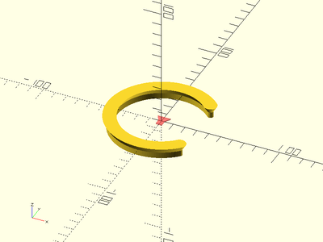

---

# 9. Miscellaneous

### orient\_and\_align()

**Usage**:
- orient\_and\_align(size, [orient], [align], [center], [noncentered], [orig\_orient], [orig\_align], [alignments]) ...

**Description**:
Takes a vertically oriented shape, and re-orients and aligns it.
This is useful for making a custom shape available in various
orientations and alignments without extra translate()s and rotate()s.
Children should be vertically (Z-axis) oriented, and centered.
Non-extremity alignment points should be named via the `alignments` arg.
Named alignments, as well as `ALIGN_NEG`/`ALIGN_POS` are aligned pre-rotation.

Argument        | What it does
--------------- | ------------------------------
`size`          | The size of the part.
`orient`        | The axis to align to.  Use ORIENT\_ constants from constants.scad
`align`         | The side of the origin the part should be aligned with.
`center`        | If given, overrides `align`.  If true, centers vertically.  If false, `align` will be set to the value in `noncentered`.
`noncentered`   | The value to set `align` to if `center` == `false`.  Default: `V_UP`.
`orig_orient`   | The original orientation of the part.  Default: `ORIENT_Z`.
`orig_align`    | The original alignment of the part.  Default: `V_CENTER`.
`alignments`    | A list of `["name", [X,Y,Z]]` alignment-label/offset pairs.

**Example**:

    #cylinder(d=5, h=10);
    orient_and_align([5,5,10], orient=ORIENT_Y, align=V_BACK, orig_align=V_UP) cylinder(d=5, h=10);


---

# 10. Deprecations

### translate\_copies()

**DEPRECATED, use `place_copies()` instead.**

**Usage**:
- translate\_copies(a) ...

**Description**:
Makes copies of the given children at each of the given offsets.

Argument        | What it does
--------------- | ------------------------------
`a`             | array of XYZ offset vectors. Default [[0,0,0]]

**Side Effects**:
- `$pos` is set to the relative centerpoint of each child copy, and can be used to modify each child individually.

---

### line\_of()

**DEPRECATED, use `spread(p1,p2)` instead**

**Usage**:
- line\_of(p1, p2, [n]) ...

**Description**:
Evenly distributes n duplicate children along an XYZ line.

Argument        | What it does
--------------- | ------------------------------
`p1`            | starting point of line.  (Default: [0,0,0])
`p2`            | ending point of line.  (Default: [10,0,0])
`n`             | number of copies to distribute along the line. (Default: 2)

**Side Effects**:
- `$pos` is set to the relative centerpoint of each child copy, and can be used to modify each child individually.

---

### grid\_of()

**DEPRECATED, use `grid3d()` instead.**

**Usage**:
- grid\_of(n, spacing) ...
- grid\_of(n=[Xn,Yn,Zn], spacing=[dX,dY,dZ]) ...
- grid\_of([xa], [ya], [za]) ...

**Description**:
Makes a 3D grid of duplicate children.

Argument        | What it does
--------------- | ------------------------------
`xa`            | array or range of X-axis values to offset by. (Default: [0])
`ya`            | array or range of Y-axis values to offset by. (Default: [0])
`za`            | array or range of Z-axis values to offset by. (Default: [0])
`n`             | Optional number of copies to have per axis.
`spacing`       | spacing of copies per axis. Use with `n`.

---

