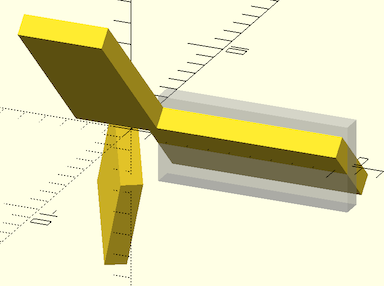
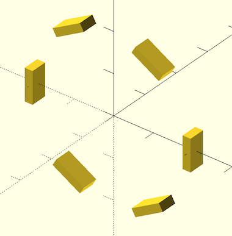
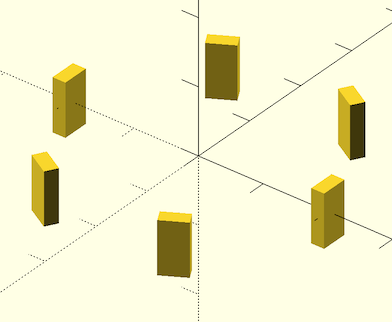
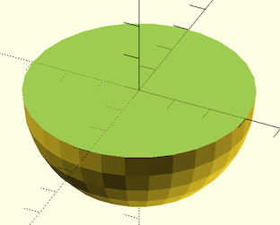

This is the file that the most commonly used transformations, distributors, and manipulators are in.

# Translation Commands

## move() { ... }
Moves/translates children.

Arg | What it is
--- | ---------------
a   | Translation vector. (optional)
x   | X axis translation. (optional)
y   | Y axis translation. (optional)
z   | Z axis translation. (optional)

Example:

    move([10,20,30]) sphere(r=1);
    move(y=10) sphere(r=1);
    move(x=5, z=10) sphere(r=1);

## xmove() { ... }
Moves/translates children the given amount along the X axis.

Arg | What it is
--- | ---------------
x   | X axis translation.

Example:

    xmove(10) sphere(r=1);

## ymove() { ... }
Moves/translates children the given amount along the Y axis.

Arg | What it is
--- | ---------------
y   | Y axis translation.

Example:

    ymove(10) sphere(r=1);

## zmove() { ... }
Moves/translates children the given amount along the Z axis.

Arg | What it is
--- | ---------------
z   | Z axis translation.

Example:

    zmove(10) sphere(r=1);

## left() { ... }
Moves/translates children the given amount left along the X axis.

Arg | What it is
--- | ---------------
x   | Translation in the -X direction.

Example:

    left(10) sphere(r=1);

## right() { ... }
Moves/translates children the given amount right along the X axis.

Arg | What it is
--- | ---------------
x   | Translation in the +X direction.

Example:

    right(10) sphere(r=1);

## fwd() { ... }, forward() { ... }
Moves/translates children the given amount forward along the Y axis.

Arg | What it is
--- | ---------------
y   | Translation in the -Y direction.

Example:

    fwd(10) sphere(r=1);
    forward(10) sphere(r=1);

## back() { ... }
Moves/translates children the given amount back along the Y axis.

Arg | What it is
--- | ---------------
y   | Translation in the +Y direction.

Example:

    back(10) sphere(r=1);

## down() { ... }
Moves/translates children the given amount down along the Z axis.

Arg | What it is
--- | ---------------
z   | Translation in the -Z direction.

Example:

    down(10) sphere(r=1);

## up() { ... }
Moves/translates children the given amount up along the Z axis.

Arg | What it is
--- | ---------------
z   | Translation in the +Z direction.

Example:

    up(10) sphere(r=1);

## place\_copies() { ... }, translate\_copies() { ... }
Makes copies of the children at each of the given translation offsets.

Arg | What it is
--- | ----------------------
a   | array of XYZ offset vectors. (Default `[[0,0,0]]`)

Example:

    place_copies([[-5,-5,0], [5,-5,0], [0,-5,7], [0,5,0]])
        sphere(r=3,center=true);

    translate_copies([[-5,-5,0], [5,-5,0], [0,-5,7], [0,5,0]])
        sphere(r=3,center=true);

## spread() { ... }, line\_of() { ... }
Evenly distributes n duplicate children along an XYZ line.

Arg | What it is
--- | ----------------------
p1  | starting point of line.  (Default: `[0,0,0]`)
p2  | ending point of line.  (Default: `[10,0,0]`)
n   | number of copies to distribute along the line. (Default: 2)

Examples:

    spread(p1=[0,0,0], p2=[-10,15,20], n=5) cube(size=[3,1,1], center=true);
    line_of(p1=[0,0,0], p2=[-10,15,20], n=5) cube(size=[3,1,1], center=true);

## xspread() { ... }
Spreads out n copies of the given children along the X axis.

Arg     | What it is
------- | ----------------------
spacing | spacing between copies. (Default: 1.0)
n       | Number of copies to spread out. (Default: 2)

Examples:

    xspread(25) sphere(1);
    xspread(25,3) sphere(1)
    xspread(25, n=3) sphere(1)
    xspread(spacing=20, n=4) sphere(1)

## yspread() { ... }
Spreads out n copies of the given children along the Y axis.

Arg     | What it is
------- | ----------------------
spacing | spacing between copies. (Default: 1.0)
n       | Number of copies to spread out. (Default: 2)

Examples:

    yspread(25) sphere(1);
    yspread(25,3) sphere(1)
    yspread(25, n=3) sphere(1)
    yspread(spacing=20, n=4) sphere(1)

## zspread() { ... }
Spreads out n copies of the given children along the Z axis.

Arg     | What it is
------- | ----------------------
spacing | spacing between copies. (Default: 1.0)
n       | Number of copies to spread out. (Default: 2)

Examples:

    zspread(25) sphere(1);
    zspread(25,3) sphere(1)
    zspread(25, n=3) sphere(1)
    zspread(spacing=20, n=4) sphere(1)

## xdistribute() { ... }
Evenly spreads out each child along the X axis.

Arg     | What it is
------- | ----------------------
spacing | spacing between children. Default: 10

Examples:

    xdistribute(15) {
        sphere(1);
        cube([1,2,3], center=true);
        cylinder(d=2, h=5);
    }

## ydistribute() { ... }
Evenly spreads out each child along the Y axis.

Arg     | What it is
------- | ----------------------
spacing | spacing between children. Default: 10

Examples:

    ydistribute(15) {
        sphere(1);
        cube([1,2,3], center=true);
        cylinder(d=2, h=5);
    }

## zdistribute() { ... }
Evenly spreads out each child along the Z axis.

Arg     | What it is
------- | ----------------------
spacing | spacing between children. Default: 10

Examples:

    zdistribute(15) {
        sphere(1);
        cube([1,2,3], center=true);
        cylinder(d=2, h=5);
    }

## grid\_of() { ... }
Makes a potentially 3D grid of duplicate children.

Arg     | What it is
------- | ----------------------
xa      | array or range of X-axis values to offset by. (Default: [0])
ya      | array or range of Y-axis values to offset by. (Default: [0])
za      | array or range of Z-axis values to offset by. (Default: [0])
count   | Optional number of copies to have per axis. (Default: none)
spacing | spacing of copies per axis. Use with count. (Default: 0)

Examples:

    grid_of(xa=[0,2,3,5], ya=[3:5], za=[-4:2:6]) sphere(r=0.5,center=true);
    grid_of(ya=[-6:3:6], za=[4,7]) sphere(r=1,center=true);
    grid_of(count=3, spacing=10) sphere(r=1,center=true);
    grid_of(count=[3, 1, 2], spacing=10) sphere(r=1,center=true);
    grid_of(count=[3, 4], spacing=[10, 8]) sphere(r=1,center=true);
    grid_of(count=[3, 4, 2], spacing=[10, 8, 5]) sphere(r=1,center=true, $fn=24);

# Rotations Commands

## xrot() { ... }
Rotates children around the X axis by the given number of degrees.

Arg | What it is
--- | ---------------
a   | Angle to rotate in degrees.

Example:

    xrot(90) cylinder(h=10, r=2, center=true);

## yrot() { ... }
Rotates children around the Y axis by the given number of degrees.

Arg | What it is
--- | ---------------
a   | Angle to rotate in degrees.

Example:

    yrot(90) cylinder(h=10, r=2, center=true);

## zrot() { ... }
Rotates children around the Z axis by the given number of degrees.

Arg | What it is
--- | ---------------
a   | Angle to rotate in degrees.

Example:

    zrot(90) cube(size=[9,1,4], center=true);

## rot\_copies() { ... }
Given an array of Euller angles, rotates copies of the children to each of those angles.

Arg  | What it is
---- | ----------------------
rots | Array of Euller [x,y,z] angles to rotate each copy to.

Example:

    rot_copies(rots=[[45,0,0],[0,45,120],[90,-45,270]])
        right(6) cube(size=[9,1,4], center=true);

## xrot\_copies() { ... }
Rotates copies of the children to a given set of angles around the X axis.

Arg    | What it is
------ | ----------------------
rots   | Array of angles, in degrees, to make copies at. (optional)
count  | number of evenly distributed copies, rotated around a circle. (optional)
offset | Angle offset in degrees, for use with `count`.

Example:

    xrot_copies(rots=[15,30,60,120,240])
        translate([0,6,0]) cube(size=[4,9,1], center=true);

    xrot_copies(count=6, offset=15)
        translate([0,6,0]) cube(size=[4,9,1], center=true);

## yrot\_copies() { ... }
Rotates copies of the children to a given set of angles around the Y axis.

Arg    | What it is
------ | ----------------------
rots   | Optional array of angles, in degrees, to make copies at.
count  | Optional number of evenly distributed copies, rotated around a circle.
offset | Angle offset in degrees, for use with `count`.

Example:

    yrot_copies(rots=[15,30,60,120,240])
        translate([6,0,0]) cube(size=[9,4,1], center=true);

    yrot_copies(count=6, offset=15)
        translate([6,0,0]) cube(size=[9,4,1], center=true);

## zrot\_copies() { ... }
Given an array of angles, rotates copies of the children to each of those angles around the Z axis.

Arg    | What it is
------ | ----------------------
rots   | Optional array of angles, in degrees, to make copies at.
count  | Optional number of evenly distributed copies, rotated around a circle.
offset | Angle offset in degrees for first copy.

Example:

    zrot_copies(rots=[15,30,60,120,240])
        translate([6,0,0]) cube(size=[9,1,4], center=true);

    zrot_copies(count=6, offset=15)
        translate([6,0,0]) cube(size=[9,1,4], center=true);

## arc\_of() { ... }
Evenly distributes n duplicate children around an ovoid arc on the XY plane.

Arg | What it is
--- | ----------------------
n   | number of copies to distribute around the circle. (Default: 6)
r   | radius of circle (Default: 1)
rx  | radius of ellipse on X axis. Used instead of r.
ry  | radius of ellipse on Y axis. Used instead of r.
d   | diameter of circle. (Default: 2)
dx  | diameter of ellipse on X axis. Used instead of d.
dy  | diameter of ellipse on Y axis. Used instead of d.
rot | whether to rotate the copied children.  (Default: false)
sa  | starting angle. (Default: 0.0)
ea  | ending angle. Will distribute copies CCW from sa to ea. (Default: 360.0)

Examples:

    arc_of(d=8,n=5) cube(size=[3,1,1],center=true);
    arc_of(r=10,n=12,rot=true) cube(size=[3,1,1],center=true);
    arc_of(rx=15,ry=10,n=12,rot=true) cube(size=[3,1,1],center=true);
    arc_of(r=10,n=5,rot=true,sa=30.0,ea=150.0) cube(size=[3,1,1],center=true);

## xring() { ... }
Evenly distributes `n` duplicate children around a circle on the YZ plane, around the X axis.  First moves children away from the X axis by `r` distance, in direction `sa`. Then copies them around the axis of rotation, for a total of `n` copies.  If `rot` is true, each copy is rotated in place to orient to the center of rotation.

Arg | What it is
--- | ----------------------
n   | Number of copies of children to distribute around the circle. (Default: 2)
r   | Radius of ring to distribute children around. (Default: 0)
sa  | Start angle for first (unrotated) copy.  (Default: 0)
rot | If true, rotate each copy of children with respect to the center of the ring. (Default: true)

Example:

    xring(n=3, r=20) cube(size=5, center=true);
    xring(n=5, r=50, rot=false) cube(size=5, center=true);
    xring(n=3, r=10, sa=270) yspread(10) yrot(120) cylinder(h=10, d=1, center=false);

## yring() { ... }
Evenly distributes `n` duplicate children around a circle on the XZ plane, around the Y axis.  First moves children away from the Y axis by `r` distance, in direction `sa`. Then copies them around the axis of rotation, for a total of `n` copies.  If `rot` is true, each copy is rotated in place to orient to the center of rotation.

Arg | What it is
--- | ----------------------
n   | Number of copies of children to distribute around the circle. (Default: 2)
r   | Radius of ring to distribute children around. (Default: 0)
sa  | Start angle for first (unrotated) copy.  (Default: 0)
rot | If true, rotate each copy of children with respect to the center of the ring. (Default: true)

Example:

    yring(n=3, r=20) cube(size=5, center=true);
    yring(n=5, r=50, rot=false) cube(size=5, center=true);
    yring(n=3, r=10, sa=270) xspread(10) xrot(-120) cylinder(h=10, d=1, center=false);

## zring() { ... }
Evenly distributes `n` duplicate children around a circle on the XY plane, around the Z axis.  First moves children away from the Z axis by `r` distance, in direction `sa`. Then copies them around the axis of rotation, for a total of `n` copies.  If `rot` is true, each copy is rotated in place to orient to the center of rotation.

Arg | What it is
--- | ----------------------
n   | Number of copies of children to distribute around the circle. (Default: 2)
r   | Radius of ring to distribute children around. (Default: 0)
sa  | Start angle for first (unrotated) copy.  (Default: 0)
rot | If true, rotate each copy of children with respect to the center of the ring. (Default: true)

Example:

    zring(n=3, r=20) cube(size=5, center=true);
    zring(n=5, r=50, rot=false) cube(size=5, center=true);
    zring(n=3, r=10, sa=90) xspread(10) xrot(30) cylinder(h=10, d=1, center=false);

# Scaling Commands

## xscale() { ... }
Scales children by the given factor in the X axis.

Arg | What it is
--- | ---------------
x   | Factor to scale by.

Example:

    xscale(3) sphere(r=100, center=true);

## yscale() { ... }
Scales children by the given factor in the Y axis.

Arg | What it is
--- | ---------------
y   | Factor to scale by.

Example:

    yscale(3) sphere(r=100, center=true);

## zscale() { ... }
Scales children by the given factor in the Z axis.

Arg | What it is
--- | ---------------
z   | Factor to scale by.

Example:

    zscale(3) sphere(r=100, center=true);

# Mirroring Commands

## xflip() { ... }
Mirrors the children along the X axis, kind of like xscale(-1)

Example:

    xflip() rotate([-30,30]) cylinder(d=10, h=40, center=false);

## yflip() { ... }
Mirrors the children along the Y axis, kind of like yscale(-1)

Example:

    yflip() rotate([-30,30]) cylinder(d=10, h=40, center=false);

## zflip() { ... }
Mirrors the children along the Z axis, kind of like zscale(-1)

Example:

    zflip() rotate([-30,30]) cylinder(d=10, h=40, center=false);

## mirror\_copy() { ... }
Makes a copy of the children, mirrored across the given plane.

Arg    | What it is
------ | ----------------------
v      | The normal vector of the plane to mirror across.
offset | distance to offset away from the plane.

Example:

    mirror_copy([1,-1,0]) yrot(30) cylinder(h=10, r=1, center=true);
    mirror_copy([1,1,1], offset=17.32) cylinder(h=10, r=1, center=false);

## xflip\_copy() { ... }
Makes a copy of the children, mirrored across the YZ plane. This leaves the
originals in place, so there will be two instances of the children total.

Arg    | What it is
------ | ----------------------
offset | distance to offset children away from the YZ plane.

Example:

    xflip_copy() yrot(30) cylinder(h=10, r=1, center=false);
    xflip_copy(offset=10) yrot(30) cylinder(h=10, r=1, center=false);

## yflip\_copy() { ... }
Makes a copy of the children, mirrored across the XZ plane. This leaves the
originals in place, so there will be two instances of the children total.

Arg    | What it is
------ | ----------------------
offset | distance to offset children away from the XZ plane.

Example:

    yflip_copy() xrot(30) cylinder(h=10, r=1, center=false);
    yflip_copy(offset=10) xrot(30) cylinder(h=10, r=1, center=false);

## zflip\_copy() { ... }
Makes a copy of the children, mirrored across the XY plane. This leaves the
originals in place, so there will be two instances of the children total.

Arg    | What it is
------ | ----------------------
offset | distance to offset children away from the XY plane.

Example:

    zflip_copy() yrot(30) cylinder(h=10, r=1, center=false);
    zflip_copy(offset=10) yrot(30) cylinder(h=10, r=1, center=false);

# Skew Commands

## xskew() { ... }, skew\_yz() { ... }
Skews children on the Y-Z plane, keeping constant in X.

Arg | What it is
--- | ----------------------
ya  | skew angle towards the +Y direction.
za  | skew angle towards the +Z direction.

Examples:

    xskew(ya=15) cube(size=10);
    skew_yz(ya=15) cube(size=10);
    skew_yz(ya=30, za=15) cube(size=10);

## yskew() { ... }, skew\_xz() { ... }
Skews children on the X-Z plane, keeping constant in Y.

Arg | What it is
--- | ----------------------
xa  | skew angle towards the +X direction.
za  | skew angle towards the +Z direction.

Examples:

    yskew(xa=15) cube(size=10);
    skew_xz(xa=15) cube(size=10);
    skew_xz(xa=-15, za=15) cube(size=10);

## zskew() { ... }, skew\_xy() { ... }
Skews children on the X-Y plane, keeping constant in Z.

Arg | What it is
--- | ----------------------
xa  | Skew angle towards the +X direction.
ya  | Skew angle towards the +Y direction.

Examples:

    zskew(xa=15) cube(size=10);
    skew_xy(xa=15) cube(size=10);
    skew_xy(xa=30, ya=15) cube(size=10);

# Mutator Commands

## top\_half() { ... }
Clips off everything below the Z=0 plane.  Leaves just the top half.

Arg     | What it is
------- | ----------------------
s       | Maximun axis size of the object to clip.

Examples:

    top_half() sphere(30);
    top_half(200) sphere(150);

## bottom\_half() { ... }
Clips off everything above the Z=0 plane.  Leaves just the bottom half.

Arg     | What it is
------- | ----------------------
s       | Maximun axis size of the object to clip.

Examples:

    bottom_half() sphere(30);
    bottom_half(200) sphere(150);

## left\_half() { ... }
Clips off everything right of the X=0 plane.  Leaves just the left half.

Arg     | What it is
------- | ----------------------
s       | Maximun axis size of the object to clip.

Examples:

    left_half() sphere(30);
    left_half(200) sphere(150);

## right\_half() { ... }
Clips off everything left of the X=0 plane.  Leaves just the right half.

Arg     | What it is
------- | ----------------------
s       | Maximun axis size of the object to clip.

Examples:

    right_half() sphere(30);
    right_half(200) sphere(150);

## front\_half() { ... }
Clips off everything behind the Y=0 plane.  Leaves just the front half.

Arg     | What it is
------- | ----------------------
s       | Maximun axis size of the object to clip.

Examples:

    front_half() sphere(30);
    front_half(200) sphere(150);

## back\_half() { ... }
Clips off everything in front of the Y=0 plane.  Leaves just the back half.

Arg     | What it is
------- | ----------------------
s       | Maximun axis size of the object to clip.

Examples:

    back_half() sphere(30);
    back_half(200) sphere(150);

## chain\_hull() { ... }
Performs hull operations between consecutive pairs of children,
then unions all of the hull results.

Examples:

    chain_hull() {
        cube(5, center=true);
        translate([50, 0, 0]) sphere(d=15);
        translate([100, 50, 0]) cylinder(d=10, h=20);
        translate([100, 100, 0]) cube([10,20,20], center=false);
    }

