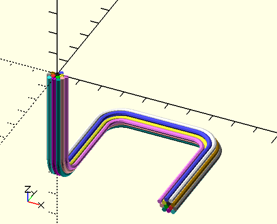

Rendering for wiring bundles

# Functions

## hex\_offset\_ring(wirediam, lev=0)
Returns an array of 1 or 6 2D points that form a ring, based on wirediam and ring lev.
Level 0 returns a single point at 0,0.  All greater levels return 6 points.

## hex\_offsets(wires, wirediam)
Returns an array of 2D centerpoints for each of a bundle of wires of given diameter.

# Modules

## wiring()
Returns a 3D object representing a bundle of wires that follow a given path,
with the corners filleted to a given radius.  There are 17 base wire colors.
If you have more than 17 wires, colors will get re-used.

Arg       | What it is
--------- | -------------------------------------
path      | The 3D polyline path that the wire bundle should follow.
wires     | The number of wires in the wiring bundle.
wirediam  | The diameter of each wire in the bundle.
fillet    | The radius that the path corners will be filleted to.
wirenum   | The first wire's offset into the color table.
bezsteps  | The corner fillets in the path will be converted into this number of segments.

Example:

    path = [[50,0,-50], [50,50,-50], [0,50,-50], [0,0,-50], [0,0,0]];
    wiring(path, fillet=10, wires=13);

