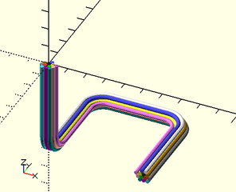

# Library File wiring.scad

Rendering for wiring bundles
To use, include the following line at the top of your file:
```
use <BOSL/wiring.scad>
```

---

# Table of Contents

1. [Functions](#functions)
    - [`hex_offset_ring()`](#hex_offset_ring)
    - [`hex_offsets()`](#hex_offsets)

2. [Modules](#modules)
    - [`wiring()`](#wiring)

---

# 1. Functions

### hex\_offset\_ring()

**Usage**:
- hex\_offset\_ring(d, lev)

**Description**:
Returns a hexagonal ring of points, with a spacing of `d`.
If `lev=0`, returns a single point at `[0,0]`.  All greater
levels return 6 times `lev` points.

Argument        | What it does
--------------- | ------------------------------
`d`             | Base unit diameter to build rings upon.
`lev`           | How many rings to produce.

**Example**:

    hex_offset_ring(d=1, lev=3); // Returns a hex ring of 18 points.

---

### hex\_offsets()

**Usage**:
- hex\_offsets(n, d)

**Description**:
Returns the centerpoints for the optimal hexagonal packing
of at least `n` circular items, of diameter `d`.  Will return
enough points to fill out the last ring, even if that is more
than `n` points.

Argument        | What it does
--------------- | ------------------------------
`n`             | Number of items to bundle.
`d`             | How far to space each point away from others.

---

# 2. Modules

### wiring()

**Usage**:
- wiring(path, wires, [wirediam], [fillet], [wirenum], [bezsteps]);

**Description**:
Returns a 3D object representing a bundle of wires that follow a given path,
with the corners filleted to a given radius.  There are 17 base wire colors.
If you have more than 17 wires, colors will get re-used.

Argument        | What it does
--------------- | ------------------------------
`path`          | The 3D polyline path that the wire bundle should follow.
`wires`         | The number of wires in the wiring bundle.
`wirediam`      | The diameter of each wire in the bundle.
`fillet`        | The radius that the path corners will be filleted to.
`wirenum`       | The first wire's offset into the color table.
`bezsteps`      | The corner fillets in the path will be converted into this number of segments.

**Example**:

    wiring([[50,0,-50], [50,50,-50], [0,50,-50], [0,0,-50], [0,0,0]], fillet=10, wires=13);



---

